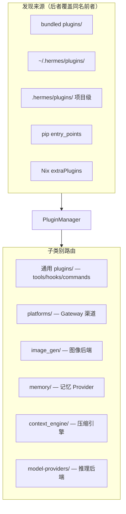
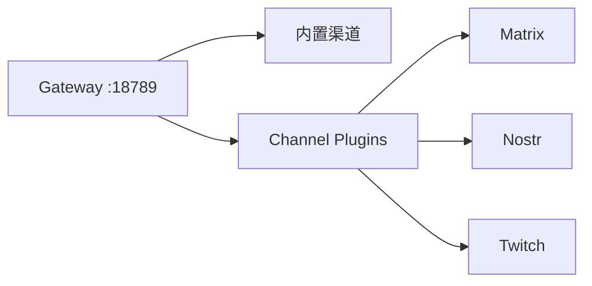

# Agent Hermes 与 OpenClaw 插件体系与 MCP 生态全解析
# Plugin Systems & MCP Ecosystem in Agent Hermes & OpenClaw

> 最后更新 | Last updated: 2026-06-06

---

## 一、扩展哲学对比 | Extension Philosophy Comparison

**中文**

两个框架都将「核心 Agent 引擎」与「可插拔能力」分离，但扩展面不同：

| 维度 | OpenClaw（龙虾） | Hermes Agent |
|------|------------------|--------------|
| 第一层扩展 | Workspace Markdown（SOUL/AGENTS） | Context files + SOUL.md |
| 第二层扩展 | Skills（SKILL.md） | Skills + 自动生成 |
| 第三层扩展 | **进程内插件** + Channel 插件 | **Python 插件系统** + pip 分发 |
| 外部工具协议 | 主要靠 Skills / 内置工具 | **MCP 客户端 + 服务端** 一等公民 |
| 默认姿态 | 插件在 Gateway 进程内 = 可信代码 | 通用插件默认 **opt-in**（`plugins.enabled`） |
| 供应链 | npm shrinkwrap 锁定发布依赖 | Tirith + Skills Guard + 懒安装隔离 |

**English**

Both separate core engines from pluggable capabilities. OpenClaw extends via workspace files, skills, and in-process Gateway plugins plus channel plugins. Hermes adds a Python plugin system with opt-in general plugins, pip distribution, and first-class bidirectional MCP. OpenClaw treats in-process plugins as trusted; Hermes gates arbitrary user plugins behind `plugins.enabled`.

---

## 二、Hermes 插件发现体系 | Hermes Plugin Discovery

**中文**



### 2.1 发现来源

| 来源 | 路径 | 用例 |
|------|------|------|
| Bundled | 仓库 `plugins/` | 随 Hermes 发布（IRC、Teams 等） |
| User | `~/.hermes/plugins/` | 个人定制工具/钩子 |
| Project | `./.hermes/plugins/` | 项目专属（需 `HERMES_ENABLE_PROJECT_PLUGINS=true`） |
| pip | `hermes_agent.plugins` entry_points | 团队 pip 包分发 |
| Nix | `extraPlugins` / `extraPythonPackages` | 声明式部署 |

同名碰撞时 **后加载者覆盖** — 用户插件可替换内置同名 Provider。

### 2.2 插件类型

| 类型 | 选择方式 | 位置 |
|------|----------|------|
| 通用插件 | 多选 `plugins.enabled` | `plugins/` |
| Memory Provider | 单选 `memory.provider` | `plugins/memory/` |
| Context Engine | 单选 `context.engine` | `plugins/context_engine/` |
| Model Provider | 多注册，用户择一 | `plugins/model-providers/` |
| Platform 插件 | bundled 自动加载；用户平台需 enabled | `plugins/platforms/` |

**English**

Discovery order: bundled → user → project (opt-in) → pip → Nix. Subdirectories route to specialized loaders (memory, context engine, model providers, platforms). Later sources override same-name plugins.

### 2.3 Opt-in 安全模型（plugins.enabled）

```yaml
plugins:
  enabled:
    - my-tool-plugin
    - disk-cleanup
  disabled:
    - noisy-plugin
```

```bash
hermes plugins                    # 交互式 SPACE 切换
hermes plugins enable my-plugin
hermes plugins disable my-plugin
hermes plugins install user/repo --enable   # 安装并启用
```

**不经过 allowlist 的类别**（内置基础设施）：

| 种类 | 激活方式 |
|------|----------|
| Bundled 平台插件（IRC、Teams） | `gateway.platforms.*.enabled` |
| Bundled 图像后端 | `image_gen.provider` |
| Memory / Context / Model Provider | 各自 `config.yaml` 单选 |

第三方 `~/.hermes/plugins/platforms/` **必须** opt-in。

**English**

General plugins require explicit `plugins.enabled`. Bundled platforms/backends and provider plugins bypass the allowlist by design. Third-party platform adapters need opt-in.

### 2.4 插件能力一览

| 能力 | API |
|------|-----|
| 注册工具 | `ctx.register_tool()` |
| 生命周期钩子 | `ctx.register_hook("post_tool_call", ...)` |
| 斜杠命令 | `ctx.register_command()` |
| CLI 子命令 | `ctx.register_cli_command()` |
| 捆绑 Skill | `ctx.register_skill()` → `plugin:skill` |
| 注册 Gateway 平台 | `ctx.register_platform()` |
| 注册推理 Provider | `register_provider(ProviderProfile(...))` |
| 借用用户 LLM | `ctx.llm.complete()` |

### 2.5 Memory Provider 插件

8 种外部记忆后端（Honcho、Mem0、Hindsight、OpenViking 等）通过 `plugins/memory/` 发现：

```yaml
memory:
  provider: "honcho"    # 空字符串 = 仅内置 MEMORY.md/USER.md
```

**独占模式** — 同时仅一个 active Provider。详见 [记忆系统](./memory-system.md)。

### 2.6 Context Engine 插件

```yaml
context:
  engine: "compressor"    # 默认内置 ContextCompressor
  engine: "lcm"           # 插件：无损上下文
```

用户必须显式设置 — 插件引擎不会自动激活。

**English**

Plugins can register tools, hooks, commands, skills, platforms, providers, and context engines. Memory and context engines are single-select via config.

---

## 三、OpenClaw 插件体系 | OpenClaw Plugin System

**中文**

### 3.1 进程内插件

OpenClaw 插件在 Gateway **同一 Node.js 进程**内运行 — 与 Gateway 共享内存与凭证，**视为可信代码**。

```json5
{
  plugins: {
    allow: ["matrix-channel", "nostr-bridge"],  // 显式白名单（推荐）
  },
  security: {
    installPolicy: "allowlist",   // 或相关安装策略
  },
}
```

| 控制 | 说明 |
|------|------|
| `plugins.allow` | 仅加载列出的插件 |
| `security.installPolicy` | 限制插件安装来源 |
| `openclaw security audit --deep` | 扫描已装 Skills/插件 |

### 3.2 Channel 插件

内置渠道：WhatsApp、Telegram、Discord、Slack、Signal、iMessage 等。

插件渠道：Matrix、Nostr、Twitch、Zalo、Feishu 等通过 bundled 或 external channel plugins 扩展。



### 3.3 插件 Skills 分发

OpenClaw Skills 以 `skills/*/SKILL.md` 存在于 workspace，社区通过 ClawHub 等市场分发。插件可附带 Skills 目录 — Skills 与插件 **`plugins.allow` 独立**，但同样应限制写入权限。

### 3.4 npm Shrinkwrap 供应链

发布包使用 `npm-shrinkwrap.json` 锁定依赖图，配合 `openclaw security audit` 检测已知妥协版本。对比 Hermes 的 `hermes doctor` 供应链告警。

**English**

OpenClaw plugins run in-process — trusted code. Use `plugins.allow` allowlists and `security.installPolicy`. Channel plugins extend connectivity. Published deps locked via npm-shrinkwrap; audit via `openclaw security audit --deep`.

---

## 四、MCP：Hermes 作为客户端 | MCP: Hermes as Client

**中文**

Model Context Protocol 让 Hermes 连接外部工具服务器（GitHub、Linear、数据库、文件系统等），无需为每个集成编写原生工具。

### 4.1 配置形态

**Stdio 本地子进程：**

```yaml
mcp_servers:
  filesystem:
    command: "npx"
    args: ["-y", "@modelcontextprotocol/server-filesystem", "/home/user/projects"]
    env:
      GITHUB_PERSONAL_ACCESS_TOKEN: "***"
```

**HTTP 远程端点：**

```yaml
mcp_servers:
  linear:
    url: "https://mcp.linear.app/mcp"
    auth: oauth
```

### 4.2 工具注册命名

```text
mcp_<server_name>_<tool_name>
```

| MCP 工具 | 注册名 |
|----------|--------|
| filesystem.read_file | `mcp_filesystem_read_file` |
| github.create-issue | `mcp_github_create_issue` |

每个有工具的服务器还创建 runtime toolset：`mcp-<server>`。

### 4.3 凭证过滤（Credential Filtering）

Stdio MCP 子进程 **不**继承完整 shell 环境：

- 仅传递配置中显式 `env` + 安全基线
- 降低意外泄漏 `OPENROUTER_API_KEY` 等的风险
- 对比 OpenClaw 进程内插件可访问 Gateway 级凭证

**English**

Hermes connects to MCP servers via stdio or HTTP. Tools register as `mcp_<server>_<tool>`. Stdio servers get filtered env — not the full shell — reducing credential leakage.

### 4.4  per-server 工具过滤

```yaml
mcp_servers:
  github:
    command: "npx"
    args: ["-y", "@modelcontextprotocol/server-github"]
    tools:
      include: [create_issue, list_issues]
      prompts: false
      resources: false
  stripe:
    url: "https://mcp.stripe.com"
    tools:
      exclude: [delete_customer]
  legacy:
    url: "https://mcp.legacy.internal"
    enabled: false
```

| 规则 | 行为 |
|------|------|
| `enabled: false` | 跳过连接 |
| `include` | 白名单 |
| `exclude` | 黑名单 |
| 同时存在 | `include` 优先 |
| `prompts/resources: false` | 禁用 utility 包装器 |

### 4.5 目录与 reload-mcp

```bash
hermes mcp                  # 交互式目录安装
hermes mcp install n8n      # 安装 Nous 审核条目
hermes mcp configure linear # 重新选择工具 checklist
```

运行中修改配置：

```text
/reload-mcp
```

服务器也可推送 `notifications/tools/list_changed` 动态刷新工具列表。

### 4.6 MCP 目录信任模型

`optional-mcps/` 条目经 PR 审核合并。安装会执行 manifest 中的 `bootstrap`（`git clone`、`pip install`、`npm install` 等）— **安装前阅读 manifest 的 `source:` 与 `install.bootstrap:`**。

**English**

Per-server tool filtering via include/exclude. Catalog entries are PR-gated under `optional-mcps/`. Use `/reload-mcp` after config changes; servers can push dynamic tool list updates.

### 4.7 MCP Sampling

MCP 服务器可通过 `sampling/createMessage` 请求 Hermes 代为推理 — 对不信任服务器设 `sampling.enabled: false`，并配置 `max_rpm` / `max_tokens_cap` 限流。

**English**

MCP sampling lets servers request LLM inference — disable for untrusted servers; rate limits apply.

---

## 五、MCP：Hermes 作为服务端 | MCP: Hermes as Server

**中文**

`hermes mcp serve` 将 Hermes 暴露为 MCP 服务器，供 Cursor、Claude Code、VS Code 等客户端调用 **消息能力**：

```json
{
  "mcpServers": {
    "hermes": {
      "command": "hermes",
      "args": ["mcp", "serve"]
    }
  }
}
```

| 工具 | 功能 |
|------|------|
| `conversations_list` | 列出活跃会话 |
| `messages_read` | 读取消息历史 |
| `messages_send` | 向 telegram:xxx / discord:#channel 发消息 |
| `events_poll` / `events_wait` | 近实时事件 |
| `permissions_respond` | 审批危险命令 |

**读操作** 无需 Gateway 运行；**发消息** 需要 Gateway 平台适配器在线。

这与 OpenClaw 通过 Gateway WebSocket 统一渠道不同 — Hermes 选择 **stdio MCP 桥接** 嵌入外部编码 Agent 工作流。

**English**

`hermes mcp serve` exposes messaging tools to MCP clients (Cursor, Claude Code). Reads work without gateway; sends require active platform adapters. Bridges external coding agents to Hermes channels.

---

## 六、ACP 与 MCP 的关系 | ACP vs MCP

**中文**

| 协议 | 角色 | 典型编辑器 |
|------|------|------------|
| **ACP** | Hermes 作为 Agent 服务端，编辑器渲染工具/审批/差异 | VS Code、Zed、JetBrains |
| **MCP** | Hermes 作为工具服务端（消息）或工具客户端（GitHub 等） | Cursor、Claude Desktop |

```bash
hermes acp              # 编辑器原生 Agent 体验
hermes mcp serve        # 消息桥 MCP 服务
# config.yaml mcp_servers — 扩展 Hermes 工具面
```

ACP 使用精选 `hermes-acp` toolset（含 `delegate_task`），**排除** cronjob、messaging delivery 等不适合编辑器 UX 的工具。

**English**

ACP: Hermes as agent server for IDE UX. MCP: Hermes as messaging bridge (server) or external tool consumer (client). Complementary, not interchangeable.

---

## 七、对比矩阵 | Comparison Matrix

**中文**

| 能力 | OpenClaw | Hermes |
|------|----------|--------|
| 插件运行时 | Gateway 进程内 Node.js | Python PluginManager |
| 默认加载 | 需 `plugins.allow` 白名单 | 通用插件 opt-in `plugins.enabled` |
| 渠道扩展 | Channel Plugins | Platform 插件 + 20 内置 Adapter |
| 外部工具协议 | 主要靠 Skills/内置 | MCP 客户端一等公民 |
| 对外暴露消息 | Gateway WebSocket / Control UI | `hermes mcp serve` |
| IDE 集成 | 外部 Runtime 生态 | ACP + MCP 双路径 |
| 记忆插件 | Workspace 文件 | `plugins/memory/` Provider |
| 上下文引擎 | 无内置可插拔 | `plugins/context_engine/` |
| 推理 Provider 插件 | 绑定 Runtime | `plugins/model-providers/` 18+ |
| 供应链审计 | shrinkwrap + security audit | Tirith + `hermes doctor` |
| Skills 随插件分发 | 社区 + workspace | `ctx.register_skill()` |
| 项目级插件 | workspace skills | `.hermes/plugins/`（默认关闭） |

**English**

Matrix: OpenClaw in-process trusted plugins with channel extensions; Hermes opt-in Python plugins with MCP client/server, ACP IDE path, and specialized provider/memory/context plugin loaders.

---

## 八、安全最佳实践 | Security Best Practices

**中文**

### OpenClaw

1. `plugins.allow` 显式白名单 — 不用则等于加载全部发现项
2. `openclaw security audit --deep` 定期扫描
3. Skills 目录 `chmod` 限制写入
4. 不信任来源的 channel plugin 不安装
5. 验证 npm shrinkwrap 完整性

### Hermes

1. 仅 `hermes plugins enable` 审查过的通用插件
2. 项目插件保持 `HERMES_ENABLE_PROJECT_PLUGINS=false` 除非信任仓库
3. MCP `tools.include` 最小暴露面
4. 不信任 MCP 服务器禁用 `sampling`
5. Stdio MCP 的 `env` 仅填必要变量
6. `hermes doctor` 检查供应链告警
7. `hermes mcp` 目录安装前阅读 manifest

**English**

OpenClaw: `plugins.allow`, security audit, lock down skills dirs. Hermes: opt-in plugins, minimal MCP tool exposure, disable sampling for untrusted servers, filtered stdio env, `hermes doctor`.

---

## 九、典型集成场景 | Typical Integration Scenarios

**中文**

| 场景 | 推荐路径 |
|------|----------|
| GitHub PR 管理 | Hermes `mcp_servers.github` + include 白名单 |
| Linear 工单 | 目录 `hermes mcp install linear` + OAuth |
| 团队自定义 CLI 工具 | Hermes `~/.hermes/plugins/` |
| Matrix 聊天渠道 | OpenClaw channel plugin 或 Hermes bundled platform |
| Cursor 发 Telegram | `hermes mcp serve` |
| VS Code 编码 Agent | `hermes acp` |
| Honcho 用户建模 | Hermes `memory.provider: honcho` |
| 无损长上下文 | Hermes `context.engine: lcm` 插件 |

**English**

Scenarios: GitHub/Linear via MCP, custom tools via Hermes plugins, Matrix via channel plugins, Cursor→Telegram via `mcp serve`, VS Code via ACP, Honcho via memory provider.

---

## 十、故障排查 | Troubleshooting

**中文**

| 症状 | Hermes 排查 | OpenClaw 排查 |
|------|-------------|---------------|
| 插件未加载 | `hermes plugins list` 检查 enabled | 检查 `plugins.allow` |
| MCP 工具缺失 | `/reload-mcp`、检查 filter | N/A |
| MCP OAuth 失败 | `hermes mcp login <name>` 独立终端 | N/A |
| 渠道未连接 | `gateway.platforms.*.enabled` | channel 配置 + plugin |
| 供应链告警 | `hermes doctor --ack` | `security audit --fix` |

**English**

Hermes: check `plugins.enabled`, `/reload-mcp`, `hermes mcp login`. OpenClaw: check `plugins.allow`, channel config, `security audit`.

---

## 十一、延伸阅读 | Further Reading

- [安全模型深度解析](./security-model.md) — 供应链与 MCP 凭证隔离
- [Gateway 架构深度解析](./gateway.md) — Channel 与 Platform 插件
- [模型 Provider 与成本](./model-provider-cost.md) — model-providers 插件
- Hermes：[Plugins](https://hermes-agent.nousresearch.com/docs/user-guide/features/plugins)、[MCP](https://hermes-agent.nousresearch.com/docs/user-guide/features/mcp)、[ACP](https://hermes-agent.nousresearch.com/docs/user-guide/features/acp)
- OpenClaw 文档：https://docs.openclaw.ai/

---

## 十二、结语 | Conclusion

**中文**

OpenClaw 的扩展栈是 **Workspace + Skills + 进程内 Channel 插件**，优势在渠道广度与社区生态，安全关键是 `plugins.allow` 与 shrinkwrap 供应链。Hermes 的扩展栈是 **分层 Python 插件（工具/记忆/上下文/Provider）+ 双向 MCP + ACP**，优势在可组合的外部工具生态与 opt-in 默认姿态。实践中常组合使用：Hermes `mcp_servers` 接 GitHub/Linear，OpenClaw channel plugin 接 Matrix，Cursor 通过 `hermes mcp serve` 桥接消息 — **插件与 MCP 不是二选一，而是分层装配能力边界**。

**English**

OpenClaw extends via workspace, skills, and in-process channel plugins — maximize connectivity with `plugins.allow` and supply-chain audits. Hermes extends via layered Python plugins and bidirectional MCP/ACP — compose external tools with opt-in safety. In practice, combine MCP servers for SaaS integrations, channel plugins for niche protocols, and `hermes mcp serve` to bridge coding agents to messaging — plugins and MCP are layers, not either/or.
