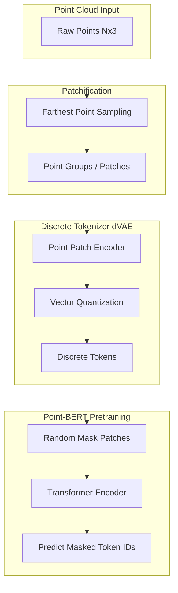

# 2021 AI 编年史：3D 视觉预训练 | 3D Vision Pretraining in 2021

---

## 一、概述与背景知识 | Overview & Background

**English**

**3D vision** processes **spatial geometric data** — **point clouds**, **meshes**, **voxels**, and **multi-view images** — to understand objects and scenes in three dimensions. Unlike 2D images, 3D data is **unordered**, **sparse**, and **computationally expensive**, making **large-scale supervised learning** difficult due to annotation costs (LiDAR segmentation, CAD part labels).

In 2021, researchers adapted **2D SSL successes** (BERT, MAE, contrastive learning) to 3D:

- **Point-BERT** — BERT-style **masked point modeling** on discretized point patches
- **MV-JAR** — **multi-view joint autoencoding** across rendered views
- **Point-M2AE** — **hierarchical masked autoencoding** for point clouds
- **CrossPoint** — **2D-3D contrastive** alignment

**Key terms:**

| Term | Definition |
|------|------------|
| **Point cloud** | Set of (x,y,z) coordinates, optionally with color/intensity |
| **LiDAR** | Laser ranging sensor producing real-world point clouds (autonomous driving) |
| **Voxelization** | Discretizing continuous space into 3D grid cells |
| **PointNet/PointNet++** | Pioneering architectures for unordered point sets |
| **Multi-view rendering** | Projecting 3D models to 2D images from multiple camera angles |
| **dVAE (discrete VAE)** | Tokenizer converting point patches to discrete tokens for BERT-style MLM |
| **ModelNet40 / ScanObjectNN** | Standard 3D classification benchmarks |

**中文**

**3D 视觉** 处理 **点云**、**网格**、**体素** 与 **多视图图像** 等空间几何数据。相较 2D 图像，3D 数据 **无序**、**稀疏**、**计算昂贵**，标注（LiDAR 分割、CAD 部件标签）成本使大规模监督学习困难。

2021 年研究者将 **2D SSL 成功范式**（BERT、MAE、对比学习）扩展至 3D：

- **Point-BERT** — 离散点 patch 上的 BERT 式 **掩码点建模**
- **MV-JAR** — 跨渲染视图的 **多视图联合自编码**
- **Point-M2AE** — 点云 **分层掩码自编码**
- **CrossPoint** — **2D-3D 对比** 对齐

**核心术语：**

| 术语 | 含义 |
|------|------|
| **点云** | (x,y,z) 坐标集合，可含颜色/强度 |
| **LiDAR** | 激光雷达，产生真实世界点云（自动驾驶） |
| **体素化** | 将连续空间离散为 3D 网格 |
| **PointNet/PointNet++** | 处理无序点集的开创性架构 |
| **多视图渲染** | 从多个相机角度将 3D 模型投影为 2D 图像 |
| **dVAE** | 将点 patch 离散化为 token 的分词器 |
| **ModelNet40 / ScanObjectNN** | 标准 3D 分类 benchmark |

3D 预训练直接服务 **自动驾驶**、**机器人抓取**、**AR/VR** 与 **工业检测** — 2021 年是 3D Foundation Model 概念的萌芽年。

---

## 二、技术架构 | Architecture

### 2.1 Point-BERT 流水线



**English**

1. **Patch grouping**: FPS selects center points; k-NN groups local neighborhoods
2. **dVAE tokenizer** (pretrained separately): maps each patch to a discrete token from a codebook
3. **Masked modeling**: Randomly mask ~25–45% of patch tokens; Transformer predicts original token IDs
4. **Fine-tuning**: Add classification head on ModelNet40 / ScanObjectNN — **+3–5%** over supervised PointNet++

**中文**

1. **Patch 分组**：FPS 选中心点，k-NN 分组局部邻域
2. **dVAE 分词器**（单独预训练）：每 patch 映射到码本离散 token
3. **掩码建模**：随机 mask 约 25–45% patch token；Transformer 预测原 token ID
4. **微调**：ModelNet40 / ScanObjectNN 分类 — 较监督 PointNet++ **提升 3–5%**

### 2.2 MV-JAR：多视图联合重建

```
3D Shape (CAD / Mesh)
        │
        ├── Render View 1 ──→ Encoder ──┐
        ├── Render View 2 ──→ Encoder ──┼── Cross-View Attention
        └── Render View 3 ──→ Encoder ──┘
                        │
              Joint Reconstruction / Contrastive Loss
                        │
              Unified 3D-Aware Representation
```

**English**

MV-JAR leverages **differentiable rendering** or offline multi-view images. The model must **reconstruct masked views** using information from other views — learning **view-invariant 3D structure** without 3D annotations.

**中文**

MV-JAR 利用 **可微渲染** 或离线多视图图像。模型须用其他视图信息 **重建被 mask 的视图** — 在无 3D 标注下学习 **视图不变 3D 结构**。

### 2.3 点云 vs. 多视图路线对比

| 路线 | 代表方法 | 输入 | 优势 | 挑战 |
|------|----------|------|------|------|
| **原生点云** | Point-BERT, Point-M2AE | LiDAR/CAD 点云 | 保留几何精度 | 无序性、稀疏性 |
| **多视图 2.5D** | MV-JAR, CrossPoint | 渲染 RGB-D | 复用 2D CNN/ViT | 依赖渲染质量 |
| **体素** | Voxel-MAE | 3D 网格 | 规则结构 | 内存 O(n³) |
| **2D-3D 对比** | CrossPoint | 点云 + 图像 | 跨模态对齐 | 配对数据需求 |

### 2.4 自动驾驶 3D 检测栈（2021 上下文）

```
LiDAR Point Cloud
      ↓
Voxelization / Pillars (PointPillars, VoxelNet)
      ↓
3D Backbone (Sparse Conv / PointNet++)
      ↓
Detection Head (CenterPoint, PV-RCNN)
      ↓
3D BBoxes + Class Labels

← 2021 预训练 backbone 开始替换随机初始化
```

---

## 三、发展趋势 | Trends

**English**

1. **BERT/MAE for 3D**: Direct port of 2D SSL paradigms — Point-BERT, Point-MAE (2022) followed MAE timeline.
2. **Large-scale 3D datasets**: ShapeNet, ModelNet, ScanNet, nuScenes drove pretraining corpus growth.
3. **Autonomous driving adoption**: Pretrained LiDAR backbones improved **few-shot** adaptation across cities/sensors.
4. **NeRF intersection**: Neural radiance fields (2020–2021) complemented explicit point cloud methods.
5. **Unified 2D-3D models**: CLIP-style alignment between images and point clouds (CrossPoint).
6. **Real-time constraints**: Distillation of heavy pretrained 3D models for edge LiDAR inference.

**中文**

1. **3D 版 BERT/MAE**：直接移植 2D SSL — Point-BERT、Point-MAE 沿 MAE 时间线跟进。
2. **大规模 3D 数据集**：ShapeNet、ModelNet、ScanNet、nuScenes 扩大预训练语料。
3. **自动驾驶采用**：预训练 LiDAR backbone 改善跨城市/传感器 **少样本** 适配。
4. **与 NeRF 交汇**：神经辐射场（2020–2021）与显式点云方法互补。
5. **统一 2D-3D 模型**：图像-点云 CLIP 式对齐（CrossPoint）。
6. **实时约束**：重型 3D 预训练模型蒸馏至边缘 LiDAR 推理。

---

## 四、优缺点分析 | Pros & Cons

| 维度 | 优点 Advantages | 缺点 Disadvantages |
|------|-----------------|---------------------|
| **标注** | 减少 3D 分割/检测标注需求 | 仍依赖大规模无标注 3D 数据 |
| **迁移** | 预训练 backbone 提升下游 SOTA | 域 gap（合成 vs. 真实 LiDAR） |
| **Point-BERT** | 离散 token 简化 MLM | dVAE 训练两阶段，复杂 |
| **多视图** | 利用现有 2D 基础设施 | 渲染开销与视角覆盖 |
| **算力** | 比全监督 3D 标注便宜 | 预训练仍需多 GPU |
| **标准** | ModelNet40 提升明显 | 真实场景 ScanObjectNN 增益较小 |
| **部署** | 特征更鲁棒 | 3D 模型体积大于 2D 同级 |

---

## 五、应用场景 | Use Cases

| 场景 | 说明 |
|------|------|
| **自动驾驶** | LiDAR 3D 检测/跟踪 backbone 预训练 |
| **机器人抓取** | 物体 6-DoF pose 估计与抓取点检测 |
| **AR/VR** | 室内场景网格/点云理解与重建 |
| **工业质检** | CAD 模型缺陷检测与配准 |
| **智慧城市** | 激光点云建筑物/地形建模 |
| **医疗影像** | CT/MRI 体数据分割预训练 |
| **游戏/元宇宙** | 3D 资产自动分类与检索 |

---

## 六、开源项目与工具 | Open Source & Tools

| 项目 | 说明 | URL |
|------|------|-----|
| **Point-BERT** | 官方点云 BERT 预训练 | https://github.com/lululemon-happy/Point-BERT |
| **Open3D** | 3D 数据处理与可视化 | https://github.com/isl-org/Open3D |
| **PyTorch3D** | Meta  Differentiable 3D 库 | https://github.com/facebookresearch/pytorch3d |
| **TensorFlow3D** | Google 3D 深度学习库 | https://github.com/google-research/tensorflow3d |
| **MMDetection3D** | OpenMMLab 3D 检测工具箱 | https://github.com/open-mmlab/mmdetection3d |
| **OpenPCDet** | 点云 3D 检测框架 | https://github.com/open-mmlab/OpenPCDet |
| **MinkowskiEngine** | 稀疏 3D 卷积 | https://github.com/NVIDIA/MinkowskiEngine |

---

## 七、参考文献 | References

1. Yu, X., et al. **"Point-BERT: Pre-training 3D Point Cloud Transformers with Masked Point Modeling."** CVPR 2022 (arXiv 2021-10). https://arxiv.org/abs/2111.14809
2. Geng, H., et al. **"Shape As Points: A Differentiable Poisson Solver (related 3D representation work)."** NeurIPS 2021. https://arxiv.org/abs/2106.03452
3. Qi, C.R., et al. **"PointNet: Deep Learning on Point Sets for 3D Classification and Segmentation."** CVPR 2017. https://arxiv.org/abs/1612.00593
4. Qi, C.R., et al. **"PointNet++: Deep Hierarchical Feature Learning on Point Sets."** NeurIPS 2017. https://arxiv.org/abs/1706.02413
5. Afham, M., et al. **"CrossPoint: Self-Supervised Cross-Modal Contrastive Learning for 3D Point Cloud Understanding."** CVPR 2022. https://arxiv.org/abs/2109.00789
6. Chang, A.X., et al. **"ShapeNet: An Information-Rich 3D Model Repository."** arXiv:1512.03012. https://arxiv.org/abs/1512.03012
7. Caesar, H., et al. **"nuScenes: A Multimodal Dataset for Autonomous Driving."** CVPR 2020. https://arxiv.org/abs/1903.11027

---

**English Summary**: 2021 brought BERT and MAE-style self-supervision to 3D — Point-BERT and multi-view methods showed that geometric representations could be pretrained at scale, foreshadowing 3D foundation models for robotics and autonomous driving.

**中文总结**：2021 年将 BERT/MAE 式自监督引入 3D 领域 — Point-BERT 与多视图方法证明几何表示可大规模预训练，为机器人与自动驾驶 3D 基础模型埋下伏笔。
