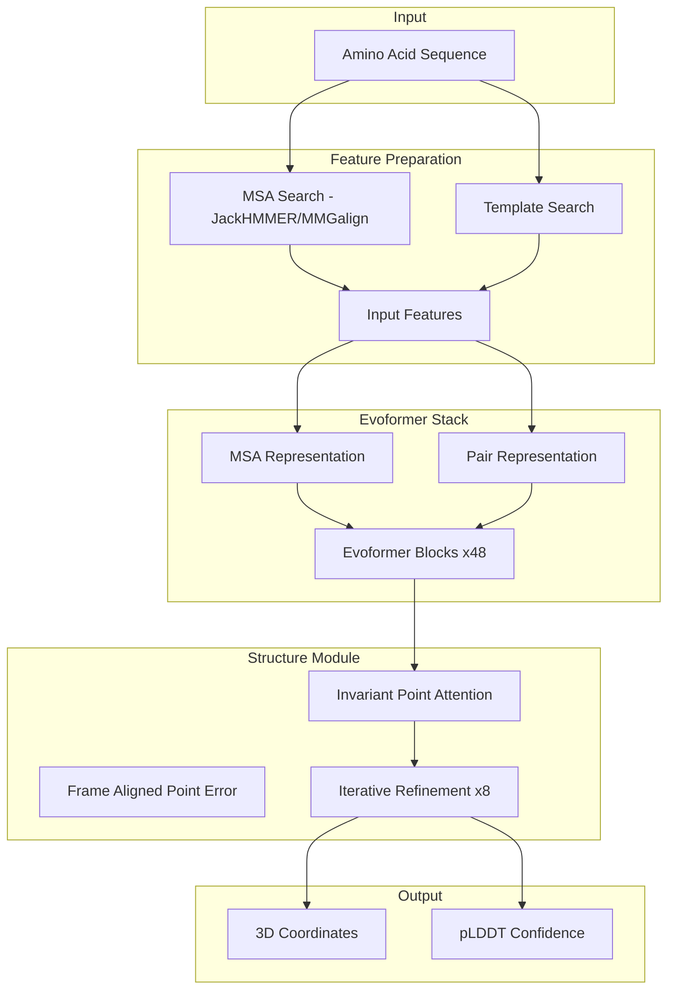

# 2021 AI 编年史：AlphaFold2 与 AI for Science | AlphaFold2 and AI for Science in 2021

---

## 一、概述与背景知识 | Overview & Background

**English**

**Protein structure prediction** — determining the 3D atomic coordinates of a protein from its amino acid sequence — is a **50-year grand challenge** in biology. In November 2020, **DeepMind's AlphaFold2** achieved **atomic-level accuracy** at **CASP14** (Critical Assessment of Structure Prediction), effectively solving the problem for single-chain proteins. Throughout **2021**, the field exploded:

- **AlphaFold2** paper and **open-source code** (July 2021)
- **AlphaFold Protein Structure Database** — 350k+ structures released
- **RosettaFold** (Baker Lab, UW) — competitive accuracy with different architecture
- **TRFold** and other **transformer-based** fold predictors

**Key terms:**

| Term | Definition |
|------|------------|
| **Primary structure** | Linear amino acid sequence |
| **Secondary structure** | Local motifs: α-helices, β-sheets |
| **Tertiary structure** | Full 3D fold of a single polypeptide chain |
| **MSA (Multiple Sequence Alignment)** | Evolutionary homolog sequences revealing co-evolution constraints |
| **CASP** | Biennial blind benchmark for structure prediction |
| **TM-score** | Metric (0–1) comparing predicted vs. experimental structures; >0.5 ≈ correct fold |
| **Evoformer** | AlphaFold2's core module processing MSA and pair representations |
| **pLDDT** | Per-residue confidence score output by AlphaFold2 |

**中文**

**蛋白质结构预测** — 从氨基酸序列推断蛋白质三维原子坐标 — 是生物学 **50 年重大挑战**。2020 年 11 月 **DeepMind AlphaFold2** 在 **CASP14** 达到 **原子级精度**，基本解决单链蛋白预测。 **2021 年** 领域爆发：

- AlphaFold2 论文与 **开源代码**（2021 年 7 月）
- **AlphaFold 蛋白质结构数据库** 发布 35 万+ 结构
- **RosettaFold**（Baker 实验室）以不同架构达到可比精度
- **TRFold** 等 **Transformer** 折叠预测器涌现

**核心术语：**

| 术语 | 含义 |
|------|------|
| **一级结构** | 氨基酸线性序列 |
| **二级结构** | 局部 motif：α 螺旋、β 折叠 |
| **三级结构** | 单条多肽链的完整三维折叠 |
| **MSA（多序列比对）** | 进化同源序列，揭示共进化约束 |
| **CASP** | 结构预测双年盲评 benchmark |
| **TM-score** | 预测与实验结构相似度（0–1）；>0.5 通常表示折叠正确 |
| **Evoformer** | AlphaFold2 核心模块，处理 MSA 与 pair 表示 |
| **pLDDT** | AlphaFold2 输出的逐残基置信度 |

AlphaFold2 被《Science》评为 **2021 年度突破**，标志着 **AI for Science** 从辅助工具升级为 **科学发现基础设施**。

---

## 二、技术架构 | Architecture

### 2.1 AlphaFold2 端到端流水线



**English**

AlphaFold2 replaces the traditional **template modeling + physics-based refinement** pipeline with a **single end-to-end differentiable network**:

1. **Input features**: MSA (evolutionary co-variation), optional structural templates, residue indices
2. **Evoformer**: Alternating updates to **MSA row representation** (per-sequence) and **pair representation** (residue i–j relationships) via row/column attention and outer-product mean
3. **Structure Module**: Predicts backbone frames using **Invariant Point Attention (IPA)** — SE(3)-aware attention in 3D — with iterative coordinate refinement
4. **Loss**: FAPE (Frame Aligned Point Error) + auxiliary distogram/MLM losses

**中文**

AlphaFold2 以 **端到端可微网络** 取代传统 **模板建模 + 物理精炼** 流水线：

1. **输入特征**：MSA（进化共变）、可选结构模板、残基索引
2. **Evoformer**：交替更新 **MSA 行表示** 与 **残基对表示**，经行/列注意力与外积均值
3. **结构模块**：**不变点注意力（IPA）** 在 3D 中 SE(3) 感知地预测骨架框架，迭代精炼坐标
4. **损失**：FAPE + 辅助 distogram/MLM 损失

### 2.2 RosettaFold 对比架构

```
RosettaFold (Three-track Network)
Track 1: MSA (1D per-sequence features)
Track 2: Pair (2D residue-residue)
Track 3: Structure (3D coordinates, updated iteratively)
         ↓
    Triangle Attention + Triangular Multiplicative Update
         ↓
    Structure Prediction + Energy Minimization (optional)
```

| 特性 | AlphaFold2 | RosettaFold |
|------|------------|-------------|
| 核心模块 | Evoformer + IPA | Three-track + Triangle updates |
| 开源时间 | 2021-07 | 2021-08 |
| 复合物预测 | AF-Multimer (later) | 需 Rosetta 框架组合 |
| 典型 TM-score | >0.9 (easy targets) | 接近 AF2 |

### 2.3 TRFold：纯 Transformer 路线

**English**

**TRFold** (Transformer-based protein folding) explored whether **standard Transformer blocks** with geometric constraints could match specialized architectures — contributing to the 2021 debate on **inductive bias vs. scale** in scientific ML.

**中文**

**TRFold** 探索 **标准 Transformer** 加几何约束能否媲美专用架构，参与 2021 年科学 ML 中 **归纳偏置 vs. 规模** 的讨论。

---

## 三、发展趋势 | Trends

**English**

1. **Structure → Function → Design**: Accurate structures enabled **de novo enzyme design**, **drug target identification**, and **mutation effect prediction**.
2. **Open data revolution**: AlphaFold DB democratized structural biology — previously **X-ray crystallography** took months per protein.
3. **Multimer & dynamics**: 2021 laid groundwork for **protein complex** (AF-Multimer) and **conformational ensemble** prediction.
4. **Integration with cryo-EM**: AI predictions + experimental density maps accelerated **hybrid modeling**.
5. **Competitive open ecosystem**: RosettaFold, OpenFold (2022) ensured **non-Google** reproducibility.
6. **AI for Science template**: Success pattern — **large curated datasets + strong inductive bias + massive compute** — copied in materials, climate, and drug discovery.

**中文**

1. **结构 → 功能 → 设计**：精准结构推动 **从头酶设计**、**药物靶点发现**、**突变效应预测**。
2. **开放数据革命**：AlphaFold DB 民主化结构生物学——此前 **X 射线晶体学** 每个蛋白需数月。
3. **多聚体与动力学**：为 **蛋白复合物**（AF-Multimer）与 **构象 ensemble** 预测铺路。
4. **与 cryo-EM 融合**：AI 预测 + 实验密度图加速 **混合建模**。
5. **开放竞争生态**：RosettaFold、OpenFold 保障 **非 Google** 可复现性。
6. **AI for Science 模板**：**大数据 + 强归纳偏置 + 大算力** 模式被材料、气候、药物等领域复制。

---

## 四、优缺点分析 | Pros & Cons

| 维度 | 优点 Advantages | 缺点 Disadvantages |
|------|-----------------|---------------------|
| **精度** | CASP14 原子级，远超传统方法 | 内在无序蛋白（IDP）仍困难 |
| **速度** | 分钟级 vs. 实验数月 | GPU 内存与 MSA 搜索仍耗时 |
| **覆盖** | AF DB 覆盖 UniProt 大部分 | 膜蛋白、超大复合物精度下降 |
| **置信度** | pLDDT 指示可靠区域 | 低 pLDDT 区域易被误用 |
| **开源** | 代码+权重公开（学术许可） | 商用需单独授权 |
| **生物学** | 静态结构，非动力学 | 缺少配体、翻译后修饰上下文 |
| **依赖 MSA** | 进化信息提升精度 |  orphan 序列（无同源）性能降 |

---

## 五、应用场景 | Use Cases

| 场景 | 说明 |
|------|------|
| **药物发现** | 靶点结构用于 virtual screening 与先导化合物优化 |
| **酶工程** | 预测突变对稳定性的影响，指导定向进化 |
| **农业生物技术** | 作物抗病蛋白结构解析 |
| **基础生物学** | 未解析 ORF 的功能注释 |
| **合成生物学** | 设计新-to-nature 蛋白骨架 |
| **疾病研究** | 致病突变如何破坏蛋白折叠 |
| **教育科研** | 零实验成本获取教学用高质量结构 |

---

## 六、开源项目与工具 | Open Source & Tools

| 项目 | 说明 | URL |
|------|------|-----|
| **AlphaFold** | DeepMind 官方实现 | https://github.com/deepmind/alphafold |
| **ColabFold** | MSA 加速 + Google Colab 一键预测 | https://github.com/sokrypton/ColabFold |
| **RosettaFold** | Baker 实验室官方代码 | https://github.com/RosettaCommons/RoseTTAFold |
| **OpenFold** | AlphaFold2 可训练复现（2022，源于 2021 需求） | https://github.com/aqlaboratory/openfold |
| **ESMFold** | 无 MSA 语言模型折叠（后续演进） | https://github.com/facebookresearch/esm |
| **PyMOL / ChimeraX** | 结构可视化 | https://pymol.org/ |
| **PDBe** | 实验结构数据库 | https://www.ebi.ac.uk/pdbe/ |

---

## 七、参考文献 | References

1. Jumper, J., et al. **"Highly accurate protein structure prediction with AlphaFold."** Nature 596, 2021. https://www.nature.com/articles/s41586-021-03819-2
2. Baek, M., et al. **"Accurate prediction of protein structures and interactions using a three-track neural network."** Science 373, 2021 (RosettaFold). https://www.science.org/doi/10.1126/science.abj8754
3. Senior, A.W., et al. **"Improved protein structure prediction using potentials from deep learning."** Nature 577, 2020 (AlphaFold1). https://www.nature.com/articles/s41586-019-1923-7
4. Varadi, M., et al. **"AlphaFold Protein Structure Database."** Nucleic Acids Research, 2022. https://alphafold.ebi.ac.uk/
5. CASP14 Official Results. https://predictioncenter.org/casp14/
6. Callaway, E. **"'The game has changed.' AI triumphs at protein folding."** Nature News, 2020. https://www.nature.com/articles/d41586-020-03348-4
7. Mirdita, M., et al. **"ColabFold: making protein folding accessible to all."** Nature Methods, 2022. https://doi.org/10.1038/s41592-022-01488-1

---

**English Summary**: AlphaFold2 in 2021 transformed structural biology from a bottleneck into a solved inference problem for most single-chain proteins — launching the modern **AI for Science** era that extends to materials, climate, and genomics.

**中文总结**：2021 年 AlphaFold2 将结构生物学从瓶颈转变为对大多数单链蛋白的「已解推理问题」，开启延伸至材料、气候、基因组等领域的 **AI for Science** 新时代。
