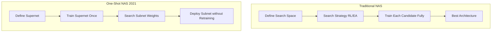

# 2021 AI 编年史：AutoML 与 NAS | AutoML and Neural Architecture Search in 2021

---

## 一、概述与背景知识 | Overview & Background

**English**

**AutoML (Automated Machine Learning)** automates the design of ML pipelines — including **hyperparameter tuning**, **feature engineering**, and **model architecture selection**. **Neural Architecture Search (NAS)** is the subfield that **algorithmically discovers neural network architectures** rather than relying on human design (ResNet, Transformer, etc.).

By 2021, NAS evolved from **computationally prohibitive** (thousands of GPU-days for NASNet) to **practical one-shot methods**:

- **EfficientNetV2** (Google) — human-guided compound scaling + NAS-refined training recipes
- **Once-for-All (OFA)** (MIT/Han Lab) — train **one supernet**, deploy **many sub-networks** without retraining
- **AutoGluon**, **NNI** — production AutoML platforms maturing
- **Weight-sharing NAS** — evaluate architectures via shared supernet weights

**Key terms:**

| Term | Definition |
|------|------------|
| **Search space** | Set of allowable architecture choices (layers, channels, operators) |
| **Search strategy** | Algorithm exploring the space: RL, evolution, differentiable NAS |
| **Performance estimator** | Predicts architecture quality without full training |
| **Supernet / Hypernet** | Over-parameterized network containing all candidate architectures as subgraphs |
| **Compound scaling** | Jointly scaling depth, width, and resolution (EfficientNet) |
| **Once-for-All** | Single training run; extract subnets for different latency/accuracy trade-offs |
| **Sub-network** | A smaller architecture carved from the supernet |

**中文**

**AutoML（自动机器学习）** 自动化 ML 流水线设计 — 含 **超参调优**、**特征工程**、**模型架构选择**。**神经架构搜索（NAS）** 子领域通过 **算法搜索神经网络架构**，替代人工设计（ResNet、Transformer 等）。

至 2021 年 NAS 从 **算力不可承受**（NASNet 需数千 GPU 天）演进为 **实用 one-shot 方法**：

- **EfficientNetV2**（Google）— 人工 compound scaling + NAS 优化训练配方
- **Once-for-All（OFA）**（MIT/Han 实验室）— 训练 **一次超网**，部署 **多种子网络** 无需重训
- **AutoGluon**、**NNI** — 生产级 AutoML 平台成熟
- **权重共享 NAS** — 通过共享超网权重评估架构

**核心术语：**

| 术语 | 含义 |
|------|------|
| **搜索空间** | 允许的架构选择集合（层数、通道、算子） |
| **搜索策略** | 探索算法：RL、进化、可微 NAS |
| **性能估计器** | 不全训即可预测架构质量 |
| **超网** | 包含所有候选架构子图的超参数化网络 |
| **复合缩放** | 深度、宽度、分辨率联合缩放（EfficientNet） |
| **Once-for-All** | 一次训练，按延迟/精度提取不同子网 |
| **子网络** | 从超网切出的较小架构 |

2021 年 NAS 从研究 curiosity 变为 **移动端/边缘部署** 与 **云端 cost optimization** 的标准工具。

---

## 二、技术架构 | Architecture

### 2.1 经典 NAS 流水线 vs. One-Shot NAS



**English**

**Traditional NAS** evaluates each architecture independently — accurate but O(N × full training cost). **One-shot NAS** trains a **weight-sharing supernet** once; architecture search becomes **path selection** or **subnet extraction** — orders of magnitude cheaper.

**中文**

**传统 NAS** 独立评估每个架构 — 准确但成本 O(N × 全训)。**One-shot NAS** 一次训练 **权重共享超网**；搜索变为 **路径选择** 或 **子网提取** — 成本降数量级。

### 2.2 Once-for-All (OFA) 超网架构

```
OFA Supernet Layers
┌─────────────────────────────────────────────────┐
│ Elastic Depth:    choose 2..4 blocks per stage  │
│ Elastic Width:    choose channels 128..256      │
│ Elastic Kernel:   choose 3x3, 5x5, 7x7 conv    │
│ Elastic Resolution: 128..224 input sizes          │
└─────────────────────────────────────────────────┘
         Progressive Shrinking Training
    Train largest config → gradually add smaller subnets
         ↓
    Deployment: pick subnet matching edge latency budget
    (Phone CPU / GPU / Datacenter) — NO retraining
```

**English**

OFA uses **progressive shrinking**: start training the largest subnet, then simultaneously optimize smaller subnets embedded within. At deployment, select a subnet matching **latency constraints** on target hardware — **instant specialization** without fine-tuning.

**中文**

OFA 采用 **渐进收缩**：先训最大子网，再同时优化嵌入其中的小子网。部署时按目标硬件 **延迟约束** 选取子网 — **即时特化** 无需微调。

### 2.3 EfficientNetV2：Compound Scaling + NAS

| 阶段 | 内容 |
|------|------|
| **Baseline design** | MBConv blocks + Fused-MBConv (NAS-selected) |
| **Scaling** | Compound coeff φ scales depth/width/resolution |
| **Training-aware NAS** | Search progressive learning + regularization schedule |
| **Result** | 5–11× faster training than EfficientNetV1 |

### 2.4 AutoML 平台架构（NNI / AutoGluon）

```
User Dataset + Task Definition
         ↓
┌────────────────────────────────────┐
│  AutoML Orchestrator               │
│  ├── Search Space Config           │
│  ├── Trial Scheduler (Hyperband)   │
│  ├── NAS Module / HPO Module       │
│  └── Model Ensemble & Stacking     │
└────────────────────────────────────┘
         ↓
Best Model + Deployment Artifacts
```

---

## 三、发展趋势 | Trends

**English**

1. **NAS → training co-design**: 2021 focus shifted from architecture alone to **joint optimization of architecture + training recipe**.
2. **Hardware-aware NAS**: Latency/energy on **mobile NPU**, **Edge TPU** as search objectives — not just accuracy.
3. **Transformer NAS**: Searching attention patterns, FFN ratios for ViT variants.
4. **AutoML democratization**: AutoGluon tabular SOTA with `fit()` one-liner; NNI integration with PyTorch Lightning.
5. **LLM era tension**: Large fixed architectures (GPT, ViT) reduced NAS relevance for foundation models — NAS pivoted to **efficient finetuning** and **compression**.
6. **Cloud AutoML services**: Google Vertex AI NAS, AWS SageMaker Autopilot mainstream adoption.

**中文**

1. **NAS → 训练协同设计**：2021 焦点从纯架构扩展到 **架构 + 训练配方** 联合优化。
2. **硬件感知 NAS**：以 **移动端 NPU**、**Edge TPU** 延迟/能耗为搜索目标。
3. **Transformer NAS**：搜索 ViT 变体的注意力模式、FFN 比例。
4. **AutoML 民主化**：AutoGluon 表格数据一行 `fit()` 达 SOTA；NNI 集成 PyTorch Lightning。
5. **LLM 时代张力**：GPT/ViT 等固定大架构降低 NAS 在 foundation model 上的 relevance — NAS 转向 **高效微调** 与 **压缩**。
6. **云 AutoML 服务**：Google Vertex AI NAS、AWS SageMaker Autopilot  mainstream 采用。

---

## 四、优缺点分析 | Pros & Cons

| 维度 | 优点 Advantages | 缺点 Disadvantages |
|------|-----------------|---------------------|
| **效率** | OFA 一次训练多部署点 | 超网训练仍需大量 GPU |
| **性能** | 常发现超越人工设计架构 | 搜索空间设计依赖专家 |
| **边缘部署** | 硬件感知 NAS 匹配延迟预算 | 跨硬件泛化需重新搜索 |
| **AutoML 平台** | 非专家可获 SOTA 模型 | 黑盒，可解释性弱 |
| **复现** | 开源 NNI/AutoGluon | 超参敏感，结果方差大 |
| **LLM 时代** | 对小模型/专用硬件仍有效 | 对千亿 LLM 架构搜索不现实 |
| **成本** | 长期节省人工试错 | 初期搜索成本仍可观 |

---

## 五、应用场景 | Use Cases

| 场景 | 说明 |
|------|------|
| **移动端视觉** | 手机相册分类、相机场景识别 |
| **IoT 边缘** | 微控制器上的 keyword spotting 模型选型 |
| **推荐系统** | 自动搜索 embedding 维度与 MLP 深度 |
| **表格数据** | AutoGluon 金融风控、医疗预测 |
| **自动驾驶感知** | 延迟约束下的 2D/3D 检测 backbone 搜索 |
| **广告 CTR** | 超大规模稀疏模型结构搜索 |
| **MLOps** | CI/CD 流水线自动模型选型与再训练 |

---

## 六、开源项目与工具 | Open Source & Tools

| 项目 | 说明 | URL |
|------|------|-----|
| **NNI (Neural Network Intelligence)** | 微软 AutoML + NAS 框架 | https://github.com/microsoft/nni |
| **AutoGluon** | Amazon 自动表格/图像/文本 ML | https://github.com/autogluon/autogluon |
| **Once-for-All** | MIT Han Lab OFA 官方实现 | https://github.com/mit-han-lab/once-for-all |
| **Auto-PyTorch** | 基于 PyTorch 的 AutoML | https://github.com/automl/Auto-PyTorch |
| **Optuna** | 超参优化框架（常与 NAS 联用） | https://github.com/optuna/optuna |
| **Ray Tune** | 分布式 HPO 与 NAS 调度 | https://github.com/ray-project/ray |
| **EfficientNet PyTorch** | EfficientNet/EfficientNetV2 实现 | https://github.com/lukemelas/EfficientNet-PyTorch |

---

## 七、参考文献 | References

1. Cai, H., et al. **"Once-for-All: Train One Network and Specialize it for Efficient Deployment."** ICLR 2020 (2021 广泛部署). https://arxiv.org/abs/1908.09791
2. Tan, M., & Le, Q. **"EfficientNetV2: Smaller Models and Faster Training."** ICML 2021. https://arxiv.org/abs/2104.00298
3. Tan, M., & Le, Q. **"EfficientNet: Rethinking Model Scaling for Convolutional Neural Networks."** ICML 2019. https://arxiv.org/abs/1905.11946
4. Elsken, T., et al. **"Neural Architecture Search: A Survey."** JMLR 2019. https://arxiv.org/abs/1808.05377
5. Liu, H., et al. **"DARTS: Differentiable Architecture Search."** ICLR 2019. https://arxiv.org/abs/1806.09055
6. Microsoft NNI Documentation. https://nni.readthedocs.io/
7. Erickson, N., et al. **"AutoGluon-Tabular: Robust and Accurate AutoML for Structured Data."** arXiv:2003.06505. https://arxiv.org/abs/2003.06505

---

**English Summary**: 2021 AutoML/NAS matured into practical infrastructure — OFA and EfficientNetV2 proved architecture search could be amortized across deployments, while platforms like NNI and AutoGluon brought automation to everyday ML engineering.

**中文总结**：2021 年 AutoML/NAS 成为实用基础设施 — OFA 与 EfficientNetV2 证明架构搜索成本可摊销至多部署场景，NNI 与 AutoGluon 等平台将自动化带入日常 ML 工程。
