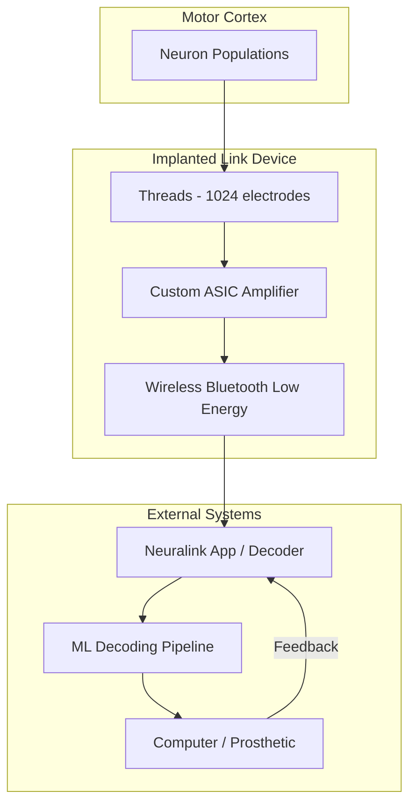

# 2021 AI 编年史：脑机接口与 Neuralink | Brain-Computer Interface in 2021

---

## 一、概述与背景知识 | Overview & Background

**English**

A **Brain-Computer Interface (BCI)** establishes a direct communication pathway between the **brain's electrical activity** and external devices — bypassing conventional muscle-controlled pathways. **Neural decoding** uses ML/DL to translate **neural signals** (spikes, local field potentials, EEG) into **control commands** or **text output**.

2021 was Neuralink's most visible year:

- **April 2021**: Video of **Pager the macaque** playing **MindPong** (Pong via decoded motor cortex signals) — no physical controller
- **FDA Breakthrough Device Designation** discussions for assistive communication
- Competing progress: **Synchron** (Stentrode, endovascular BCI), **Blackrock Neurotech**, **BrainGate** clinical trials

**Key terms:**

| Term | Definition |
|------|------------|
| **BCI (Brain-Computer Interface)** | System translating neural activity to device commands |
| **Invasive BCI** | Implanted electrodes (Neuralink, Utah array) — high SNR |
| **Non-invasive BCI** | EEG, fNIRS, MEG — no surgery, lower bandwidth |
| **Motor cortex** | Brain region encoding movement intent |
| **Spike sorting** | Identifying individual neuron action potentials from raw signals |
| **Neural decoding** | ML model mapping neural patterns → intended action |
| **Utah array** | 96-microelectrode array, clinical research standard |
| **Closed-loop BCI** | Sensory feedback returned to user (bidirectional) |

**中文**

**脑机接口（BCI）** 在大脑 **电活动** 与外部设备之间建立直接通信通路 — 绕过传统肌肉控制路径。**神经解码** 用 ML/DL 将 **神经信号**（ spike、局部场电位、EEG）翻译为 **控制指令** 或 **文本输出**。

2021 年是 Neuralink 曝光度最高的一年：

- **2021 年 4 月**：**Pager 猕猴** 玩 **MindPong**（解码运动皮层信号控制 Pong）— 无物理控制器
- **FDA 突破性设备** 认定讨论（辅助通信）
- 竞争进展：**Synchron**（Stentrode 血管内 BCI）、**Blackrock Neurotech**、**BrainGate** 临床试验

**核心术语：**

| 术语 | 含义 |
|------|------|
| **BCI** | 将神经活动转为设备指令的系统 |
| **侵入式 BCI** | 植入电极（Neuralink、Utah array）— 高信噪比 |
| **非侵入式 BCI** | EEG、fNIRS、MEG — 无手术，带宽较低 |
| **运动皮层** | 编码运动意图的脑区 |
| **Spike  sorting** | 从原始信号识别单个神经元动作电位 |
| **神经解码** | 神经模式 → 意图动作的 ML 模型 |
| **Utah array** | 96 微电极阵列，临床研究标准 |
| **闭环 BCI** | 感觉反馈返回用户（双向） |

BCI 是 **AI + 神经科学 + 医疗器械** 的交叉领域 — 2021 年 Neuralink 将 BCI 从学术/医疗 niche 推入 **公众视野**。

---

## 二、技术架构 | Architecture

### 2.1 Neuralink N1 系统架构



**English**

Neuralink's **Link** device implants **flexible threads** (1024 electrodes) into motor cortex. A **custom ASIC** amplifies and digitizes neural signals. Data transmits wirelessly to an external decoder running **real-time ML** (typically **Kalman filters + RNNs** or **LSTM decoders**) that maps firing rate patterns to **2D cursor velocity** — enabling Pong paddle control.

**中文**

Neuralink **Link** 设备将 **柔性 thread**（1024 电极）植入运动皮层。**定制 ASIC** 放大并数字化神经信号。数据无线传输至外部解码器，运行 **实时 ML**（通常 **Kalman 滤波 + RNN/LSTM 解码器**），将 firing rate 映射为 **二维光标速度** — 实现 Pong 挡板控制。

### 2.2 侵入式 vs. 非侵入式 BCI 对比

```
Invasive (Neuralink, Utah Array, Stentrode)
├── Single-neuron / small population resolution
├── kbps–Mbps neural bandwidth
├── Surgical risk, FDA regulatory path
└── Target: paralysis, ALS communication

Non-Invasive (EEG headsets, fNIRS)
├── Scalp-level averaged signals
├── bps bandwidth, high noise
├── Consumer wellness, research, prosthetic trigger
└── Target: meditation apps, basic wheelchair control
```

| 特性 | Neuralink (侵入式) | EEG (非侵入式) |
|------|-------------------|----------------|
| 电极数 | 1024+ | 8–256 |
| 信噪比 | 高 | 低 |
| 手术 | 需要 | 不需要 |
| 带宽 | 高（多 DOF 控制） | 低（简单命令） |
| 延迟 | ms 级 | 100ms+ |
| 2021 阶段 | 动物试验 → 人试准备 | 消费级产品 |

### 2.3 神经解码 ML 流水线

**English**

1. **Signal acquisition**: Raw voltage → bandpass filter → spike detection
2. **Feature extraction**: Firing rates in sliding windows (100–500ms)
3. **Decoder training**: Supervised learning on known movement intentions (calibration phase)
4. **Online inference**: Real-time prediction at 10–100 Hz
5. **Adaptive recalibration**: Continual learning as neural signals drift (electrode encapsulation)

**中文**

1. **信号采集**：原始电压 → 带通滤波 → spike 检测
2. **特征提取**：滑动窗口（100–500ms）firing rate
3. **解码器训练**：已知运动意图上的监督学习（校准阶段）
4. **在线推理**：10–100 Hz 实时预测
5. **自适应重校准**：神经信号漂移时持续学习（电极 encapsulation）

### 2.4 竞争架构：Synchron Stentrode

```
Endovascular approach (no craniotomy)
Blood vessel → Stentrode electrode array
         ↓
Wireless transmitter (chest implant)
         ↓
Motor intent decoding → computer control

Advantage: lower surgical risk
Trade-off: fewer channels vs. Neuralink threads
```

---

## 三、发展趋势 | Trends

**English**

1. **From demo to clinical**: 2021 MindPong was PR breakthrough; 2022+ focus shifted to **human trials** and **assistive communication** (typing via imagined handwriting).
2. **AI decoder improvement**: Deep learning (RNNs, transformers on neural sequences) replacing linear decoders — higher DOF control.
3. **Bidirectional BCI**: Sensory feedback via **intracortical microstimulation** — closed-loop prosthetics.
4. **Regulatory pathway**: FDA Breakthrough Device program accelerating BCI for **locked-in syndrome**.
5. **Ethical debate**: Neural data privacy, enhancement vs. therapy, equitable access — public discourse intensified post-2021.
6. **Non-invasive consumer BCIs**: Meta (CTRL-Labs EMG), NextMind (visual cortex EEG) — different trade-offs.

**中文**

1. **从演示到临床**：2021 MindPong 是 PR 突破；2022+ 转向 **人体试验** 与 **辅助通信**（想象手写打字）。
2. **AI 解码器进步**：深度学习（RNN、神经序列 Transformer）替代线性解码器 — 更高自由度控制。
3. **双向 BCI**：**皮层内微刺激** 感觉反馈 — 闭环假肢。
4. **监管路径**：FDA 突破性设备计划加速 **闭锁综合征** BCI。
5. **伦理讨论**：神经数据隐私、增强 vs. 治疗、公平可及 — 2021 后公众 discourse  intensified。
6. **非侵入消费级 BCI**：Meta（CTRL-Labs EMG）、NextMind — 不同 trade-off。

---

## 四、优缺点分析 | Pros & Cons

| 维度 | 优点 Advantages | 缺点 Disadvantages |
|------|-----------------|---------------------|
| **侵入式精度** | 单神经元级解码，高 DOF | 手术风险、感染、排异 |
| **Neuralink** | 无线、高通道数、ASIC 集成 | 长期稳定性未充分验证 |
| **非侵入式** | 安全、可普及 | 带宽低、噪声大 |
| **AI 解码** | 自适应、高维控制 | 需大量校准数据 |
| **医疗价值** | 瘫痪患者恢复沟通/控制 | 成本极高，可及性有限 |
| **隐私** | 本地解码可能保护神经数据 | 无线传输黑客风险 |
| **伦理** | 改善生活质量 | 增强/监控滥用可能 |

---

## 五、应用场景 | Use Cases

| 场景 | 说明 |
|------|------|
| **辅助通信** | ALS/闭锁综合征患者意念打字 |
| **运动假肢** | 解码运动皮层控制机械臂/手 |
| **轮椅控制** | 非侵入式 EEG 方向指令 |
| **癫痫监测** | 植入电极预测发作 |
| **深度脑刺激** | Parkinson's 闭环 DBS 优化 |
| **科研** | 神经科学基础研究与脑图谱 |
| **康复** | 中风后运动功能 BCI 训练 |

---

## 六、开源项目与工具 | Open Source & Tools

| 项目 | 说明 | URL |
|------|------|-----|
| **NeuroTechX/bci-datasets** | BCI 数据集索引 | https://github.com/NeuroTechX/bci-datasets |
| **mne-tools/mne-python** | 神经信号分析（EEG/MEG） | https://github.com/mne-tools/mne-python |
| **sccnlab/labstreaminglayer** | 实时神经数据流 | https://github.com/sccnlab/labstreaminglayer |
| **pytorch/pytorch** | 神经解码 RNN/Transformer 训练 | https://github.com/pytorch/pytorch |
| **BrainGate** | 临床研究联盟（参考） | https://www.braingate.org/ |
| **OpenBCI** | 开源 EEG 硬件与软件 | https://github.com/OpenBCI |
| **MOABB** | BCI benchmark 框架 | https://github.com/NeuroTechX/moabb |

> 注：Neuralink 硬件与解码器为 proprietary；上表为 BCI 研究与非侵入式生态的开源工具。

---

## 七、参考文献 | References

1. Musk, E., Neuralink Team. **"Pager Plays Pong with His Mind."** Neuralink Blog, April 2021. https://neuralink.com/blog/
2. Musk, E., Neuralink Team. **"Neuralink Progress Update, Summer 2021."** https://neuralink.com/
3. Hochberg, L.R., et al. **"Reach and grasp by people with tetraplegia using a neurally controlled robotic arm."** Nature 2012 (BrainGate foundation). https://www.nature.com/articles/nature11076
4. Gilja, V., et al. **"A high-performance neural prosthesis enabled by control algorithm design."** Nature Neuroscience 2012. https://www.nature.com/articles/nn.3265
5. Oxley, T.J., et al. **"Motor neuroprosthesis implanted with neurointerventional surgery."** JAMA Neurology 2021 (Synchron). https://jamanetwork.com/journals/jamaneurology/fullarticle/2772066
6. Wolpaw, J., & Wolpaw, E.W. **Brain-Computer Interfaces: Principles and Practice.** Oxford University Press, 2012.
7. FDA. **Breakthrough Devices Program Guidance.** https://www.fda.gov/medical-devices/how-study-and-market-your-device/breakthrough-devices-program

---

**English Summary**: 2021 Neuralink's MindPong demo brought invasive BCI into mainstream consciousness — showcasing how real-time neural decoding and AI could restore agency for paralysis patients, while raising profound ethical questions about neural privacy and human enhancement.

**中文总结**：2021 年 Neuralink MindPong 演示将侵入式 BCI 带入公众视野 — 展示实时神经解码与 AI 如何为瘫痪患者恢复行动力，同时引发关于神经隐私与人类增强的深刻伦理讨论。
