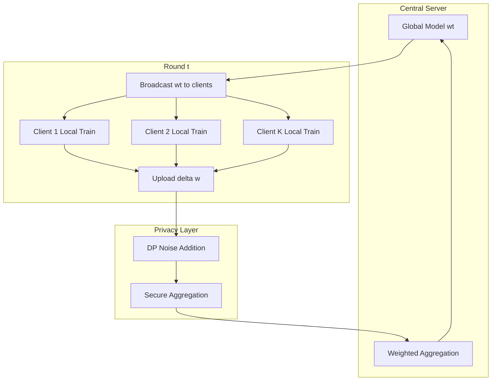

# 2021 AI 编年史：联邦学习与隐私计算 | Federated Learning in 2021

---

## 一、概述与背景知识 | Overview & Background

**English**

**Federated Learning (FL)** trains a shared ML model across **decentralized devices or organizations** without exchanging raw data — only **model updates** (gradients or weights) are communicated. Combined with **privacy computing** techniques (**differential privacy**, **secure aggregation**, **homomorphic encryption**), FL became a 2021 **industrial standard** for regulated domains: finance, healthcare, and mobile keyboards.

Key 2021 milestones:

- **Google Gboard** — billions of devices contribute to **next-word prediction** via FL
- **FATE (Federated AI Technology Enabler)** — WeBank open-source FL platform adoption in China
- **TensorFlow Federated (TFF)** — Google's FL simulation and deployment framework
- **Apple + Google Exposure Notification** — privacy-preserving contact tracing (related privacy tech)
- **Cross-silo FL** — hospitals/banks training jointly on sensitive data

**Key terms:**

| Term | Definition |
|------|------------|
| **Client (participant)** | Device or organization holding local private data |
| **Server (aggregator)** | Coordinates rounds; combines client updates |
| **FedAvg** | Federated Averaging — weighted average of client model weights |
| **Non-IID data** | Client data distributions differ — major FL challenge |
| **Differential Privacy (DP)** | Mathematical guarantee limiting individual data leakage |
| **Secure Aggregation (SecAgg)** | Cryptographic protocol: server sees only sum of updates |
| **Cross-device FL** | Many mobile devices (Google Gboard) |
| **Cross-silo FL** | Few institutions (hospitals, banks) |

**中文**

**联邦学习（FL）** 在 **分散设备或机构** 上训练共享 ML 模型，**不交换原始数据** — 仅通信 **模型更新**（梯度或权重）。结合 **差分隐私**、**安全聚合**、**同态加密** 等 **隐私计算** 技术，FL 在 2021 年成为金融、医疗、移动输入法等 **监管领域** 的工业标准。

2021 关键里程碑：

- **Google Gboard** — 数十亿设备通过 FL 贡献 **下一词预测**
- **FATE** — 微众银行开源 FL 平台在国内 adoption
- **TensorFlow Federated（TFF）** — Google FL 仿真与部署框架
- **Apple + Google 暴露通知** — 隐私保护接触追踪（相关隐私技术）
- **Cross-silo FL** — 医院/银行在敏感数据上联合训练

**核心术语：**

| 术语 | 含义 |
|------|------|
| **客户端（参与方）** | 持有本地私有数据的设备或机构 |
| **服务端（聚合器）** | 协调训练轮次，合并客户端更新 |
| **FedAvg** | 联邦平均 — 客户端模型权重加权平均 |
| **Non-IID 数据** | 客户端数据分布差异 — FL 主要挑战 |
| **差分隐私（DP）** | 限制个体数据泄露的数学保证 |
| **安全聚合（SecAgg）** | 密码学协议：服务端仅见更新之和 |
| **Cross-device FL** | 大量移动设备（Gboard） |
| **Cross-silo FL** | 少数机构（医院、银行） |

FL 是 2021 年 **数据不出域** 合规要求下的核心 AI 范式 — 中国《个人信息保护法》（2021 年 11 月施行）进一步加速 adoption。

---

## 二、技术架构 | Architecture

### 2.1 经典 FedAvg 流程



**English**

Each round: (1) Server broadcasts global model; (2) Each selected client trains on local data for E epochs; (3) Clients upload **Δw**; (4) Server aggregates: **w_{t+1} = Σ (n_k/N) · w_k**; repeat until convergence.

**中文**

每轮：(1) 服务端广播全局模型；(2) 各选中客户端本地训练 E epoch；(3) 上传 **Δw**；(4) 服务端聚合：**w_{t+1} = Σ (n_k/N) · w_k**；重复至收敛。

### 2.2 Cross-Device vs. Cross-Silo

```
Cross-Device (Mobile FL)
├── Millions of clients (phones)
├── High client dropout / unreliable network
├── Small local datasets per client
└── Example: Gboard next-word prediction

Cross-Silo (Enterprise FL)
├── 3–100 institutions (hospitals, banks)
├── Reliable connections, high compute per client
├── Large local datasets, strong Non-IID
└── Example: multi-hospital disease prediction
```

### 2.3 隐私计算技术栈

| 技术 | 作用 | 2021 成熟度 |
|------|------|-------------|
| **Differential Privacy** | 更新加噪，(ε,δ)-DP 保证 | 生产可用（Gboard） |
| **Secure Aggregation** | 服务端无法看单个客户端更新 | Google 部署 |
| **Homomorphic Encryption** | 加密数据上计算 | 研究/试点 |
| **SMPC** | 多方安全计算 | FATE 支持 |
| **Trusted Execution (TEE)** | SGX/TrustZone 隔离 | 金融试点 |

### 2.4 FATE 平台架构

**English**

FATE provides **horizontal FL** (same features, different samples — e.g., banks) and **vertical FL** (same samples, different features — e.g., bank + e-commerce). Components: **FederatedML** (algorithms), **FATE-Flow** (scheduling), **KubeFATE** (K8s deployment).

**中文**

FATE 提供 **横向联邦**（同特征不同样本 — 如银行间）与 **纵向联邦**（同样本不同特征 — 如银行+电商）。组件：**FederatedML**（算法）、**FATE-Flow**（调度）、**KubeFATE**（K8s 部署）。

---

## 三、发展趋势 | Trends

**English**

1. **Regulation-driven adoption**: China's PIPL (Nov 2021), EU GDPR pushed FL from research to **mandatory architecture**.
2. **Personalization**: **FedAvg + local fine-tuning** — global model + on-device personalization (Gboard user style).
3. **Vertical FL growth**: Chinese fintech used VFL for **joint credit scoring** without data sharing.
4. **FL + LLM preview**: Early federated **BERT fine-tuning** experiments before 2023 federated LLM research.
5. **Benchmark standardization**: LEAF, FedML, Flower framework unified evaluation.
6. **Byzantine robustness**: Defending against **poisoned client updates** — critical for open participation.

**中文**

1. **法规驱动**：《个人信息保护法》（2021.11）、GDPR 推动 FL 从研究变为 **必选架构**。
2. **个性化**：**FedAvg + 本地微调** — 全局模型 + 端侧个性化（Gboard 用户风格）。
3. **纵向联邦增长**：中国金融科技用 VFL 做 **联合征信** 不共享数据。
4. **FL + LLM 预演**：联邦 **BERT 微调** 实验早于 2023 联邦 LLM 研究。
5. **Benchmark 标准化**：LEAF、FedML、Flower 统一评估。
6. **拜占庭鲁棒性**：防御 **投毒客户端更新** — 开放参与场景关键。

---

## 四、优缺点分析 | Pros & Cons

| 维度 | 优点 Advantages | 缺点 Disadvantages |
|------|-----------------|---------------------|
| **隐私** | 原始数据不出本地 | 梯度反演攻击仍可能泄露 |
| **合规** | 满足数据本地化法规 | 跨境 FL 法律框架不完善 |
| **数据效用** | 利用分散数据总量 | Non-IID 导致收敛慢/偏差 |
| **通信** | 仅传模型更新 | 大模型更新带宽仍高 |
| **FedAvg** | 简单、可证明收敛（IID） | 非 IID 性能下降明显 |
| **DP** | 可证明隐私保证 | 精度-隐私 trade-off |
| **工程** | FATE/TFF 降低门槛 | 跨机构协调成本高 |

---

## 五、应用场景 | Use Cases

| 场景 | 说明 |
|------|------|
| **移动输入法** | Gboard/SwiftKey 下一词预测 |
| **金融风控** | 银行间联合反欺诈模型 |
| **医疗 AI** | 多医院联合训练诊断模型 |
| **物联网** | 工厂设备异常检测联邦训练 |
| **广告** | 跨 app 用户建模（隐私受限） |
| **自动驾驶** | 车队数据联邦学习（试点） |
| **政务** | 跨部门数据协作不出域 |

---

## 六、开源项目与工具 | Open Source & Tools

| 项目 | 说明 | URL |
|------|------|-----|
| **FederatedAI/FATE** | 微众银行联邦学习平台 | https://github.com/FederatedAI/FATE |
| **TensorFlow Federated** | Google FL 框架 | https://github.com/tensorflow/federated |
| **adaptives/flower** | 统一 FL 客户端-服务端框架 | https://github.com/adap/flower |
| **FedML-AI/FedML** | Research + 云平台 | https://github.com/FedML-AI/FedML |
| **OpenMined/PySyft** | 隐私 preserving ML | https://github.com/OpenMined/PySyft |
| **google-research/federated** | Google FL 研究代码 | https://github.com/google-research/federated |
| **microsoft/nni** | 含 FL 算法模块 | https://github.com/microsoft/nni |

---

## 七、参考文献 | References

1. McMahan, B., et al. **"Communication-Efficient Learning of Deep Networks from Decentralized Data (FedAvg)."** AISTATS 2017. https://arxiv.org/abs/1602.05629
2. Kairouz, P., et al. **"Advances and Open Problems in Federated Learning."** Foundations and Trends in ML, 2021. https://arxiv.org/abs/1912.04977
3. Bonawitz, K., et al. **"Towards Federated Learning at Scale: System Design."** SysML 2019 (Gboard production). https://arxiv.org/abs/1902.01046
4. Yang, Q., et al. **"Federated Machine Learning: Concept and Applications."** ACM TIST 2019. https://arxiv.org/abs/1902.04885
5. Wei, K., et al. **"Federated Learning with Differential Privacy: Algorithms and Performance Analysis."** IEEE TIFS 2020. https://arxiv.org/abs/1911.00222
6. FATE Documentation. https://fate.readthedocs.io/
7. TensorFlow Federated Guide. https://www.tensorflow.org/federated

---

**English Summary**: 2021 federated learning transitioned from academic concept to regulated-industry infrastructure — powered by Gboard-scale cross-device deployment, FATE cross-silo platforms, and privacy computing that made collaborative AI legally viable.

**中文总结**：2021 年联邦学习从学术概念转为受监管行业基础设施 — Gboard 级 cross-device 部署、FATE cross-silo 平台与隐私计算使协作式 AI 在法律上可行。
