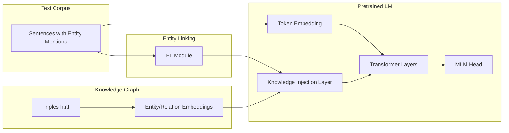

# 2021 AI 编年史：知识增强预训练 | Knowledge-Enhanced Pretraining in 2021

---

## 一、概述与背景知识 | Overview & Background

**English**

**Knowledge-Enhanced Pretraining (KEP)** augments standard **Language Model Pretraining (LMP)** by injecting **structured knowledge** — typically from **Knowledge Graphs (KGs)** such as Wikidata, Freebase, or domain-specific graphs — into the model's representation space. In 2021, KEP matured from niche research into a **mainstream industrial practice**, driven by the need for **factual accuracy**, **entity-aware reasoning**, and **robustness on knowledge-intensive tasks**.

Representative 2021 systems:

- **KEPLM** (Knowledge-Enhanced Pre-trained Language Model) — unified entity linking + masked language modeling
- **K-BERT** — injects triples as **visible tree structures** without breaking tokenization
- **KEPLER** — joint optimization of **KG embedding** and **MLM** objectives
- **ERNIE 3.0** — large-scale production KG fusion at Baidu

**Key terms:**

| Term | Definition |
|------|------------|
| **Knowledge Graph (KG)** | Structured store of (head, relation, tail) triples representing facts |
| **Entity Linking (EL)** | Mapping text mentions to canonical KG entity IDs |
| **MLM (Masked Language Modeling)** | BERT-style pretraining: predict masked tokens from context |
| **KG Embedding** | Dense vector representations of entities and relations (TransE, RotatE, etc.) |
| **Factual consistency** | Model outputs align with verifiable world knowledge |
| **Knowledge-intensive NLP** | Tasks requiring external facts: QA, relation extraction, entity typing |

**中文**

**知识增强预训练（KEP）** 在标准 **语言模型预训练（LMP）** 基础上，注入来自 **知识图谱（KG）** 的结构化知识——如 Wikidata、Freebase 或领域图谱——以提升模型的 **事实性**、**实体推理** 与 **知识密集型任务** 表现。2021 年 KEP 从学术探索走向 **工业主流**。

代表性工作：

- **KEPLM** — 统一实体链接与掩码语言建模
- **K-BERT** — 将三元组以 **可见树结构** 注入，不破坏分词
- **KEPLER** — **图谱嵌入** 与 **MLM** 联合优化
- **ERNIE 3.0** — 百度大规模生产级知识融合

**核心术语：**

| 术语 | 含义 |
|------|------|
| **知识图谱（KG）** | 以（头实体, 关系, 尾实体）三元组存储事实的结构化知识库 |
| **实体链接（EL）** | 将文本中的 mention 映射到图谱标准实体 ID |
| **MLM（掩码语言建模）** | BERT 式预训练：根据上下文预测被 mask 的 token |
| **KG 嵌入** | 实体与关系的稠密向量表示（TransE、RotatE 等） |
| **事实一致性** | 模型输出与可验证世界知识相符 |
| **知识密集型 NLP** | 依赖外部事实的任务：问答、关系抽取、实体 typing |

纯文本预训练虽能捕获统计共现，但对 **长尾实体**、**精确属性** 与 **逻辑关系** 建模不足；KEP 通过显式知识通道弥补这一缺口，为 2023 年 RAG 与工具调用范式提供了早期思想基础。

---

## 二、技术架构 | Architecture

### 2.1 通用 KEP 流水线



**English**: Raw text passes through **entity linking** to retrieve relevant triples. Knowledge is injected via **embedding lookup**, **soft position encoding** (K-BERT), or **cross-attention** (ERNIE). The LM backbone jointly optimizes language modeling and knowledge alignment losses.

**中文**：原始文本经 **实体链接** 检索相关三元组；知识通过 **嵌入查找**、**软位置编码**（K-BERT）或 **交叉注意力**（ERNIE）注入。语言模型主干联合优化语言建模损失与知识对齐损失。

### 2.2 K-BERT：可见矩阵注入

**English**

K-BERT constructs a **sentence tree** by attaching KG triples as branches. A **visible matrix** controls which tokens can attend to which — preventing knowledge tokens from "polluting" unrelated context while preserving BERT's bidirectional attention within allowed regions.

```
Input: "Tim Cook is CEO of Apple."
Linked triples: (Tim Cook, CEO_of, Apple Inc.), (Apple Inc., founded_in, 1976)

Sentence Tree:
Tim Cook ── CEO_of ── Apple Inc. ── founded_in ── 1976
    │                      │
    └──── is CEO of ───────┘

Visible Matrix: blocks cross-branch attention between unrelated subtrees
```

**中文**

K-BERT 将 KG 三元组挂载为 **句子树** 分支，用 **可见矩阵** 控制注意力范围——知识 token 不会污染无关上下文，同时在允许区域内保持 BERT 双向注意力。

### 2.3 KEPLER 双任务架构

| 组件 | 功能 |
|------|------|
| **Text Encoder** | RoBERTa-style MLM on entity-rich sentences |
| **KG Encoder** | TransE-style scoring: ‖h + r − t‖ |
| **Shared Entity Embeddings** | Same entity vectors used in both objectives |
| **Joint Loss** | L = L_MLM + λ · L_KG |

### 2.4 ERNIE 3.0 持续知识预训练

**English**

ERNIE 3.0 alternates **general corpus phases** with **knowledge-specific phases** where entity spans are masked and must be predicted using both context and KG neighbors — enabling **260B-scale** knowledge retention without separate retrieval at inference (though hybrid systems later combined both).

**中文**

ERNIE 3.0 在 **通用语料阶段** 与 **知识专用阶段** 间交替训练：mask 实体 span 时须结合上下文与 KG 邻居预测，在 **2600 亿** 规模下内化知识，推理时无需单独检索（尽管后续混合系统常二者结合）。

---

## 三、发展趋势 | Trends

**English**

1. **From static injection to dynamic retrieval**: KEP evolved toward **RAG (Retrieval-Augmented Generation)** — external KB lookup at inference rather than only baked-in weights.
2. **Unified entity representations**: Joint text-KG embedding spaces (KEPLER, ERNIE) became standard for **entity linking** and **link prediction**.
3. **Domain KGs**: Medical (UMLS), legal, and financial graphs drove **vertical KEP** models.
4. **Multilingual knowledge**: Cross-lingual entity alignment enabled **transfer** from English KGs to low-resource languages.
5. **Evaluation shift**: Benchmarks like **KILT**, **EntityQuestions**, and **Open Entity** measured factual grounding explicitly.
6. **Merge with LLM scaling**: By late 2021, KEP was viewed as **complementary** to scale — not a replacement for trillion-parameter LMs.

**中文**

1. **从静态注入到动态检索**：KEP 向 **RAG** 演进——推理时查外部 KB，而非仅依赖权重内化。
2. **统一实体表示**：文本-KG 联合嵌入（KEPLER、ERNIE）成为 **实体链接** 与 **链接预测** 标准方案。
3. **领域图谱**：医疗（UMLS）、法律、金融图谱驱动 **垂直 KEP**。
4. **多语言知识**：跨语言实体对齐支持从英语 KG 向低资源语言 **迁移**。
5. **评测转向**：KILT、EntityQuestions 等基准 Explicit 衡量事实 grounding。
6. **与 LLM 缩放融合**：2021 年底 KEP 被视为 **规模化的补充** 而非替代。

---

## 四、优缺点分析 | Pros & Cons

| 维度 | 优点 Advantages | 缺点 Disadvantages |
|------|-----------------|---------------------|
| **事实性** | 提升实体 QA、关系抽取准确率 | 图谱错误会 propagates 到模型 |
| **长尾实体** | 结构化 ID 帮助 rare entity 表征 | EL 错误导致知识噪声 |
| **可解释性** | 可追溯 linked triples 作为依据 | 深度注入后归因仍困难 |
| **训练成本** | 比同等规模纯文本略增数据工程 | KG 构建与维护持续投入大 |
| **时效性** | 更新 KG 后可继续预训练/微调 | 权重内化知识更新滞后 |
| **泛化** | 跨任务迁移（NLU+KG tasks） | 对开放域 creative 生成帮助有限 |
| **工程** | K-BERT 等即插即用 | 大规模 cross-attention 通信开销高 |

---

## 五、应用场景 | Use Cases

| 场景 Scenario | 中文说明 | English |
|---------------|----------|---------|
| **搜索引擎** | 实体感知排序与知识卡片 | Entity-aware ranking and knowledge panels |
| **智能客服** | 产品规格、政策等 factual QA | Factual QA on product specs and policies |
| **医疗 NLP** | 疾病-药物-症状关系推理 | Disease-drug-symptom relation reasoning |
| **金融风控** | 企业关联图谱与事件抽取 | Corporate graph linking and event extraction |
| **法律文书** | 法条引用与案例检索 | Statute citation and case retrieval |
| **对话系统** | 减少幻觉，增强实体消歧 | Reduced hallucination, better entity disambiguation |
| **推荐系统** | 知识图谱增强用户-物品建模 | KG-augmented user-item modeling |

---

## 六、开源项目与工具 | Open Source & Tools

| 项目 | 说明 | URL |
|------|------|-----|
| **PaddleNLP (ERNIE)** | ERNIE 系列预训练与下游任务 | https://github.com/PaddlePaddle/PaddleNLP |
| **K-BERT** | 官方 K-BERT 实现 | https://github.com/autoliuweijian/K-BERT |
| **KEPLER** | UniLM 团队 KEPLER 代码 | https://github.com/mniepert/kepler |
| **Hugging Face Transformers** | BERT/RoBERTa 微调基座 | https://github.com/huggingface/transformers |
| **OpenKE** | 知识图谱嵌入工具包 | https://github.com/thunlp/OpenKE |
| **DGL-KE** | 大规模 KG 嵌入训练 | https://github.com/awslabs/dgl-ke |
| **Wikidata Toolkit** | Wikidata 数据解析 | https://github.com/Wikidata/Wikidata-Toolkit |

---

## 七、参考文献 | References

1. Liu, W., et al. **"K-BERT: Enabling Language Representation with Knowledge Graph."** AAAI 2020 (广泛引用至 2021 工业实践). https://arxiv.org/abs/1909.07606
2. Wang, X., et al. **"KEPLER: A Unified Model for Knowledge Embedding and Pre-trained Language Representation."** TACL 2021. https://arxiv.org/abs/1911.06136
3. Sun, Y., et al. **"ERNIE 3.0: Large-scale Knowledge Enhanced Pre-training."** arXiv:2107.02137. https://arxiv.org/abs/2107.02137
4. Xiong, W., et al. **"Pretrained Encyclopedia: Weakly Supervised Knowledge-Pretrained Language Model."** ICLR 2021. https://arxiv.org/abs/1912.09637
5. Petroni, F., et al. **"KILT: a Benchmark for Knowledge Intensive Language Tasks."** NAACL 2021. https://arxiv.org/abs/2009.02252
6. Bordes, A., et al. **"Translating Embeddings for Modeling Multi-relational Data (TransE)."** NeurIPS 2013. https://arxiv.org/abs/1301.3781
7. Devlin, J., et al. **"BERT: Pre-training of Deep Bidirectional Transformers."** NAACL 2019. https://arxiv.org/abs/1810.04805

---

**English Summary**: 2021 cemented knowledge-enhanced pretraining as the bridge between symbolic KGs and neural LMs — improving factual NLP while foreshadowing the retrieval-augmented systems that would dominate enterprise AI after ChatGPT.

**中文总结**：2021 年知识增强预训练成为符号知识图谱与神经语言模型之间的桥梁，显著提升事实性 NLP 能力，并为 ChatGPT 之后企业级 RAG 系统奠定方法论基础。
