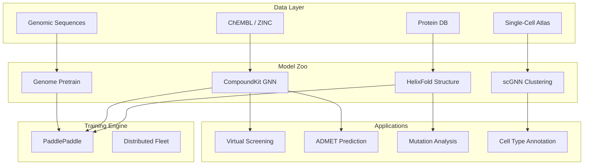

# 2021 AI 编年史：PaddleHelix 生物计算 | PaddleHelix Bio-Computing in 2021

---

## 一、概述与背景知识 | Overview & Background

**English**

**PaddleHelix** is Baidu's open-source **AI bio-computing platform** built on **PaddlePaddle**, launched and expanded throughout 2020–2021. It targets the full **AI for Life Sciences** pipeline:

- **Protein structure prediction** (HelixFold — Baidu's AlphaFold-class system)
- **Drug discovery** — molecular property prediction, virtual screening, **ADMET** prediction
- **Genomics** — DNA/RNA sequence pretraining and variant effect prediction
- **Single-cell analysis** — scRNA-seq clustering and annotation

2021 was pivotal: AlphaFold2's release triggered a global race, and PaddleHelix positioned itself as the **Chinese open-source bio-AI stack** with integrated datasets, pretrained models, and cloud deployment on **Baidu AI Cloud**.

**Key terms:**

| Term | Definition |
|------|------------|
| **SMILES** | Text notation for molecular structures (drug compounds) |
| **ADMET** | Absorption, Distribution, Metabolism, Excretion, Toxicity — drug safety properties |
| **Virtual screening** | Computational ranking of candidate molecules against a target |
| **Molecular fingerprint** | Fixed-length vector encoding chemical structure |
| **GNN (Graph Neural Network)** | Neural networks on molecular graphs (atoms = nodes, bonds = edges) |
| **scRNA-seq** | Single-cell RNA sequencing — gene expression per individual cell |
| **Variant calling** | Identifying genetic mutations from sequencing data |

**中文**

**PaddleHelix** 是百度基于 **PaddlePaddle** 的开源 **AI 生物计算平台**，2020–2021 年持续扩展。覆盖 **AI for 生命科学** 全链路：

- **蛋白质结构预测**（HelixFold — 百度 AlphaFold 级系统）
- **药物发现** — 分子性质预测、虚拟筛选、**ADMET** 预测
- **基因组学** — DNA/RNA 序列预训练与变异效应预测
- **单细胞分析** — scRNA-seq 聚类与注释

2021 年 AlphaFold2 发布引发全球竞赛，PaddleHelix 定位为 **中文开源生物 AI 栈**，集成数据集、预训练模型与 **百度智能云** 部署。

**核心术语：**

| 术语 | 含义 |
|------|------|
| **SMILES** | 分子结构的文本表示（药物化合物） |
| **ADMET** | 吸收、分布、代谢、排泄、毒性 — 药物安全属性 |
| **虚拟筛选** | 计算排序候选分子与靶点的结合潜力 |
| **分子指纹** | 编码化学结构的定长向量 |
| **GNN（图神经网络）** | 分子图上的神经网络（原子=节点，键=边） |
| **scRNA-seq** | 单细胞 RNA 测序 — 每个细胞的基因表达 |
| **变异检测** | 从测序数据识别基因突变 |

PaddleHelix 将分散的生物 AI 工具 **平台化** — 降低药企与 CRO 的 AI 采用门槛。

---

## 二、技术架构 | Architecture

### 2.1 PaddleHelix 平台总览



### 2.2 HelixFold 蛋白结构预测

**English**

HelixFold implements an **AlphaFold2-inspired architecture** with Evoformer-style blocks and structure module, optimized for **PaddlePaddle** distributed training on Baidu's **Kunlun XPU** and NVIDIA GPUs. It provides:

- MSA search via integrated **HHblits/JackHMMER** pipelines
- pLDDT confidence scores
- Batch prediction API for proteomics workflows

**中文**

HelixFold 实现 **AlphaFold2 风格架构**，含 Evoformer 块与结构模块，针对 **PaddlePaddle** 在 **昆仑 XPU** 与 NVIDIA GPU 上分布式训练优化。提供 MSA 搜索、pLDDT 置信度与批量预测 API。

```
HelixFold Pipeline
Sequence Input → MSA Generation → Evoformer → Structure Module → PDB Output
                      ↑
              PaddleHelix data preprocessing
```

### 2.3 CompoundKit 药物分子 GNN

| 模块 | 功能 |
|------|------|
| **Graph Encoder** | GIN/GAT on molecular graphs from SMILES |
| **Pretraining** | Masked atom/bond prediction on ZINC/ChEMBL |
| **Fine-tuning heads** | IC50, solubility, toxicity (Tox21) |
| **Virtual screening** | Rank millions of compounds by predicted binding |

### 2.4 基因组预训练

**English**

**LinearFold** (fast RNA folding) and **genomic BERT-style models** predict **splice sites**, **promoter regions**, and **variant pathogenicity** — extending NLP pretraining paradigms to **DNA k-mer tokens**.

**中文**

**LinearFold**（快速 RNA 折叠）与 **基因组 BERT 式模型** 预测 **剪接位点**、**启动子区域**、**变异致病性** — 将 NLP 预训练范式扩展至 **DNA k-mer token**。

---

## 三、发展趋势 | Trends

**English**

1. **Post-AlphaFold ecosystem**: 2021 platforms competed on **integrated pipelines** (structure → docking → ADMET) not just folding accuracy.
2. **Chinese bio-AI sovereignty**: PaddleHelix + Baidu Cloud offered **domestic alternative** to Google DeepMind stack.
3. **GNN for molecules**: Graph pretraining on **100M+ compounds** became standard before LLM-for-chemistry (2023+).
4. **Single-cell foundation models**: scRNA-seq pretraining foreshadowed **scGPT** (2023).
5. **XPU/GPU heterogeneity**: PaddleHelix optimized for **Kunlun** — early **heterogeneous AI** in bio.
6. **Open science tension**: Open-source code vs. proprietary training data in pharma.

**中文**

1. **AlphaFold 后生态**：2021 年平台竞争 **集成流水线**（结构 → 对接 → ADMET）而非仅折叠精度。
2. **中国生物 AI 自主**：PaddleHelix + 百度云提供 DeepMind 栈的 **国内替代**。
3. **分子 GNN**：**1 亿+ 化合物** 图预训练成标准（早于 2023+ 化学 LLM）。
4. **单细胞基础模型**：scRNA-seq 预训练预示 **scGPT**（2023）。
5. **XPU/GPU 异构**：PaddleHelix 针对 **昆仑** 优化 — 生物领域早期异构 AI。
6. **开放科学张力**：开源代码 vs.  pharma  proprietary 训练数据。

---

## 四、优缺点分析 | Pros & Cons

| 维度 | 优点 Advantages | 缺点 Disadvantages |
|------|-----------------|---------------------|
| **集成度** | 蛋白+药物+基因组一站式 | 各模块成熟度不一 |
| **开源** | Apache 2.0，可商用 | 部分模型权重需申请 |
| **HelixFold** | 接近 AlphaFold2 精度 | 国际 benchmark 曝光少于 AF2 |
| **CompoundKit** | 丰富 GNN 预训练模型 | 对新骨架泛化有限 |
| **云部署** | 百度 AI Cloud 一键部署 | 绑定国内云生态 |
| **文档** | 中文文档完善 | 英文社区支持较弱 |
| **合规** | 适合国内药企数据合规 | 跨境数据流动限制 |

---

## 五、应用场景 | Use Cases

| 场景 | 说明 |
|------|------|
| **靶点结构解析** | HelixFold 预测未解析蛋白结构 |
| **先导化合物优化** | ADMET 预测筛选候选药物 |
| **虚拟筛选** | 百万化合物库对接排序 |
| **精准医疗** | 基因变异致病性评估 |
| **RNA 药物** | mRNA 二级结构预测（LinearFold） |
| **肿瘤单细胞** | scRNA-seq 细胞类型注释 |
| **Epidemic surveillance** | 病毒基因组变异追踪 |

---

## 六、开源项目与工具 | Open Source & Tools

| 项目 | 说明 | URL |
|------|------|-----|
| **PaddleHelix** | 百度生物计算主仓库 | https://github.com/PaddlePaddle/PaddleHelix |
| **PaddlePaddle** | 深度学习框架 | https://github.com/PaddlePaddle/Paddle |
| **DeepMind AlphaFold** | 结构预测参照 | https://github.com/deepmind/alphafold |
| **DeepChem** | 开源药物发现 ML | https://github.com/deepchem/deepchem |
| **RDKit** | 化学信息学 toolkit | https://github.com/rdkit/rdkit |
| **OpenMM** | 分子动力学模拟 | https://github.com/openmm/openmm |
| **Scanpy** | 单细胞分析（Python） | https://github.com/scverse/scanpy |

---

## 七、参考文献 | References

1. PaddleHelix Team. **"PaddleHelix: An AI Bio-Computing Platform."** https://github.com/PaddlePaddle/PaddleHelix
2. Jumper, J., et al. **"Highly accurate protein structure prediction with AlphaFold."** Nature 596, 2021. https://www.nature.com/articles/s41586-021-03819-2
3. Yang, Z., et al. **"Analyzing Learned Molecular Representations for Property Prediction (Chemprop)."** JCIM 2020. https://arxiv.org/abs/2005.04126
4. Huang, W., et al. **"LinearFold: Linear-Time Approximate RNA Folding."** Bioinformatics 2019. https://academic.oup.com/bioinformatics/article/35/14/i295/5426094
5. Stokes, J., et al. **"A Deep Learning Approach to Antibiotic Discovery."** Cell 2020. https://www.cell.com/cell/fulltext/S0092-8674(20)30102-1
6. Baidu Research. **HelixFold Technical Report.** https://paddlehelix.baidu.com/
7. ChEMBL Database. https://www.ebi.ac.uk/chembl/

---

**English Summary**: PaddleHelix in 2021 assembled Baidu's bio-AI capabilities into an open platform — HelixFold for proteins, CompoundKit for drug discovery, and genomic models — positioning China in the post-AlphaFold computational biology race.

**中文总结**：2021 年 PaddleHelix 将百度生物 AI 能力整合为开放平台 — HelixFold 蛋白、CompoundKit 药物、基因组模型 — 使中国参与 AlphaFold 后的计算生物学竞赛。
