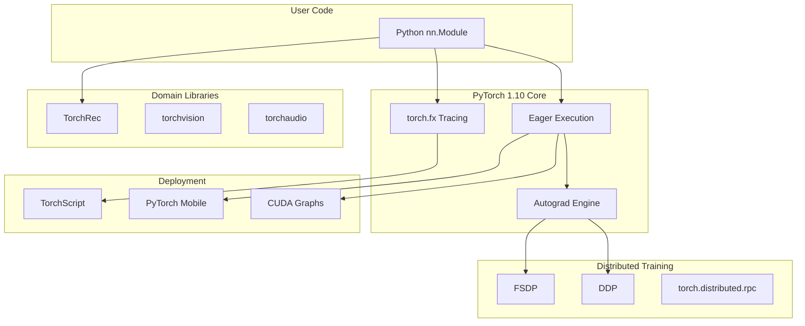

# 2021 AI 编年史：PyTorch 1.10 生态 | PyTorch 1.10 Ecosystem in 2021

---

## 一、概述与背景知识 | Overview & Background

**English**

**PyTorch** is Meta's open-source **deep learning framework** known for **dynamic computation graphs**, **Pythonic API**, and dominant **research adoption**. **PyTorch 1.10** (released October 2021) consolidated features critical for **production-scale training**:

- **TorchRec** — modular **recommendation system** library (sparse embeddings, sharding)
- **FSDP (Fully Sharded Data Parallel)** — memory-efficient distributed training for **large models**
- **CUDA Graphs integration** — reduced CPU launch overhead
- **FX (torch.fx)** — symbolic tracing for **compiler** and **quantization** pipelines
- **Android/iOS** deployment improvements via **PyTorch Mobile**

**Key terms:**

| Term | Definition |
|------|------------|
| **Dynamic graph (eager mode)** | Operations executed immediately; graph built on-the-fly |
| **DDP (DistributedDataParallel)** | Replicate model on each GPU; sync gradients via AllReduce |
| **FSDP** | Shard parameters, gradients, optimizer states across GPUs (ZeRO-3 style) |
| **Embedding table** | Large sparse lookup tables in recommendation models (billions of rows) |
| **Model sharding** | Split model weights across devices to fit memory |
| **torch.fx** | Intermediate representation (IR) via Python AST tracing |
| **CUDA Graph** | Capture GPU kernel sequence; replay with minimal CPU overhead |

**中文**

**PyTorch** 是 Meta 开源 **深度学习框架**，以 **动态计算图**、**Pythonic API** 和 **科研主流** 地位著称。**PyTorch 1.10**（2021 年 10 月发布）整合 **生产级大规模训练** 关键特性：

- **TorchRec** — 模块化 **推荐系统** 库（稀疏 embedding、分片）
- **FSDP（全分片数据并行）** — **大模型** 显存高效分布式训练
- **CUDA Graphs 集成** — 降低 CPU 启动开销
- **FX（torch.fx）** — 符号追踪支持 **编译器** 与 **量化** 流水线
- **PyTorch Mobile** 改善 Android/iOS 部署

**核心术语：**

| 术语 | 含义 |
|------|------|
| **动态图（Eager 模式）** | 运算即时执行，图在运行时构建 |
| **DDP** | 每 GPU 复制模型，AllReduce 同步梯度 |
| **FSDP** | 跨 GPU 分片参数、梯度、优化器状态（ZeRO-3 风格） |
| **Embedding 表** | 推荐模型中的大型稀疏查表（可达数十亿行） |
| **模型分片** | 将权重切分到多设备以适配显存 |
| **torch.fx** | 通过 Python AST 追踪的中间表示（IR） |
| **CUDA Graph** | 捕获 GPU kernel 序列，重放时最小化 CPU 开销 |

2021 年 PyTorch 在 **论文引用** 与 **工业部署** 上全面领先 TensorFlow — 1.10 版本标志从「研究框架」向「大模型基础设施」转型。

---

## 二、技术架构 | Architecture

### 2.1 PyTorch 1.10 技术栈总览



### 2.2 FSDP 内存分片架构

**English**

FSDP wraps layers and **shards parameters** across ranks. During forward pass, each rank **all-gathers** needed shards; during backward, **reduce-scatters** gradients. Peak memory drops from O(N) full model to O(N/world_size) — enabling **multi-billion parameter** training on commodity GPU clusters.

```
Standard DDP (4 GPUs):
  Each GPU holds FULL copy of model (4× memory)

FSDP (4 GPUs):
  GPU0: Shard 0 (25% params)  ── AllGather ──► full layer for compute
  GPU1: Shard 1 (25% params)  ── AllGather ──►
  GPU2: Shard 2 (25% params)  ── AllGather ──►
  GPU3: Shard 3 (25% params)  ── AllGather ──►
  Backward: ReduceScatter gradients to respective shards
```

**中文**

FSDP 包装层并 **跨 rank 分片参数**。前向时各 rank **all-gather** 所需分片；反向时 **reduce-scatter** 梯度。峰值显存从 O(N) 全模型降至 O(N/world_size) — 使 **数十亿参数** 训练在普通 GPU 集群可行。

### 2.3 TorchRec 推荐系统架构

```
User/Item IDs
      ↓
┌─────────────────────────────────────┐
│  EmbeddingBagCollection (sharded)   │
│  ├── Table 0 → GPU 0 (100M rows)    │
│  ├── Table 1 → GPU 1 (200M rows)    │
│  └── Table 2 → GPU 2 (50M rows)     │
└─────────────────────────────────────┘
      ↓
Dense MLP / Transformer Interaction
      ↓
Click / Conversion Prediction

Key: Model Parallel for sparse, Data Parallel for dense
```

**English**

TorchRec provides **Planner** APIs that automatically determine **embedding sharding** strategies (row-wise, column-wise, table-wise) based on memory budgets — critical for Meta-scale ads and feed ranking models.

**中文**

TorchRec 提供 **Planner** API，按显存预算自动确定 **embedding 分片** 策略（行/列/表级）— Meta 级广告与信息流排序模型的关键基础设施。

### 2.4 torch.fx 编译器前端

| 组件 | 功能 |
|------|------|
| **symbolic_trace** | 将 nn.Module 转为 FX GraphModule |
| **GraphModule** | 可变换的 IR，支持 pass 插入 |
| **fuser** | 算子融合（Conv+BN+ReLU） |
| **Quantization** | FX-based PTQ/QAT 流程 |

---

## 三、发展趋势 | Trends

**English**

1. **PyTorch dominates research**: >70% of NeurIPS 2021 papers used PyTorch — ecosystem gravity accelerated.
2. **FSDP → LLM training**: Direct precursor to techniques used in **GPT-NeoX**, **BLOOM**, and later **FSDP + Megatron** hybrids.
3. **Compiler race**: torch.fx + **TorchInductor** (preview) vs. **XLA**, **TensorRT** — PyTorch 2.0 trajectory began in 2021.
4. **Recommendation at scale**: TorchRec open-sourced Meta's production patterns — sparse-dense co-design.
5. **Mobile inference**: PyTorch Mobile + **ExecuTorch** lineage for on-device deployment.
6. ** ONNX interoperability**: Improved export for cross-framework deployment.

**中文**

1. **PyTorch 主导科研**：NeurIPS 2021 超 70% 论文使用 PyTorch。
2. **FSDP → LLM 训练**：为 GPT-NeoX、BLOOM 及后续 **FSDP + Megatron** 混合方案铺路。
3. **编译器竞赛**：torch.fx + TorchInductor 预览 vs. XLA、TensorRT — PyTorch 2.0 轨迹始于 2021。
4. **大规模推荐**：TorchRec 开源 Meta 生产模式 — 稀疏-稠密协同设计。
5. **移动端推理**：PyTorch Mobile 及 ExecuTorch  lineage。
6. **ONNX 互操作**：改进导出以跨框架部署。

---

## 四、优缺点分析 | Pros & Cons

| 维度 | 优点 Advantages | 缺点 Disadvantages |
|------|-----------------|---------------------|
| **易用性** | Pythonic、调试友好 | 动态图优化不如静态图彻底 |
| **FSDP** | 大模型显存线性缩减 | 通信开销，小模型反而更慢 |
| **生态** | torchvision/torchrec 丰富 | 版本碎片化，升级兼容成本 |
| **TorchRec** | 生产级稀疏训练 | 学习曲线陡，文档初期不完善 |
| **部署** | TorchScript/Mobile 改善 | 仍弱于 TFLite/TensorRT 成熟方案 |
| **性能** | CUDA Graph 降低 overhead | Eager 模式 raw 吞吐低于 XLA |
| **社区** | 全球最大 DL 社区 | 企业支持依赖 Meta/NVIDIA 生态 |

---

## 五、应用场景 | Use Cases

| 场景 | 说明 |
|------|------|
| **大语言模型预训练** | FSDP 多节点 GPT 类模型 |
| **推荐/广告** | TorchRec 千亿 embedding 训练 |
| **计算机视觉** | torchvision + FSDP 训练 ViT |
| **语音/NLP** | fairseq（PyTorch）+ FSDP |
| **科研原型** | 动态图快速实验 |
| **移动端 AI** | PyTorch Mobile 相机/语音 app |
| **量化部署** | FX-based INT8 推理 |

---

## 六、开源项目与工具 | Open Source & Tools

| 项目 | 说明 | URL |
|------|------|-----|
| **pytorch/pytorch** | PyTorch 核心仓库 | https://github.com/pytorch/pytorch |
| **pytorch/torchrec** | 推荐系统库 | https://github.com/pytorch/torchrec |
| **pytorch/vision** | 计算机视觉模型与数据集 | https://github.com/pytorch/vision |
| **pytorch/audio** | 音频处理 | https://github.com/pytorch/audio |
| **pytorch/lightning** | 高层训练框架 | https://github.com/Lightning-AI/pytorch-lightning |
| **huggingface/accelerate** | 简化 FSDP/DDP 配置 | https://github.com/huggingface/accelerate |
| **pytorch/TensorRT** | NVIDIA TensorRT 集成 | https://github.com/pytorch/TensorRT |

---

## 七、参考文献 | References

1. Paszke, A., et al. **"PyTorch: An Imperative Style, High-Performance Deep Learning Library."** NeurIPS 2019. https://arxiv.org/abs/1912.01703
2. PyTorch 1.10 Release Notes. https://github.com/pytorch/pytorch/releases/tag/v1.10.0
3. Zhao, Y., et al. **"PyTorch FSDP: Experiences on Scaling Fully Sharded Data Parallel."** arXiv:2304.11277 (技术 lineage 2021). https://arxiv.org/abs/2304.11277
4. Meta AI. **TorchRec: Large-scale recommendation systems.** https://pytorch.org/torchrec/
5. Reichstein, C., et al. **"torch.fx: Practical Program Capture and Transformation for Deep Learning in Python."** MLSys 2022. https://arxiv.org/abs/2112.08429
6. Rajbhandari, S., et al. **"ZeRO: Memory Optimizations Toward Training Trillion Parameter Models."** SC 2020. https://arxiv.org/abs/1910.02054
7. PyTorch Documentation — Distributed Training. https://pytorch.org/docs/stable/distributed.html

---

**English Summary**: PyTorch 1.10 in 2021 was the inflection release — FSDP and TorchRec brought Meta-scale production capabilities to the open ecosystem, cementing PyTorch as the default stack for both research and industrial AI.

**中文总结**：2021 年 PyTorch 1.10 是转折性版本 — FSDP 与 TorchRec 将 Meta 级生产能力带入开源生态，巩固 PyTorch 作为科研与工业 AI 默认技术栈的地位。
