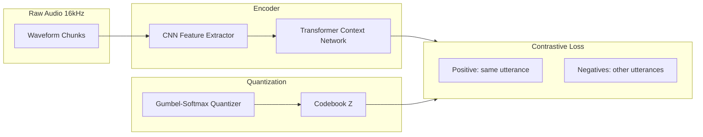
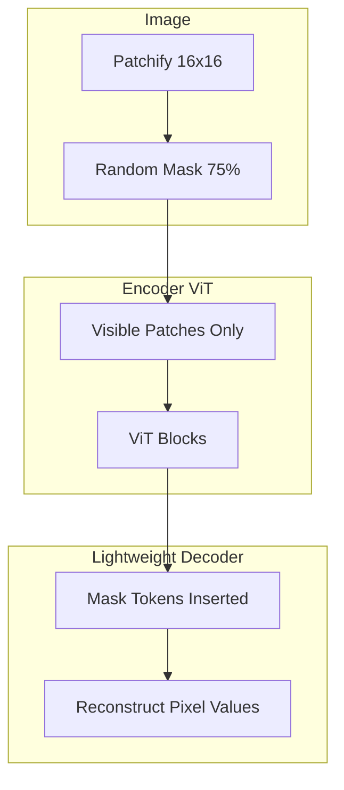

# 2021 AI 编年史：自监督学习 SSL | Self-Supervised Learning in 2021

---

## 一、概述与背景知识 | Overview & Background

**English**

**Self-Supervised Learning (SSL)** learns useful representations from **unlabeled data** by defining **pretext tasks** where labels are derived from the data itself. In 2021, SSL reached **parity with supervised learning** on major benchmarks in **speech** and **vision**, reducing dependence on expensive human annotations.

Three landmark 2021 contributions:

- **Wav2Vec 2.0** (Meta/Facebook) — **contrastive learning** on raw audio waveforms with **quantization**
- **HuBERT** (Meta) — **masked prediction** of **hidden-unit clusters** (BERT for speech)
- **MAE** (Meta) — **Masked Autoencoder** for vision: mask 75% of image patches, reconstruct pixels

**Key terms:**

| Term | Definition |
|------|------------|
| **Pretext task** | Surrogate objective (e.g., predict masked regions) enabling unsupervised learning |
| **Contrastive learning** | Pull similar samples together, push dissimilar apart in embedding space |
| **Negative sampling** | Non-matching audio/visual segments used as contrastive negatives |
| **Quantization** | Discretizing continuous latent representations into codebook entries |
| **Fine-tuning** | Adapting pretrained representations to labeled downstream tasks (ASR, classification) |
| **Linear probe** | Evaluating frozen features with a linear classifier — measures representation quality |
| **Mask ratio** | Fraction of input hidden during pretraining (MAE uses 75%) |

**中文**

**自监督学习（SSL）** 通过构造 **前置任务**（标签来自数据本身）从 **无标注数据** 学习有效表示。2021 年 SSL 在 **语音** 与 **视觉** 主要 benchmark 上 **媲美监督学习**，降低对昂贵人工标注的依赖。

三项标志性工作：

- **Wav2Vec 2.0**（Meta）— 原始音频 **对比学习** + **量化**
- **HuBERT**（Meta）— 预测 **隐单元聚类** 的 **掩码建模**（语音版 BERT）
- **MAE**（Meta）— 视觉 **掩码自编码器**：mask 75% 图像块并重建像素

**核心术语：**

| 术语 | 含义 |
|------|------|
| **前置任务** | 代理目标（如预测被 mask 区域）驱动无监督学习 |
| **对比学习** | 相似样本在嵌入空间拉近，不相似推远 |
| **负采样** | 用作对比负例的不匹配音/视频片段 |
| **量化** | 将连续 latent 离散化为码本条目 |
| **微调** | 将预训练表示适配到有标注下游任务（ASR、分类） |
| **线性探测** | 冻结特征 + 线性分类器评估表示质量 |
| **Mask 比例** | 预训练时隐藏输入的比例（MAE 为 75%） |

SSL 成为 2021 年 **Foundation Model** 预训练的标准范式——与 CLIP（对比）、BERT（掩码）共同构成现代 multimodal 栈的基础。

---

## 二、技术架构 | Architecture

### 2.1 Wav2Vec 2.0



**English**

1. **CNN frontend** downsamples raw waveform to latent speech frames (~20ms)
2. **Context network** (Transformer) produces contextualized representations
3. **Quantization module** maps latents to discrete codes via **Gumbel-Softmax**
4. **Contrastive loss**: contextual vector must identify correct quantized target among K negatives
5. **Fine-tuning for ASR**: CTC loss on labeled speech — **10 min labeled data** can match supervised baselines

**中文**

1. **CNN 前端** 将原始波形下采样为 latent 语音帧（约 20ms）
2. **上下文网络**（Transformer）产生 contextualized 表示
3. **量化模块** 经 **Gumbel-Softmax** 映射到离散码
4. **对比损失**：context 向量须在 K 个负例中识别正确量化目标
5. **ASR 微调**：CTC 损失 — **10 分钟标注** 即可媲美监督基线

### 2.2 HuBERT：迭代聚类 + 掩码预测

```
HuBERT Training Loop
┌──────────────────────────────────────────────┐
│ Step 1: K-means on MFCC/features → targets   │
│ Step 2: Mask spans of input (like BERT 15%)  │
│ Step 3: Predict cluster IDs of masked frames │
│ Step 4: Re-cluster with better encoder → iterate │
└──────────────────────────────────────────────┘

Architecture: CNN → Transformer → Classification over clusters
Loss: Cross-entropy on masked positions only
```

**English**

HuBERT decouples **target generation** (offline clustering) from **prediction** (online Transformer). Iterative refinement of clusters improves target quality — analogous to **BERT's MLM** but with **learned discrete speech units** instead of text tokens.

**中文**

HuBERT 将 **目标生成**（离线聚类）与 **预测**（在线 Transformer）解耦。迭代聚类提升目标质量 — 类似 **BERT MLM**，但目标是 **学习到的离散语音单元** 而非文本 token。

### 2.3 MAE：非对称编解码视觉 SSL



**English**

- **High mask ratio (75%)**: Forces semantic compression — cannot cheat via local interpolation
- **Asymmetric design**: Heavy encoder on visible patches only; lightweight decoder reconstructs all patches
- **Result**: SOTA linear probe and fine-tuning on ImageNet with **1600 epoch** pretraining — simpler than contrastive methods (MoCo, SimCLR)

**中文**

- **高 mask 比例（75%）**：迫使语义压缩 — 无法靠局部插值作弊
- **非对称设计**：重型 encoder 仅处理可见 patch；轻量 decoder 重建全部
- **结果**：ImageNet 线性探测与微调 SOTA — 比 MoCo、SimCLR 等对比方法更简洁

### 2.4 三大方法对比

| 方法 | 模态 | 核心机制 | 下游典型任务 |
|------|------|----------|--------------|
| Wav2Vec 2.0 | 语音 | 对比 + 量化 | ASR, speaker ID |
| HuBERT | 语音 | 掩码 + 聚类目标 | ASR, speech emotion |
| MAE | 视觉 | 掩码重建 | 分类, 检测, 分割 |

---

## 三、发展趋势 | Trends

**English**

1. **Unified SSL paradigms**: Contrastive (Wav2Vec), predictive (HuBERT/MAE), and generative objectives converging in multimodal models.
2. **Low-label fine-tuning**: SSL + small labeled sets became standard for **ASR in low-resource languages**.
3. **Scaling ViT pretraining**: MAE validated that **Transformers + SSL** outperform CNN pretraining at scale.
4. **Speech as the new NLP**: HuBERT/Wav2Vec paved way for **Whisper** (2022) and speech LLMs.
5. **Efficiency focus**: Distilled SSL models (DistilHuBERT) for on-device deployment.
6. **Multi-modal SSL**: ImageBind, CLIP extensions combining SSL objectives across modalities.

**中文**

1. **SSL 范式统一**：对比（Wav2Vec）、预测（HuBERT/MAE）、生成目标在多模态模型中融合。
2. **低标注微调**：SSL + 少量标注成为 **低资源语言 ASR** 标准方案。
3. **ViT 预训练缩放**：MAE 验证 **Transformer + SSL** 在大规模下超越 CNN 预训练。
4. **语音成新 NLP**：HuBERT/Wav2Vec 为 **Whisper**（2022）与语音 LLM 铺路。
5. **效率导向**：蒸馏 SSL（DistilHuBERT）服务端侧部署。
6. **多模态 SSL**：ImageBind 等跨模态 SSL 扩展。

---

## 四、优缺点分析 | Pros & Cons

| 维度 | 优点 Advantages | 缺点 Disadvantages |
|------|-----------------|---------------------|
| **标注成本** | 利用海量无标注数据 | 预训练算力需求大 |
| **泛化** | 跨任务迁移强 | 域偏移时仍需微调 |
| **Wav2Vec 2.0** | ASR 低资源 SOTA | 对比学习调参敏感 |
| **HuBERT** | 简单 BERT 式目标 | 依赖聚类质量与迭代 |
| **MAE** | 架构简洁、易扩展 | 高 mask 比训练不稳定需技巧 |
| **可复现** | Fairseq 官方实现 | 大规模预训练资源门槛高 |
| **部署** | 微调后模型紧凑 | 预训练阶段内存占用大 |

---

## 五、应用场景 | Use Cases

| 场景 | 说明 |
|------|------|
| **自动语音识别 (ASR)** | 低资源语言、方言、领域自适应 |
| **语音助手** | 唤醒词无关的鲁棒语音理解 |
| **医疗语音** | Clinical note dictation with limited labeled data |
| **ImageNet 级分类** | MAE 预训练 + 少量 epoch 微调 |
| **目标检测/分割** | MAE/ViT backbone 迁移至 Detectron2 |
| **内容审核** | 音频/视频 SSL 特征用于异常检测 |
| **工业质检** | 视觉 MAE 预训练 + 小样本缺陷检测 |

---

## 六、开源项目与工具 | Open Source & Tools

| 项目 | 说明 | URL |
|------|------|-----|
| **fairseq** | Wav2Vec 2.0、HuBERT 官方实现 | https://github.com/facebookresearch/fairseq |
| **MAE** | Masked Autoencoder 官方代码 | https://github.com/facebookresearch/mae |
| **Hugging Face Transformers** | Wav2Vec2、Hubert 预训练权重 | https://github.com/huggingface/transformers |
| **torchaudio** | 音频预处理与 Wav2Vec2 pipeline | https://github.com/pytorch/audio |
| **timm** | ViT + MAE 预训练模型集合 | https://github.com/huggingface/pytorch-image-models |
| **OpenSelfSup** | 综合 SSL 工具箱（对比/旋转等） | https://github.com/open-mmlab/OpenSelfSup |
| **SpeechBrain** | 语音 SSL 下游任务 toolkit | https://github.com/speechbrain/speechbrain |

---

## 七、参考文献 | References

1. Baevski, A., et al. **"wav2vec 2.0: A Framework for Self-Supervised Learning of Speech Representations."** NeurIPS 2020 (广泛影响 2021). https://arxiv.org/abs/2006.11477
2. Hsu, W.-N., et al. **"HuBERT: Self-Supervised Speech Representation Learning by Masked Prediction of Hidden Units."** IEEE/ACM TASLP, 2021. https://arxiv.org/abs/2106.07447
3. He, K., et al. **"Masked Autoencoders Are Scalable Vision Learners."** CVPR 2022 (arXiv 2021-11). https://arxiv.org/abs/2111.06377
4. Chen, T., et al. **"A Simple Framework for Contrastive Learning of Visual Representations (SimCLR)."** ICML 2020. https://arxiv.org/abs/2002.05709
5. Dosovitskiy, A., et al. **"An Image is Worth 16x16 Words: Transformers for Image Recognition at Scale (ViT)."** ICLR 2021. https://arxiv.org/abs/2010.11929
6. Radford, A., et al. **"Learning Transferable Visual Models From Natural Language Supervision (CLIP)."** ICML 2021. https://arxiv.org/abs/2103.00020
7. Fairseq Documentation — Wav2Vec 2.0. https://github.com/facebookresearch/fairseq/tree/main/examples/wav2vec

---

**English Summary**: 2021 SSL breakthroughs in speech (Wav2Vec 2.0, HuBERT) and vision (MAE) proved that self-supervised pretraining could match or exceed supervised baselines — establishing the default recipe for foundation models before the LLM explosion.

**中文总结**：2021 年语音（Wav2Vec 2.0、HuBERT）与视觉（MAE）的 SSL 突破证明自监督预训练可媲美甚至超越监督基线，成为 LLM 爆发前 Foundation Model 的默认配方。
