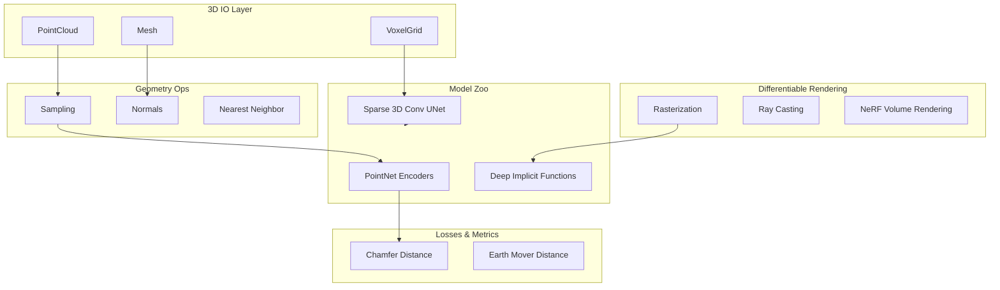

# 2021 AI 编年史：TensorFlow3D | TensorFlow3D in 2021

---

## 一、概述与背景知识 | Overview & Background

**English**

**TensorFlow3D (TF3D)** is Google Research's open-source library for **3D deep learning** built on **TensorFlow 2.x**. Released and actively developed through 2020–2021, TF3D provides unified APIs for:

- **Point cloud** processing (classification, segmentation)
- **Voxel grids** and **sparse 3D convolutions**
- **Mesh** operations (sampling, normals, IO)
- **Differentiable rendering** — bridging 3D geometry and 2D supervision
- **NeRF-style** volumetric rendering primitives

In 2021, TF3D became a **reference implementation** for autonomous driving research at Google/Waymo and the broader 3D vision community — complementing **PyTorch3D** on the PyTorch side.

**Key terms:**

| Term | Definition |
|------|------------|
| **Differentiable rendering** | Gradients flow through projection/rasterization for end-to-end 3D learning |
| **Voxel grid** | 3D occupancy grid discretizing space |
| **Sparse tensor** | Efficient representation storing only occupied voxels |
| **Point cloud encoder** | Network mapping unordered points to global features |
| **Chamfer distance** | Metric comparing two point sets |
| **Waymo Open Dataset** | Large-scale autonomous driving dataset (LiDAR + cameras) |
| **TF2 eager execution** | TensorFlow 2's imperative mode matching PyTorch ergonomics |

**中文**

**TensorFlow3D（TF3D）** 是 Google Research 基于 **TensorFlow 2.x** 的 **3D 深度学习** 开源库。2020–2021 年持续开发，提供统一 API：

- **点云** 处理（分类、分割）
- **体素网格** 与 **稀疏 3D 卷积**
- **网格** 操作（采样、法线、IO）
- **可微渲染** — 连接 3D 几何与 2D 监督
- **NeRF 风格** 体渲染原语

2021 年 TF3D 成为 Google/Waymo 及 3D 视觉社区的 **参考实现** — 与 PyTorch 生态的 **PyTorch3D** 形成对照。

**核心术语：**

| 术语 | 含义 |
|------|------|
| **可微渲染** | 梯度穿过投影/光栅化，实现端到端 3D 学习 |
| **体素网格** | 离散化空间的 3D 占据网格 |
| **稀疏张量** | 仅存储非空体素的高效表示 |
| **点云编码器** | 将无序点映射为全局特征的网络 |
| **Chamfer 距离** | 比较两个点集的 metric |
| **Waymo Open Dataset** | 大规模自动驾驶数据集（LiDAR + 相机） |
| **TF2 Eager 执行** | TensorFlow 2 命令式模式，接近 PyTorch 体验 |

TF3D 降低 3D 深度学习 **工程门槛** — 研究者无需手写 CUDA 光栅化即可实验可微渲染 pipeline。

---

## 二、技术架构 | Architecture

### 2.1 TensorFlow3D 模块架构



### 2.2 点云处理流水线

**English**

```
Raw LiDAR (N × 3+)
      ↓
tf3d.utils.pointcloud.preprocess (normalize, subsample)
      ↓
PointNet / PointNet++ layer (tf3d.models)
      ↓
Global feature vector OR per-point features
      ↓
Task head: classification / semantic segmentation / detection
```

TF3D implements **farthest point sampling**, **ball query grouping**, and **interpolated feature propagation** — the PointNet++ hierarchy — as reusable TF layers with GPU acceleration.

**中文**

TF3D 将 **最远点采样**、**球查询分组**、**插值特征传播** 等 PointNet++ 层次实现为可复用 TF GPU 加速层。

### 2.3 可微渲染栈

```
3D Scene Representation
  ├── Mesh + Textures
  ├── Point Cloud + Colors
  └── Neural Field (NeRF)
         ↓
Camera Parameters (extrinsics, intrinsics)
         ↓
tf3d.renderer (differentiable)
         ↓
Rendered RGB / Depth / Silhouette
         ↓
Loss vs. Ground Truth Images (2D supervision for 3D learning)
```

**English**

Differentiable rendering enables **inverse graphics** — optimize 3D shape/appearance to match 2D observations — foundational for **multi-view 3D reconstruction** and **autonomous driving simulation**.

**中文**

可微渲染实现 **逆图形学** — 优化 3D 形状/外观以匹配 2D 观测 — 是多视图 3D 重建与 **自动驾驶仿真** 的基础。

### 2.4 与 PyTorch3D 对比

| 特性 | TensorFlow3D | PyTorch3D |
|------|--------------|-----------|
| 后端 | TensorFlow 2.x | PyTorch |
| 主要用户 | Google/Waymo, TF 生态 | Meta, 学术界 |
| 稀疏 3D 卷积 | ✅ | ✅ |
| 可微渲染 | ✅ | ✅ |
| TF Lite 部署 | 天然集成 | 需转换 |
| 2021 活跃度 | 高 | 高 |

---

## 三、发展趋势 | Trends

**English**

1. **3D as first-class DL modality**: TF3D + PyTorch3D normalized 3D ops alongside Conv2D and Linear.
2. **Autonomous driving integration**: Waymo models used TF3D for **LiDAR segmentation** and **3D object detection** research.
3. **NeRF explosion (2020–2021)**: TF3D volumetric rendering utilities accelerated NeRF reproductions.
4. **Simulation-to-real**: Differentiable rendering for **synthetic data** generation with gradient-based domain adaptation.
5. **Sparse convolution standardization**: MinkowskiEngine-style ops wrapped in TF3D APIs.
6. **Cross-framework competition**: Healthy duplication with PyTorch3D drove rapid feature parity.

**中文**

1. **3D 成为一等 DL 模态**：TF3D + PyTorch3D 将 3D 算子与 Conv2D、Linear 并列标准化。
2. **自动驾驶集成**：Waymo 用 TF3D 做 **LiDAR 分割** 与 **3D 检测** 研究。
3. **NeRF 爆发**：TF3D 体渲染工具加速 NeRF 复现。
4. **仿真到真实**：可微渲染生成 **合成数据** 并梯度域适配。
5. **稀疏卷积标准化**：MinkowskiEngine 风格算子封装进 TF3D API。
6. **跨框架竞争**：与 PyTorch3D 良性重复推动功能快速对齐。

---

## 四、优缺点分析 | Pros & Cons

| 维度 | 优点 Advantages | 缺点 Disadvantages |
|------|-----------------|---------------------|
| **统一 API** | 点云/网格/体素/渲染一体 | API 表面积大学习成本高 |
| **Google 背书** | Waymo 级工程验证 | 社区小于 PyTorch3D |
| **TF 生态** | TPU 训练、TF Lite 部署 | TF2 整体市场份额下降 |
| **可微渲染** | 研究友好 | 性能低于专用 CUDA 渲染器 |
| **文档** | 官方 Colab 教程丰富 | 复杂 pipeline 示例不足 |
| **维护** | 2021 活跃更新 | 后续 PyTorch 主导 3D 研究 |
| **扩展** | 模块化 geometry ops | 自定义 op 需 C++ 绑定 |

---

## 五、应用场景 | Use Cases

| 场景 | 说明 |
|------|------|
| **LiDAR 语义分割** | 自动驾驶点云逐点分类 |
| **3D 目标检测** | 从点云预测 3D bounding box |
| **NeRF 重建** | 多视图新视角合成 |
| **机器人仿真** | 可微渲染优化 grasp pose |
| **医学影像** | CT/MRI 体数据分割 |
| **AR 物体重建** | 手机多视图 mesh 优化 |
| **合成数据** | 仿真场景渲染训练数据 |

---

## 六、开源项目与工具 | Open Source & Tools

| 项目 | 说明 | URL |
|------|------|-----|
| **tensorflow3d** | Google 官方 TF3D 库 | https://github.com/google-research/tensorflow3d |
| **PyTorch3D** | Meta 对标 3D 库 | https://github.com/facebookresearch/pytorch3d |
| **Open3D** | 通用 3D 数据处理 | https://github.com/isl-org/Open3D |
| **Waymo Open Dataset** | 自动驾驶 benchmark | https://github.com/waymo-research/waymo-open-dataset |
| **MinkowskiEngine** | 稀疏 3D 卷积 | https://github.com/NVIDIA/MinkowskiEngine |
| **TensorFlow** | TF2 核心框架 | https://github.com/tensorflow/tensorflow |
| **nerf-master** | NeRF 原始实现（参考） | https://github.com/bmild/nerf |

---

## 七、参考文献 | References

1. Google Research. **TensorFlow3D Documentation.** https://www.tensorflow.org/graphics/tf3d
2. Mildenhall, B., et al. **"NeRF: Representing Scenes as Neural Radiance Fields for View Synthesis."** ECCV 2020. https://arxiv.org/abs/2003.08934
3. Qi, C.R., et al. **"PointNet++: Deep Hierarchical Feature Learning on Point Sets."** NeurIPS 2017. https://arxiv.org/abs/1706.02413
4. Sun, P., et al. **"Scalability in Perception for Autonomous Driving: Waymo Open Dataset."** CVPR 2020. https://arxiv.org/abs/1912.04838
5. Loper, M., & Black, M.J. **"OpenDR: An Approximate Differentiable Renderer."** ECCV 2014. https://arxiv.org/abs/1405.0308
6. Ravi, N., et al. **"PyTorch3D: A Library for Deep Learning with 3D Data."** arXiv:2007.08501. https://arxiv.org/abs/2007.08501
7. TensorFlow 3D GitHub Repository. https://github.com/google-research/tensorflow3d

---

**English Summary**: TensorFlow3D in 2021 standardized 3D deep learning on TensorFlow — providing point cloud, voxel, and differentiable rendering primitives that powered autonomous driving research and NeRF-era 3D vision.

**中文总结**：2021 年 TensorFlow3D 在 TensorFlow 上标准化 3D 深度学习 — 提供点云、体素与可微渲染原语，支撑自动驾驶研究与 NeRF 时代 3D 视觉。
