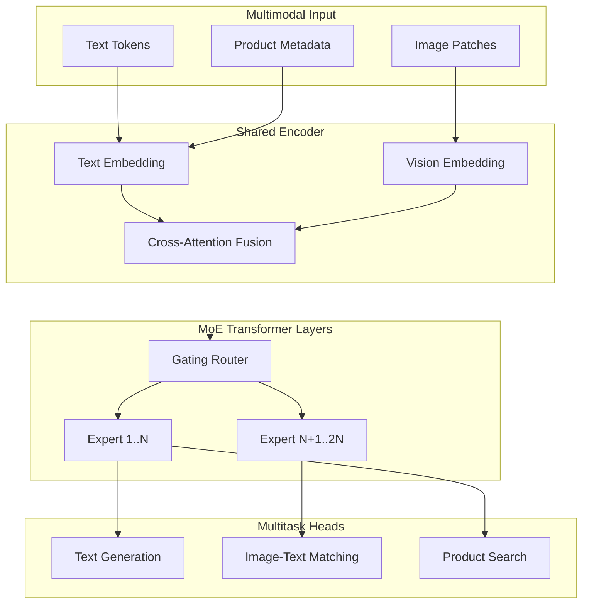

# 2021 AI 编年史：万亿级多模态预训练 | Trillion-Scale Multimodal Pretraining in 2021

---

## 一、概述与背景知识 | Overview & Background

**English**

2021 marked a decisive inflection point in **large-scale pretraining**: model sizes crossed into the **trillion-parameter** regime, and **multimodal fusion** became a first-class design goal rather than an afterthought. Two landmark systems from China dominated headlines in early 2021:

- **M6 (Multi-Modality-to-Multi-Modality Multitask Mega-transformer)** from Alibaba DAMO Academy — reportedly scaled to **10 trillion parameters** using a **Mixture-of-Experts (MoE)** architecture, trained on Chinese e-commerce text, images, and product metadata.
- **ERNIE 3.0 Titan (260B)** from Baidu — a **knowledge-enhanced** dense transformer integrating structured **Knowledge Graph (KG)** embeddings with text and vision, pushing Chinese NLP benchmarks to new highs.

**Key technical terms defined:**

| Term | Definition |
|------|------------|
| **Pretraining** | Unsupervised or self-supervised learning on massive unlabeled data before task-specific fine-tuning |
| **Multimodal** | Models jointly processing two or more modalities (text, image, audio, video) |
| **MoE (Mixture of Experts)** | Sparse activation: only a subset of "expert" sub-networks fire per token, enabling huge total capacity with manageable compute |
| **Scaling Laws** | Empirical power-law relationships between model size, data, compute, and downstream performance |
| **Cross-modal alignment** | Learning shared representations so text and images referring to the same concept map to nearby vectors |
| **Parameter efficiency** | Achieving strong performance per FLOP or per activated parameter |

**中文**

2021 年是 **超大规模预训练** 的转折之年：模型规模首次进入 **万亿参数** 量级，**多模态融合** 从附加能力升级为核心设计目标。年初两项标志性工作引发全球关注：

- 阿里巴巴达摩院 **M6** — 采用 **混合专家（MoE）** 架构，总参数量达 **10 万亿**，在电商文本、图像与商品元数据上联合训练。
- 百度 **ERNIE 3.0 Titan（2600 亿参数）** — **知识增强** 稠密 Transformer，将结构化 **知识图谱** 嵌入与文本、视觉模态深度融合，刷新中文 NLP 多项基准。

**核心术语：**

| 术语 | 含义 |
|------|------|
| **预训练（Pretraining）** | 在大规模无标注数据上先做自监督学习，再针对下游任务微调 |
| **多模态（Multimodal）** | 同时处理文本、图像、音频、视频等多种数据类型 |
| **MoE（混合专家）** | 稀疏激活：每个 token 仅路由到部分专家子网络，总容量大但单次计算可控 |
| **缩放定律（Scaling Laws）** | 模型规模、数据量、算力与性能之间的幂律关系 |
| **跨模态对齐** | 使语义相同的文本与图像映射到相近的向量空间 |
| **参数效率** | 单位算力或激活参数所能达到的性能水平 |

2021 年 1 月前后，GPT-3（175B）仍是全球参照系；M6 与 ERNIE Titan 证明 **中文多模态预训练** 可在规模与知识注入上走出独立路径，为后续 2022–2023 的 Foundation Model 浪潮奠定产业基础。

---

## 二、技术架构 | Architecture

### 2.1 M6：MoE 多模态万亿架构

**English**

M6 adopts a **hierarchical MoE Transformer**. A **gating network** routes each input token to top-k experts (typically 1–2 of 64+ experts per layer). Total parameters reach trillions, but **activated parameters per forward pass** remain in the tens-of-billions range — making training feasible on Alibaba's **512-GPU** clusters with pipeline and expert parallelism.



**中文**

M6 采用 **分层 MoE Transformer**：**门控网络** 为每个 token 选择 top-k 专家（如 64+ 专家中激活 1–2 个）。总参数量达万亿级，但 **单次前向激活参数量** 控制在百亿量级，依托阿里 **512 GPU** 集群的流水线并行与专家并行完成训练。

### 2.2 ERNIE 3.0 Titan：知识增强稠密架构

**English**

ERNIE 3.0 Titan uses a **dense 260B-parameter Transformer** with a dedicated **Knowledge Module**. Structured facts from Baidu's KG (entities, relations, attributes) are encoded and **injected via cross-attention** into text and vision streams. A **continual pretraining** schedule alternates between general corpus, KG-aligned sentences, and multimodal image-text pairs.

```
ERNIE 3.0 Titan Architecture
┌─────────────────────────────────────────────────────┐
│  Knowledge Graph Encoder                            │
│  Entity Embedding → Relation Transformer → KG Vec   │
└──────────────────────┬──────────────────────────────┘
                       │ Cross-Attention
┌──────────────────────▼──────────────────────────────┐
│  Unified Transformer Backbone (260B dense)          │
│  ┌─────────────┐  ┌─────────────┐  ┌─────────────┐  │
│  │ Text Stream │  │ Vision Stream│  │ KG Stream  │  │
│  └──────┬──────┘  └──────┬──────┘  └──────┬──────┘  │
│         └────────────────┼────────────────┘         │
│              Self-Attention + FFN Layers            │
└──────────────────────┬──────────────────────────────┘
                       ▼
              Task Heads (NLU / NLG / VQA)
```

**中文**

ERNIE 3.0 Titan 为 **2600 亿参数稠密 Transformer**，配备独立 **知识模块**：百度知识图谱中的实体、关系、属性经编码后，通过 **交叉注意力** 注入文本与视觉流。训练采用 **持续预训练** 策略，交替使用通用语料、图谱对齐句对与图文对。

### 2.3 训练基础设施对比

| 维度 | M6 (10T MoE) | ERNIE 3.0 Titan (260B) |
|------|--------------|------------------------|
| 激活策略 | 稀疏 MoE，每 token 激活子集 | 全稠密激活 |
| 主要模态 | 文本 + 图像 + 商品 | 文本 + 图像 + 知识图谱 |
| 并行策略 | Expert + Pipeline + Data Parallel | Tensor + Pipeline Parallel |
| 典型应用 | 电商搜索、广告、推荐 | 搜索、对话、内容理解 |

---

## 三、发展趋势 | Trends

**English**

1. **From dense to sparse**: MoE proved that **total capacity** and **inference cost** can be decoupled — a trend later adopted by Switch Transformer, GLaM, and Mixtral.
2. **Multimodal by default**: Product-centric platforms (Taobao, Baidu Search) drove **native multimodal pretraining** rather than stitching separate unimodal models.
3. **Knowledge injection**: Moving beyond raw text corpora toward **structured KG + web text** hybrid training — precursor to retrieval-augmented and tool-augmented LLMs.
4. **Chinese-centric scaling**: Demonstrated that non-English, domain-rich ecosystems can justify **independent trillion-scale investment**.
5. **Industrial closed-loop**: Training data, compute, and deployment (search/ads) formed tight feedback loops — influencing 2022+ industry LLM strategies.

**中文**

1. **从稠密到稀疏**：MoE 证明 **总容量** 与 **推理成本** 可解耦，Switch Transformer、GLaM、Mixtral 均沿此路径演进。
2. **多模态成默认能力**：电商与搜索场景推动 **原生多模态预训练**，而非后期拼接单模态模型。
3. **知识注入**：从纯文本语料走向 **知识图谱 + 网页文本** 混合训练，为 RAG 与工具增强 LLM 铺路。
4. **中文生态独立缩放**：证明非英语、领域数据丰富的市场可支撑 **独立万亿级投入**。
5. **产业闭环**：训练数据、算力与搜索/广告部署形成反馈环，深刻影响 2022 年后行业大模型战略。

---

## 四、优缺点分析 | Pros & Cons

| 维度 Dimension | 优点 Advantages | 缺点 Disadvantages |
|----------------|-----------------|---------------------|
| **规模 Scale** | 万亿 MoE 容量极大，下游零样本/少样本能力强 | 训练与运维成本极高，仅头部企业可承担 |
| **多模态 Multimodal** | 统一表征简化跨模态检索与生成 | 模态不平衡时弱模态易被忽视 |
| **MoE 稀疏性** | 推理激活参数可控，扩展容量边际成本较低 | 负载均衡、通信开销、专家坍塌等工程难题 |
| **知识增强 KG** | 事实性、实体链接、推理能力更强 | 图谱维护成本高，覆盖与时效性受限 |
| **中文优化** | 深度适配中文分词、实体与文化语境 | 多语言泛化与开源可复现性弱于 GPT 系 |
| **产业落地** | 与搜索/电商场景天然耦合 | 模型与数据高度封闭，学术复现困难 |
| **能耗 Energy** | MoE 相对同等稠密模型训练更节能（per FLOP） | 整体集群功耗仍达 MW 级 |

---

## 五、应用场景 | Use Cases

**English**

| Scenario | Description |
|----------|-------------|
| **E-commerce search** | Cross-modal product retrieval: text query → relevant images/SKUs (M6) |
| **Visual question answering** | "What brand is this shoe?" on product photos |
| **Ad creative generation** | Multimodal understanding for targeted ad copy and image selection |
| **Enterprise search** | ERNIE-powered semantic search with entity-aware ranking |
| **Content moderation** | Joint text-image toxicity and compliance detection |
| **Knowledge-grounded QA** | Answering factual questions with KG-backed entity resolution |
| **Recommendation** | User behavior + product multimodal embeddings for personalization |

**中文**

| 场景 | 说明 |
|------|------|
| **电商搜索** | 跨模态商品检索：文本 query 匹配相关图像与 SKU（M6） |
| **视觉问答** | 对商品图回答「这是什么品牌？」等问题 |
| **广告创意** | 多模态理解驱动定向文案与素材选择 |
| **企业搜索** | ERNIE 语义搜索 + 实体感知排序 |
| **内容审核** | 图文联合违规与合规检测 |
| **知识问答** | 基于知识图谱的事实性问答与实体消歧 |
| **个性化推荐** | 用户行为与商品多模态 embedding 联合建模 |

---

## 六、开源项目与工具 | Open Source & Tools

| 项目 Project | 说明 Description | URL |
|--------------|------------------|-----|
| **Transformers (Hugging Face)** | 通用预训练模型加载与微调框架 | https://github.com/huggingface/transformers |
| **Megatron-DeepSpeed** | 大规模 Transformer 训练（张量/流水线并行） | https://github.com/microsoft/Megatron-DeepSpeed |
| **Fairscale** | PyTorch 模型并行与 FSDP 工具 | https://github.com/facebookresearch/fairscale |
| **PaddleNLP / ERNIE** | 百度 ERNIE 系列开源实现与预训练权重 | https://github.com/PaddlePaddle/PaddleNLP |
| **OpenMoE** | 社区 MoE 研究与实现参考 | https://github.com/XueFuzhao/OpenMoE |
| **DeepSpeed** | MoE 训练优化与 ZeRO 显存管理 | https://github.com/microsoft/DeepSpeed |
| **CLIP (OpenAI)** | 经典图文对比学习基线，多模态预训练参照 | https://github.com/openai/CLIP |

> 注：M6 与 ERNIE 3.0 Titan 本体为工业闭源系统；上表为同类技术栈的可复现开源替代与生态组件。

---

## 七、参考文献 | References

1. Lin, J., et al. **"M6: A Chinese Multimodal Pretrainer."** arXiv:2103.00823, 2021. https://arxiv.org/abs/2103.00823
2. Sun, Y., et al. **"ERNIE 3.0: Large-scale Knowledge Enhanced Pre-training for Language Understanding and Generation."** arXiv:2107.02137, 2021. https://arxiv.org/abs/2107.02137
3. Fedus, W., et al. **"Switch Transformers: Scaling to Trillion Parameter Models with Simple and Efficient Sparsity."** JMLR, 2022 (MoE 理论基础). https://arxiv.org/abs/2101.03961
4. Radford, A., et al. **"Learning Transferable Visual Models From Natural Language Supervision (CLIP)."** ICML 2021. https://arxiv.org/abs/2103.00020
5. Kaplan, J., et al. **"Scaling Laws for Neural Language Models."** arXiv:2001.08361. https://arxiv.org/abs/2001.08361
6. Alibaba DAMO Academy. **M6 技术博客（官方）**. https://damo.alibaba.com/
7. Baidu Research. **ERNIE 3.0 Titan 发布说明**. https://research.baidu.com/

---

**English Summary**: Early 2021 proved that trillion-scale, multimodal, knowledge-aware pretraining was no longer theoretical — it was production infrastructure for China's largest AI platforms. M6's MoE sparsity and ERNIE's KG injection remain influential design patterns.

**中文总结**：2021 年初，万亿级多模态知识增强预训练从概念变为头部平台的生产基础设施。M6 的 MoE 稀疏化与 ERNIE 的知识注入，至今仍是超大规模模型的重要设计范式。
