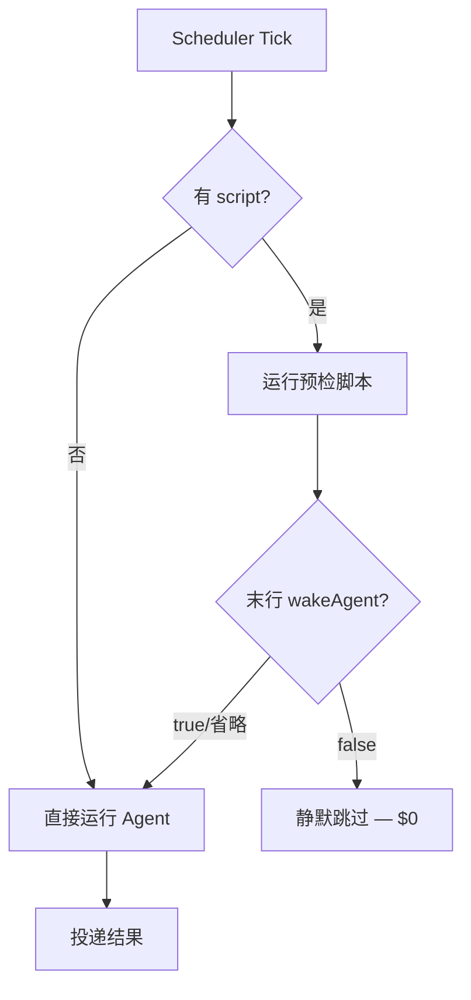

# Agent Hermes 与 OpenClaw 自动化调度与主动巡检全解析
# Agent Hermes & OpenClaw: Automation Scheduling and Proactive Monitoring — A Deep Dive

> 最后更新 | Last updated: 2026-06-06

---

## 一、自动化能力概览 | Automation Capability Overview

**中文**

个人 Agent 的「主动性」取决于能否在无人值守时执行任务。两个框架提供互补机制：

| 维度 | OpenClaw（龙虾） | Hermes Agent |
|------|------------------|--------------|
| 定时调度 | `cron` 工具（Gateway 内） | `cronjob` 工具 + Gateway 调度器 |
| 主动巡检 | `HEARTBEAT.md` + heartbeat 周期 | Cron + wakeAgent 门控 |
| 调度粒度 | 默认 30m heartbeat | 60s scheduler tick |
| 零成本巡检 | HEARTBEAT_OK 静默 | `no_agent` + `wakeAgent: false` |
| 流水线串联 | 单 Agent 内多任务 | `context_from` 跨任务链 |
| 安全 | deny cron 给不可信面 | Prompt 扫描 + cron 工具禁用 |

**English**

Proactivity depends on unattended execution. Both frameworks offer complementary automation:

| Dimension | OpenClaw (Lobster) | Hermes Agent |
|-----------|-------------------|--------------|
| Scheduling | `cron` tool (in Gateway) | `cronjob` tool + Gateway scheduler |
| Proactive checks | `HEARTBEAT.md` + heartbeat cadence | Cron + wakeAgent gate |
| Scheduler tick | Default 30m heartbeat | 60s scheduler tick |
| Zero-cost checks | HEARTBEAT_OK silent ack | `no_agent` + `wakeAgent: false` |
| Pipelines | Multi-task within one agent | `context_from` cross-job chains |
| Security | deny cron on untrusted surfaces | Prompt scan + cron toolset disabled in cron runs |

---

## 二、Hermes cronjob 工具全解析 | Hermes cronjob Tool Deep Dive

**中文**

Hermes 将定时任务管理收敛为单一 **`cronjob` 工具**（action 风格），CLI、Gateway、自然语言对话共用同一 API。

### 2.1 支持的操作

| Action | 作用 |
|--------|------|
| `create` | 创建一次性或周期性任务 |
| `list` | 列出所有任务 |
| `update` | 修改 schedule、prompt、skills 等 |
| `pause` | 暂停调度 |
| `resume` | 恢复并计算下次运行时间 |
| `run` | 下次 tick 立即触发 |
| `remove` | 删除任务 |

```python
cronjob(
    action="create",
    name="morning-digest",
    schedule="0 9 * * *",
    skills=["blogwatcher"],
    prompt="Check configured feeds and summarize anything new.",
    deliver="telegram",
)
```

### 2.2 调度格式

| 类型 | 格式 | 示例 |
|------|------|------|
| 相对延迟（一次性） | `30m`, `2h`, `1d` | 30 分钟后执行一次 |
| 间隔（周期性） | `every 30m`, `every 2h` | 每 2 小时 |
| Cron 表达式 | 标准 5 段 | `0 9 * * 1-5` 工作日 9:00 |
| 自然语言 | `every day 7am` | 解析为等效 cron |
| ISO 时间戳 | `2026-03-15T09:00:00` | 指定时刻一次性 |

**重复行为**：

| 调度类型 | 默认 repeat | 覆盖 |
|----------|-------------|------|
| 一次性 | 1 | — |
| 间隔 / cron | forever | `repeat=5` 限制次数 |

### 2.3 Skill-Backed Cron

任务可附加零个、一个或多个技能，执行时按顺序注入：

```python
cronjob(
    action="create",
    skills=["blogwatcher", "maps"],
    prompt="Combine new feed items with nearby events into one brief.",
    schedule="every 6h",
    name="local-brief",
)
```

技能内容作为上下文注入，prompt 仅承载任务指令——避免在 cron prompt 中粘贴完整技能正文。

**English**

Hermes unifies scheduling in the `cronjob` tool with actions: create, list, update, pause, resume, run, remove. Schedule formats: relative delays, intervals (`every N`), cron expressions, natural language, ISO timestamps. Attach zero or more skills loaded in order at execution. Prompt carries task instruction only.

---

## 三、workdir 与 profile 钉扎 | workdir & profile Pinning

**中文**

Cron 任务默认**脱离任何代码库**运行——不加载 `AGENTS.md`、`.cursorrules`，终端/文件工具使用 Gateway 启动目录。

### 3.1 workdir 钉扎

```python
cronjob(
    action="create",
    schedule="every 1d at 09:00",
    workdir="/home/me/projects/acme",
    prompt="Audit open PRs, summarize CI health, and post to #eng",
)
```

当 `workdir` 设置时：

- 注入该目录的 `AGENTS.md`、`.cursorrules`（与交互式 CLI 相同发现顺序）
- `terminal`、`read_file`、`patch`、`execute_code` 使用该目录为 cwd
- 路径必须是存在的绝对路径
- `workdir=""` 可清除钉扎

**序列化约束**：带 `workdir` 的任务在 scheduler tick 上**串行执行**（进程全局 cwd 状态）。

### 3.2 profile 钉扎

```python
cronjob(
    action="create",
    schedule="every 1d at 03:00",
    profile="night-ops",
    prompt="Tail the security log and flag anomalies",
)
```

调度器临时切换 `HERMES_HOME` 到目标 profile，加载其 `.env` + `config.yaml`。带 `profile` 的任务同样**串行执行**（`HERMES_HOME` 是进程全局状态）。

**English**

Cron jobs default to detached execution without project context. `workdir` pins AGENTS.md/.cursorrules injection and tool cwd to an absolute project path — serial execution due to global cwd. `profile` pins HERMES_HOME/config for the run — also serial due to global profile switch.

---

## 四、投递选项与静默模式 | Delivery Options & Silent Mode

**中文**

### 4.1 deliver 参数

| 值 | 行为 |
|----|------|
| `origin` / `local` | 回到来源聊天 / 仅本地 `cron/output/` |
| `telegram` / `telegram:ID` / `telegram:chat:thread` | Telegram 目标 |
| `discord:#channel` / `slack` / `whatsapp` 等 | 各平台 home 或具名频道 |
| `all` / `origin,all` | 扇出全部 home channel（去重） |
| `telegram,discord` | 逗号分隔多目标 |

最终响应**自动投递**，无需 prompt 内 `send_message`。

### 4.2 响应包装

默认包装 header/footer 标明来源为定时任务。设 `cron.wrap_response: false` 可输出原始内容。

### 4.3 [SILENT] 静默抑制

若 Agent 最终响应以 `[SILENT]` 开头，**抑制外发投递**，输出仍保存到 `~/.hermes/cron/output/` 供审计。

```text
Check if nginx is running. If healthy, respond with only [SILENT].
Otherwise, report the issue.
```

**仅成功运行可静默**；失败任务始终投递。

**English**

`deliver` routes output to origin, local files, specific platforms, or `all` fan-out. Final agent response auto-delivers without `send_message`. `[SILENT]` prefix suppresses outbound delivery on success while saving locally. Failed jobs always deliver. `cron.wrap_response: false` removes the wrapper header/footer.

---

## 五、no-agent 模式与 wakeAgent 门控 | no-agent Mode & wakeAgent Gate

**中文**

### 5.1 no-agent 模式（零 Token 看门狗）

```bash
hermes cron create "every 5m" \
  --no-agent \
  --script memory-watchdog.sh \
  --deliver telegram \
  --name "memory-watchdog"
```

| 语义 | 说明 |
|------|------|
| 执行 | 仅运行脚本，**不调用 LLM** |
| 输出 | stdout 原文投递 |
| 空 stdout | 静默 tick，不投递 |
| 非零退出/超时 | 投递错误告警 |
| 脚本位置 | 必须在 `~/.hermes/scripts/` |

`.sh`/`.bash` 用 `/bin/bash`；其他用当前 Python 解释器。

### 5.2 wakeAgent 门控（LLM 任务的 $0 预检）

带 `script=` 的 LLM 任务，预检脚本末行可输出 JSON 决定是否唤醒 Agent：

```json
{"wakeAgent": false}
```

```json
{"wakeAgent": true, "context": {"new_issues": 3}}
```

| 行为 | 说明 |
|------|------|
| `wakeAgent: false` | 跳过本次 Agent 调用，零 Token |
| 省略或 `true` | 正常唤醒 Agent（默认） |
| `context` 字段 | 注入 Agent 上下文的结构化数据 |

**典型配方**：

| 门控类型 | 场景 |
|----------|------|
| 文件变更门控 | 仅当 feed.json mtime > last_run 时唤醒 |
| 外部标志门控 | CI 部署后 drop `/tmp/ready` 文件 |
| SQL 计数门控 | 仅当新行数 > 0 时唤醒，并传递 count |



**English**

`no_agent=True`: script-only, zero LLM tokens, stdout delivered verbatim, empty stdout = silent tick. `wakeAgent` gate: pre-check script emits `{"wakeAgent": false}` on last stdout line to skip the agent call for that tick — useful for 1-5 min polls that only need the LLM when state changed. Optional `context` object passes structured data to the agent.

---

## 六、context_from 流水线 | context_from Pipelines

**中文**

Cron 任务在**隔离会话**中运行，无上次执行记忆。`context_from` 自动将上游任务最近输出前置到当前 prompt：

```python
# 阶段 1：采集
cronjob(action="create", name="ai-news-fetch",
        schedule="0 7 * * *",
        prompt="Fetch top 10 AI stories from HN, save to raw.md")

# 阶段 2：筛选（读取阶段 1 最近输出）
cronjob(action="create", name="ai-news-triage",
        schedule="30 7 * * *",
        context_from="ai-news-fetch",
        prompt="Score each story 1-10, output top 5 to ranked.md")

# 阶段 3：发布
cronjob(action="create", name="ai-news-brief",
        schedule="0 8 * * *",
        context_from="ai-news-triage",
        prompt="Write 3 tweet drafts and deliver to telegram:7976161601")
```

| 格式 | 示例 |
|------|------|
| 单任务 ID/名称 | `context_from="ai-news-fetch"` |
| 多任务列表 | `context_from=["job_a", "job_b"]` |

输出从 `~/.hermes/cron/output/{job_id}/*.md` 读取，按列表顺序拼接。读取**最近已完成**输出——不等待同 tick 仍在运行的上游任务。

**English**

`context_from` prepends upstream jobs' most recent completed output from `~/.hermes/cron/output/{job_id}/` to the current prompt. Accepts single job ID/name or list for fan-in. Enables collect → filter → deliver pipelines without glue code or databases.

---

## 七、Gateway 调度器 internals | Gateway Scheduler Internals

**中文**

```mermaid
sequenceDiagram
    participant T as 60s Ticker
    participant L as .tick.lock
    participant J as jobs.json
    participant A as AIAgent
    participant D as Delivery
    T->>L: 获取文件锁
    T->>J: 加载任务
    T->>T: 筛选 due jobs (next_run <= now)
    loop 每个 due job
        T->>A: 创建全新会话（无历史）
        opt 附加 skills
        T->>A: 注入 skills + prompt + context_from
        opt script 预检
        T->>A: wakeAgent 门控
        A->>D: 完成 → 投递
        T->>J: 更新 run_count, next_run
    end
    T->>L: 释放锁
```

存储：`jobs.json`（原子写）、`cron/output/{job_id}/`。Gateway 每 **60s** tick，`.tick.lock` 防重叠；Cron 会话禁用 `cronjob` toolset。`enabled_toolsets` 可 per-job 收紧工具 schema。

**English**

60s tick, file lock, fresh sessions, cron toolset disabled in cron runs, `enabled_toolsets` for cost control, fallback provider inheritance.

---

## 八、OpenClaw HEARTBEAT 主动巡检 | OpenClaw HEARTBEAT Proactive Monitoring

**中文**

OpenClaw 的主动性主要通过 **Gateway heartbeat** 实现——周期性 Agent turn，默认 **30 分钟**（Anthropic OAuth 检测时为 1 小时）。

### 8.1 配置

```json5
{
  heartbeat: {
    every: "30m",           // "0m" 禁用
    target: "last",         // "none" | "last" | "slack" | "telegram" ...
    activeHours: {
      start: "09:00",
      end: "22:00",
      timezone: "America/New_York",
    },
    schedule: [             // 可选：时段差异化间隔
      { start: "08:00", end: "18:00", every: "15m" },
      { start: "23:00", end: "08:00", every: "2h" },
    ],
  },
}
```

### 8.2 HEARTBEAT.md 清单

工作区中的 `HEARTBEAT.md` 是巡检 checklist——短小、稳定、适合每 30 分钟考虑：

```markdown
# Heartbeat Checklist

- Scan inbox for urgent emails (last 30 min)
- Check calendar for meetings in next 2 hours
- Verify production health endpoint returns 200
```

**tasks: 结构化块**（任务级独立间隔）：

```yaml
tasks:
  - name: inbox-triage
    interval: 30m
    prompt: Check for urgent emails.
  - name: calendar-scan
    interval: 2h
    prompt: Check for upcoming meetings.
```

| 行为 | 说明 |
|------|------|
| 仅 due tasks 进入 prompt | 节省 Token |
| 无 due tasks | 跳过整个 heartbeat（`reason=no-tasks-due`） |
| 非 task 正文 | 追加为额外上下文 |
| 状态持久化 | `heartbeatTaskState` 存 session state |

### 8.3 HEARTBEAT_OK 静默

一切正常时回复 `HEARTBEAT_OK` — 静默确认，不外发；有异常才 alert 到 `target`。

**English**

OpenClaw heartbeat: 30m cadence (1h for Anthropic OAuth), `HEARTBEAT.md` checklist, optional `tasks:` per-interval checks, `HEARTBEAT_OK` silent ack.

---

## 九、OpenClaw cron 工具与风险 | OpenClaw cron Tool & Risks

**中文**

OpenClaw 提供 `cron` 工具让 Agent 创建**持久定时任务**——属于**高风险控制面工具**：

| 风险 | 说明 |
|------|------|
| 持久性 | 任务存于 Gateway，重启后仍执行 |
| 权限扩散 | 可调度 exec/browser 等危险操作 |
| Prompt 注入 | 恶意消息诱导创建有害 cron |
| 跨会话 | 与当前聊天上下文解耦 |

硬化：`tools.deny: ["cron", "gateway", "sessions_spawn"]`；不可信面必须 deny；`openclaw security audit` 定期审查。Hermes 对等：Cron 内禁用 `cronjob` + Prompt 扫描。

**English**

OpenClaw `cron` is high-risk persistent scheduling — deny on untrusted surfaces, minimal profiles, security audit. Hermes: cron toolset disabled in cron runs + prompt scanning.

---

## 十、安全：Cron Prompt 扫描 | Security: Cron Prompt Scanning

**中文**

Hermes 在创建/更新时扫描 prompt：注入、凭证外泄、不可见 Unicode、SSH 后门等——阻断则拒绝创建并返回明确错误。运行时：`cron_mode: deny`（无人值守推荐）、`enabled_toolsets` 限制、脚本限于 `~/.hermes/scripts/`、`script_timeout_seconds` 默认 120s。

**English**

Create/update prompt scanning blocks injection and exfiltration. Runtime: `cron_mode: deny`, limited toolsets, script sandbox, configurable timeout.

---

## 十一、选型速查 | Selection Quick Reference

| 场景 | OpenClaw | Hermes |
|------|----------|--------|
| 30m 收件箱/日历巡检 | HEARTBEAT.md | cron + wakeAgent |
| 每日定时简报 | cron 工具 | cronjob + deliver |
| 多阶段流水线 | 单 Agent 内编排 | context_from 链 |
| 零 Token 看门狗 | — | no_agent |
| 不可信面 | deny cron | deny cronjob + Prompt 扫描 |

---

## 十二、最佳实践与命令速查 | Best Practices & Quick Commands

**中文**

### Hermes Cron

1. **自包含 prompt**：Cron 会话无历史，须写清一切必要细节
2. **技能而非长 prompt**：复用工作流用 `skills=[...]` 附加
3. **收敛 toolsets**：`enabled_toolsets=["web","file"]` 控制成本
4. **健康检查用 [SILENT]**：正常时静默，异常才打扰
5. **流水线用 context_from**：避免硬编码文件路径在 prompt 中
6. **生产用 Nous Portal OAuth**：无人值守避免 API key 过期

| 操作 | 命令 |
|------|------|
| 添加 | `/cron add 30m "..."` 或自然语言描述 |
| 列表 | `/cron list` / `hermes cron list` |
| 暂停/恢复 | `/cron pause\|resume <id>` |
| 手动触发 | `/cron run <id>` / `hermes cron tick` |
| 安装调度 | `hermes gateway install` |

### OpenClaw Heartbeat

1. **保持 HEARTBEAT.md 短小**：<20 行 checklist
2. **tasks: 分间隔**：不同检查项用不同 interval
3. **activeHours 限制**：避免深夜无意义 Token 消耗
4. **target: "last"**：有异常时发到最近活跃渠道
5. **deny cron 给聊天 Agent**：heartbeat 与 cron 职责分离

**English**

**Hermes**: self-contained prompts, skills attachment, limited toolsets, `[SILENT]` health checks, `context_from` pipelines, Nous Portal OAuth. Commands: `/cron add|list|pause|resume|run`, `hermes gateway install`.

**OpenClaw**: short HEARTBEAT.md, per-task intervals, activeHours, target last channel, deny cron on chat agents.

---

## 十三、延伸阅读 | Further Reading

- [工具链与执行环境](./tools-execution-environments.md)
- [工作区文件与 Prompt 组装](./workspace-context-prompt.md)
- [安全模型深度解析](./security-model.md)
- [Hermes Cron 文档](https://hermes-agent.nousresearch.com/docs/user-guide/features/cron)
- [OpenClaw Heartbeat 文档](https://docs.openclaw.ai/gateway/heartbeat)

---

## 十四、结语 | Conclusion

**中文**

自动化调度与主动巡检让个人 Agent 从「被动应答」进化为「持续值守」。OpenClaw 以 **HEARTBEAT.md + 30 分钟 heartbeat + HEARTBEAT_OK 静默** 提供轻量、内置的主动性，适合多渠道助理的日常巡检。Hermes 以 **60 秒调度器、cronjob 统一 API、context_from 流水线、no-agent 零 Token 看门狗和 wakeAgent 门控** 提供工业级无人值守能力，适合复杂流水线和成本敏感的高频轮询。安全配置的核心原则一致：**不可信面 deny 调度工具，自包含 prompt，最小 toolset，失败必告警**。

**English**

Automation and proactive monitoring evolve personal agents from reactive to always-on. OpenClaw offers lightweight proactivity via **HEARTBEAT.md, 30m heartbeat, and HEARTBEAT_OK silent ack** — ideal for multi-channel daily checks. Hermes offers industrial unattended capability via **60s scheduler, unified cronjob API, context_from pipelines, no-agent zero-token watchdogs, and wakeAgent gates** — ideal for complex pipelines and cost-sensitive frequent polling. Shared security principle: deny scheduling tools on untrusted surfaces, self-contained prompts, minimal toolsets, and fail-loud on errors.
