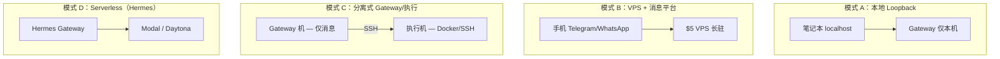

# Agent Hermes 与 OpenClaw 部署迁移与运维实战指南
# Deployment, Migration & Operations Guide for Agent Hermes & OpenClaw

> 最后更新 | Last updated: 2026-06-06

---

## 一、部署模式总览 | Deployment Patterns Overview

**中文**

个人 Agent 常见四种部署拓扑：



| 模式 | OpenClaw | Hermes | 适用 |
|------|----------|--------|------|
| A 本地 | `gateway.bind: loopback` | Gateway 默认不暴露 HTTP | 最安全开发 |
| B VPS | `openclaw onboard --install-daemon` | `hermes gateway install` | **最常见生产** |
| C 分离 | sandbox + remote node | `terminal.backend: ssh` | 高安全 |
| D Serverless | — | Modal/Daytona 后端 | 低闲置成本 |

**English**

Four deployment patterns: local loopback (safest dev), VPS + messaging (most common prod), split gateway/execution (high security), serverless backends (Hermes Modal/Daytona for near-zero idle cost).

---

## 二、Hermes 安装 | Hermes Installation

**中文**

### 2.1 一键安装

**Linux / macOS / WSL2 / Android (Termux)：**

```bash
curl -fsSL https://hermes-agent.nousresearch.com/install.sh | bash
source ~/.bashrc   # 或 source ~/.zshrc
```

**Windows 原生（PowerShell）：**

```powershell
iex (irm https://hermes-agent.nousresearch.com/install.ps1)
```

**Windows 推荐路径**：WSL2 内运行 bash 安装脚本 — 与 Linux 生产环境一致。

**Termux（Android）**：直接在手机上运行 Agent，适合轻量 Gateway + Telegram Bot。注意电量与后台进程限制。

### 2.2 安装器做了什么

| 组件 | 说明 |
|------|------|
| uv | Python 包管理 |
| Python 3.11 | 经 uv 安装，无需 sudo |
| Node.js v22 | 浏览器自动化、WhatsApp bridge |
| ripgrep | 快速文件搜索 |
| ffmpeg | TTS 音频转换 |
| 仓库克隆 | `~/.hermes/hermes-agent/` |
| 全局命令 | `~/.local/bin/hermes` |

### 2.3 安装布局

| 方式 | 代码位置 | 数据目录 |
|------|----------|----------|
| Git 安装器（用户） | `~/.hermes/hermes-agent/` | `~/.hermes/` |
| pip install | site-packages | `~/.hermes/` |
| sudo 系统安装 | `/usr/local/lib/hermes-agent/` | 每用户 `~/.hermes/` 或 `$HERMES_HOME` |

### 2.4 初始化

```bash
hermes setup              # 完整配置向导
hermes setup --portal     # 推荐：OAuth + Tool Gateway 一步完成
hermes model              # 选择 Provider 与模型
hermes tools              # 配置 toolsets
hermes gateway setup      # 配置消息平台
```

`hermes setup --portal` 覆盖：模型 Provider + web search + image gen + TTS + cloud browser — **最低摩擦无人值守路径**。

**English**

Install via curl script (Linux/macOS/WSL2/Termux) or PowerShell (native Windows; WSL2 preferred). Installer bundles Python, Node, ripgrep, ffmpeg. Run `hermes setup --portal` for fastest OAuth + Tool Gateway setup.

### 2.5 非 root / systemd 服务用户

```bash
# 管理员一次性（Debian/Ubuntu）
sudo npx playwright install-deps chromium

# 服务用户
curl -fsSL https://hermes-agent.nousresearch.com/install.sh | bash
# 或跳过浏览器：bash -s -- --skip-browser

# 确保 PATH 含 ~/.local/bin/hermes
hermes doctor
```

**English**

For systemd service accounts: admin installs Playwright system deps; service user runs installer with `--skip-browser` if headless only. Verify with `hermes doctor`.

---

## 三、OpenClaw 安装 | OpenClaw Installation

**中文**

```bash
npm install -g openclaw@latest
openclaw onboard --install-daemon
openclaw dashboard
```

| 步骤 | 作用 |
|------|------|
| `npm install -g` | 全局 CLI + Gateway |
| `onboard --install-daemon` | 引导式配置 + 系统服务（launchd/systemd） |
| `dashboard` | 浏览器控制台 `http://127.0.0.1:18789/` |

工作区默认：`~/.openclaw/workspace/`（SOUL.md、AGENTS.md 等）

主配置：`~/.openclaw/openclaw.json`

**English**

`npm install -g openclaw@latest`, then `openclaw onboard --install-daemon` for guided setup and daemon install. Control UI at `http://127.0.0.1:18789/`. Workspace at `~/.openclaw/workspace/`.

---

## 四、渠道配置：Telegram 最快路径 | Channel Setup: Telegram Fastest Path

**中文**

Telegram 是两框架 **上手最快** 的渠道之一：Bot Token 申请简单、无需企业资质、长轮询即可运行。

### 4.1 Hermes Telegram

```bash
hermes gateway setup
# 或编辑 ~/.hermes/.env：
# TELEGRAM_BOT_TOKEN=...
# TELEGRAM_ALLOWED_USERS=123456789
hermes gateway start
```

生产建议：

- 配置 `TELEGRAM_ALLOWED_USERS` 或启用 DM pairing
- `terminal.backend: docker`
- 可选 `TELEGRAM_HOME_CHANNEL` 用于 Cron 投递

### 4.2 OpenClaw Telegram

```json5
{
  channels: {
    telegram: {
      botToken: "...",
      dmPolicy: "pairing",
      groups: { "*": { requireMention: true } },
    },
  },
}
```

通过 `openclaw dashboard` 或 onboard 向导配置。

### 4.3 渠道对比速查

| 渠道 | 上手难度 | Hermes | OpenClaw |
|------|----------|--------|----------|
| Telegram | ★☆☆ | 内置 Adapter | 内置 |
| Discord | ★★☆ | 内置 | 内置 |
| WhatsApp | ★★★ | Cloud API / Baileys | 内置 bridge |
| iMessage | ★★★★ | BlueBubbles | 内置 + Nodes |
| 企业微信/飞书 | ★★★ | 内置 | 插件 |

**English**

Telegram is the fastest channel for both frameworks. Hermes: `hermes gateway setup` + allowlist/pairing. OpenClaw: `channels.telegram` in `openclaw.json` with `dmPolicy: pairing`.

---

## 五、Gateway 系统服务 | Gateway as System Service

**中文**

### 5.1 Hermes

```bash
hermes gateway install              # 用户级 systemd/launchd
sudo hermes gateway install --system  # Linux 开机系统服务
hermes gateway start
hermes gateway stop
hermes gateway stop --all           # 更新前停止所有 Profile
```

PID 文件：`~/.hermes/gateway.pid`（Profile 作用域）

后台任务并行运行：Cron 调度（60s tick）、会话过期、记忆 flush、Provider 缓存刷新。

### 5.2 OpenClaw

`openclaw onboard --install-daemon` 安装 launchd/systemd 服务。

```json5
{
  gateway: {
    mode: "local",
    bind: "loopback",           // 生产：loopback 或 auth
    auth: { mode: "token", token: "long-random-token" },
  },
}
```

远程访问：Tailscale 或 SSH 隧道 — **避免直接公网暴露 18789**。

**English**

Hermes: `hermes gateway install` (user or `--system` service). OpenClaw: daemon via onboard. Bind loopback or enable auth; use Tailscale/SSH for remote access.

---

## 六、hermes claw migrate 迁移 | Migrating from OpenClaw

**中文**

```bash
hermes claw migrate
```

一键从 `~/.openclaw/` 导入：

| 导入项 | 目标 |
|--------|------|
| SOUL.md | Hermes 人格 / global SOUL |
| MEMORY.md / USER.md | 持久记忆条目 |
| skills/ | `~/.hermes/skills/` |
| API Keys | `.env` 映射 |
| 消息/Gateway 设置 | Hermes 平台配置 |

**迁移后仍需**：

```bash
hermes model              # 确认 Provider
hermes gateway setup      # 验证渠道 Token
hermes doctor             # 健康检查
```

适用场景：已有龙虾部署、想叠加 Hermes 学习闭环，或社区 **HermesClaw** 双栈实验。

**English**

`hermes claw migrate` imports SOUL, memory, skills, API keys, and messaging config from `~/.openclaw/`. Follow with `hermes model`, `hermes gateway setup`, and `hermes doctor`.

---

## 七、诊断与审计 | Diagnostics & Auditing

**中文**

### 7.1 hermes doctor

```bash
hermes doctor
hermes doctor --ack <id>    # 确认处置供应链告警
```

检查项包括：

- Python venv 完整性
- 已知妥协包版本（供应链蠕虫等）
- 配置迁移状态
- 安装方式检测（pip/git/Homebrew/Nix）
- 缺失依赖与修复建议

### 7.2 openclaw security audit

```bash
openclaw security audit
openclaw security audit --deep    # 含实时 Gateway 探测
openclaw security audit --fix     # 自动修复常见问题
```

覆盖：入站访问、工具爆炸半径、网络暴露、文件权限、插件策略漂移。

### 7.3 对照表

| 操作 | OpenClaw | Hermes |
|------|----------|--------|
| 健康诊断 | Gateway 日志 + security audit | `hermes doctor` |
| 安全审计 | `openclaw security audit --deep` | doctor + Tirith + 审批配置 |
| 更新 | `npm update -g openclaw` | `hermes update`（自动检测安装方式） |
| 配置检查 | 手动编辑 openclaw.json | `hermes config check` / `migrate` |

**English**

`hermes doctor` for health and supply-chain advisories. `openclaw security audit [--deep] [--fix]` for OpenClaw hardening. `hermes update` auto-detects install method.

---

## 八、ACP IDE 集成 | ACP IDE Integration

**中文**

```bash
pip install -e '.[acp]'    # 或在标准安装后
hermes acp
```

| 编辑器 | 配置 |
|--------|------|
| VS Code | ACP Client 扩展 → `acp.agents.Hermes Agent` |
| Zed | ACP Registry → `uvx --from 'hermes-agent[acp]' hermes-acp` |
| JetBrains | 指向 `acp_registry/` |

ACP 使用 `hermes-acp` 精选 toolset：文件、终端、web、memory、skills、`delegate_task` — **不含** cronjob、messaging delivery。

审批选项：`allow_once` / `allow_session` / `allow_always` / `deny`

```bash
hermes acp --setup-browser --yes   # 可选浏览器工具
```

**English**

`hermes acp` for VS Code, Zed (via ACP Registry + uv), JetBrains. Curated toolset for editor workflows. Configure credentials first with `hermes model`.

---

## 九、轨迹导出与 RL 研究 | Trajectories & RL Research

**中文**

Hermes 提供 Batch Runner、ShareGPT 轨迹导出、Atropos RL 集成与断点续跑，面向工具调用模型微调。OpenClaw 会话存于 `sessions/*.jsonl`，可手动提取但无内置 RL 管线。

**English**

Hermes: batch runner, ShareGPT export, Atropos RL. OpenClaw: jsonl transcripts only — no built-in RL pipeline.

---

## 十、移动端 Nodes（OpenClaw）| iOS/Android Nodes

**中文**

OpenClaw 通过 Web Control UI 配对 iOS/Android **Nodes**（Canvas、相机、语音）。Hermes **无原生 Node**，以 Telegram/WhatsApp 等消息平台作「口袋助理」；Android 可用 Termux 自托管。需手机硬件深度集成选 OpenClaw Nodes；纯消息 + Cron 选 Hermes Gateway。

**English**

OpenClaw nodes: canvas, camera, voice via Control UI pairing. Hermes: messaging platforms or Termux on Android — no native mobile SDK.

---

## 十一、分离式 Gateway/执行（SSH 模式）| Split Gateway / Execution

**中文**

高安全生产拓扑：

```text
┌─────────────────────┐         SSH          ┌─────────────────────┐
│  Gateway VPS        │ ──────────────────► │  执行 VPS           │
│  - 仅消息 + 配对     │    terminal.backend  │  - Docker 沙箱      │
│  - 无敏感代码仓库    │         : ssh          │  - GPU / 大磁盘     │
└─────────────────────┘                      └─────────────────────┘
```

**Hermes 配置：**

```yaml
terminal:
  backend: ssh
  ssh:
    host: execution.internal
    user: hermes
    key_path: ~/.ssh/hermes_exec
```

**OpenClaw**：sandbox 配置 + remote node 模式。

**English**

Split trust: Gateway host for messaging only; execution host via SSH/Docker sandbox. Hermes: `terminal.backend: ssh`. OpenClaw: sandbox + remote nodes.

---

## 十二、运维清单 | Operations Checklist

**中文**

| 频率 / 硬化项 | Hermes | OpenClaw |
|---------------|--------|----------|
| 每日 | Gateway 日志 / Cron 输出 | Dashboard 会话 |
| 每周 | `hermes doctor`、command_allowlist | `security audit` |
| 每月 | `hermes update`、轮换 Key | npm 更新、审计 Skills |
| Allowlist / 配对 | 平台 allowlist + DM pairing | `dmPolicy: pairing` + `dmScope` |
| 执行隔离 | `terminal.backend: docker/ssh` | sandbox + `tools.profile` |
| 服务化 | `hermes gateway install` | `onboard --install-daemon` |
| 审计 | `hermes doctor` | `security audit --deep --fix` |
| 插件/供应链 | Cron `enabled_toolsets` | `plugins.allow` + shrinkwrap |

**English**

Routine ops: logs, weekly doctor/audit, monthly updates and key rotation. Production: allowlists, pairing, sandboxed execution, gateway services, and supply-chain checks for both frameworks.

---

## 十三、故障排查 | Troubleshooting

**中文**

| 问题 | Hermes 解决 | OpenClaw 解决 |
|------|-------------|---------------|
| `hermes: command not found` | `source ~/.bashrc`；检查 `~/.local/bin` | 检查 npm global bin PATH |
| API key 未设置 | `hermes model` 或 `hermes setup --portal` | onboard 向导 |
| Gateway 不响应 | `hermes gateway stop && start`；查 PID | 重启 daemon；查 18789 |
| Telegram 无回复 | 检查 allowlist / pairing | `dmPolicy`、bot token |
| 配置迁移失败 | `hermes config check` → `migrate` | 手动合并 openclaw.json |
| 模块导入错误 | 用 venv 的 `hermes`，非系统 Python | 重装 npm 包 |
| Cron 不触发 | `hermes gateway` 必须运行；`cron status` | Gateway cron 配置 |
| 浏览器工具失败 | `hermes acp --setup-browser` | Playwright 依赖 |
| 供应链告警 | `hermes doctor --ack` | `security audit` |

**English**

Common fixes: PATH for `hermes`, credentials via `hermes model`/`setup --portal`, gateway restart, pairing/allowlists for Telegram, `config migrate` for Hermes, `security audit` for OpenClaw. Run `hermes doctor` / `hermes status` or `openclaw security audit --deep` for guided diagnosis.

---

## 十四、快速命令对照 | Quick Command Reference

| 操作 | OpenClaw（龙虾） | Hermes Agent |
|------|------------------|--------------|
| 安装 | `npm install -g openclaw@latest` | `curl -fsSL .../install.sh \| bash` |
| 初始化 | `openclaw onboard --install-daemon` | `hermes setup` / `setup --portal` |
| 控制 UI | `openclaw dashboard` | CLI TUI + 各平台聊天 |
| 启动 Gateway | daemon 自动 | `hermes gateway start` |
| 系统服务 | onboard `--install-daemon` | `hermes gateway install` |
| 换模型 | Runtime 配置 | `hermes model` / `/model` |
| 安全审计 | `openclaw security audit` | `hermes doctor` |
| 从对方迁移 | — | `hermes claw migrate` |
| IDE 集成 | 外部 Runtime | `hermes acp` |
| MCP 桥接 | — | `hermes mcp serve` |
| 更新 | `npm update -g openclaw` | `hermes update` |

---

## 十五、延伸阅读 | Further Reading

- [Gateway 架构深度解析](./gateway.md) — 部署模式与生产清单
- [安全模型深度解析](./security-model.md) — audit 与硬化基线
- [模型 Provider 与成本](./model-provider-cost.md) — Portal 与 Cron 成本
- [插件体系与 MCP](./plugins-mcp-ecosystem.md) — 扩展安装
- Hermes：[Installation](https://hermes-agent.nousresearch.com/docs/getting-started/installation)、[Termux](https://hermes-agent.nousresearch.com/docs/getting-started/termux)、[FAQ](https://hermes-agent.nousresearch.com/docs/reference/faq)
- OpenClaw：https://docs.openclaw.ai/

---

## 十六、结语 | Conclusion

**中文**

部署个人 Agent 的「最快路径」是：**Hermes 用 `curl` + `setup --portal` + Telegram；OpenClaw 用 `npm` + `onboard` + Dashboard**。生产环境无论选型，都应完成 **配对/allowlist、执行沙箱、诊断审计、Gateway 系统服务** 四件事。已有龙虾用户可通过 `hermes claw migrate` 平滑叠加学习闭环；高安全场景采用 **SSH 分离 Gateway/执行**。运维不是一次性安装 — `hermes doctor` 与 `openclaw security audit` 应纳入日常节奏。

**English**

Fastest paths: Hermes `curl` + `setup --portal` + Telegram; OpenClaw `npm` + `onboard` + Dashboard. Production requires pairing/allowlists, execution sandboxing, diagnostics, and gateway services. Migrate from OpenClaw with `hermes claw migrate`. Split gateway/execution via SSH for high security. Treat `hermes doctor` and `security audit` as routine ops, not one-time setup.
