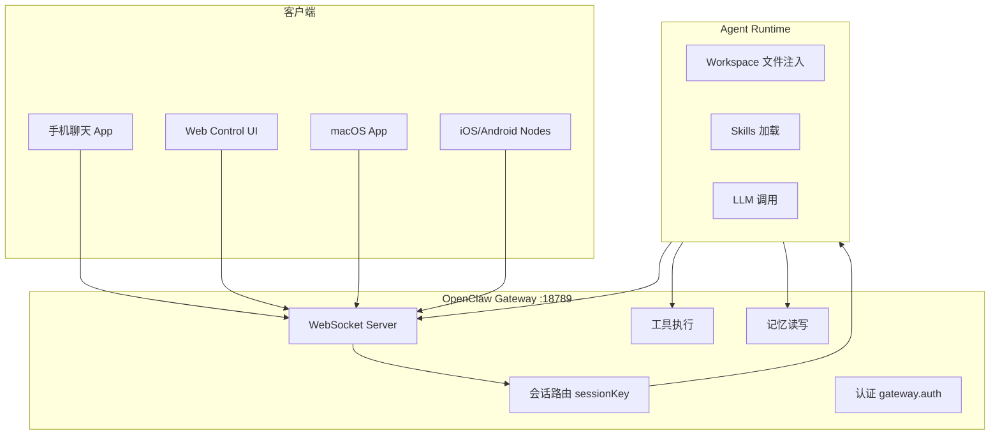
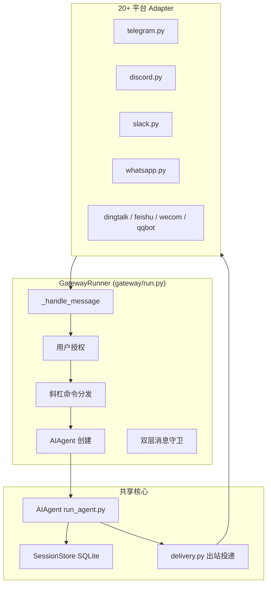

# Agent Hermes 与 OpenClaw（龙虾）Gateway 架构深度解析
# Gateway Architecture in Agent Hermes & OpenClaw (Lobster): A Deep Dive

> 最后更新 | Last updated: 2026-06-05

---

## 一、Gateway 的角色定位 | Gateway Role & Positioning

**中文**

在两个框架中，Gateway 都是**连接外部世界与 Agent 引擎的枢纽**，但职责权重不同：

| 维度 | OpenClaw Gateway | Hermes Gateway |
|------|------------------|----------------|
| 架构地位 | **Gateway 即产品** — 唯一控制平面 | Gateway 是入口之一，核心在 AIAgent 引擎 |
| 实现语言 | TypeScript（Node.js） | Python |
| 默认端口 | `18789` | 无固定公开端口（各平台 Adapter 独立连接） |
| 进程模型 | 单进程 WebSocket 服务 | 长驻 `GatewayRunner` 进程 |
| Agent 运行时 | Gateway 内嵌或路由到外部 Runtime | 每消息创建 `AIAgent` 实例 |
| 渠道数量 | 50+（含插件） | 20 个内置 Adapter |
| 控制 UI | 浏览器 Dashboard | CLI TUI + 各平台原生聊天界面 |

**English**

In both frameworks, the Gateway is the **hub connecting the external world to the agent engine**, but with different weight:

| Dimension | OpenClaw Gateway | Hermes Gateway |
|-----------|-------------------|----------------|
| Architectural role | **Gateway is the product** — sole control plane | Gateway is one entry point; core is AIAgent engine |
| Language | TypeScript (Node.js) | Python |
| Default port | `18789` | No fixed public port (per-platform adapters) |
| Process model | Single WebSocket server | Long-running `GatewayRunner` |
| Agent runtime | Embedded or routed to external runtime | `AIAgent` instance per message |
| Channels | 50+ (with plugins) | 20 built-in adapters |
| Control UI | Browser dashboard | CLI TUI + native chat on each platform |

---

## 二、OpenClaw Gateway 架构 | OpenClaw Gateway Architecture

**中文**

### 2.1 整体架构



OpenClaw 没有独立的「编排微服务层」——Gateway 接收消息、路由会话、调用 LLM、执行工具、写回响应，全部在一个进程中完成。

### 2.2 消息处理流程

```text
1. 聊天 App 发来消息
2. Gateway 接收（WebSocket / 渠道 Webhook）
3. 解析 sessionKey（路由键，非授权令牌）
4. 加载对应 Agent 的 Workspace 文件 + Skills
5. 组装系统提示词，调用 LLM
6. 若有工具调用 → 执行 shell/文件/浏览器/API
7. 响应经 Gateway 发回原渠道
```

### 2.3 会话路由（sessionKey）

`sessionKey` 是**路由选择器**，决定使用哪个会话上下文，**不是**用户认证令牌。

常见隔离策略（`session.dmScope`）：

| 值 | 行为 |
|----|------|
| `per-channel-peer` | 每个发送者独立会话（推荐多用户 DM） |
| `per-account-channel-peer` | 多账号渠道下按账号+发送者隔离 |

### 2.4 多 Agent 路由

OpenClaw 支持在同一 Gateway 上运行多个 Agent，按工作区、发送者或规则路由：

```text
Gateway
├── Agent A（工作区 ~/.openclaw/workspace-personal）
├── Agent B（工作区 ~/.openclaw/workspace-work）
└── 路由规则 → 按 channel / sender / mention 分发
```

### 2.5 渠道接入

**内置渠道**：WhatsApp、Telegram、Discord、Slack、Signal、iMessage、Google Chat、Microsoft Teams、WebChat 等。

**插件渠道**：Matrix、Nostr、Twitch、Zalo、Feishu 等通过 bundled 或 external channel plugins 扩展。

**Nodes（移动端）**：iOS/Android 设备配对后提供 Canvas、相机、语音等工作流。

### 2.6 配置中心

主配置文件：`~/.openclaw/openclaw.json`

```json5
{
  gateway: {
    mode: "local",
    bind: "loopback",
    auth: { mode: "token", token: "long-random-token" },
  },
  channels: {
    whatsapp: {
      dmPolicy: "pairing",
      groups: { "*": { requireMention: true } },
    },
  },
  tools: {
    profile: "messaging",
    exec: { security: "deny", ask: "always" },
  },
}
```

### 2.7 Web Control UI

本地默认：`http://127.0.0.1:18789/`

提供聊天、配置、会话管理、节点配对的浏览器控制台。远程访问需 Tailscale 或 SSH 隧道。

**English**

### 2.1 Overall Architecture

Single TypeScript process on port 18789: WebSocket server handles all channels, session routing, tool execution, and memory I/O. No separate orchestration microservice — the Gateway *is* the product.

### 2.2 Message Flow

Chat app → Gateway (WebSocket/webhook) → sessionKey routing → load workspace + skills → LLM → tools → response back to channel.

### 2.3 Session Routing (sessionKey)

`sessionKey` is a **routing selector**, not an auth token. `session.dmScope` controls DM isolation (e.g., `per-channel-peer` for multi-user inboxes).

### 2.4 Multi-Agent Routing

Multiple agents on one Gateway, routed by workspace, sender, or rules.

### 2.5 Channel Integration

Built-in channels (WhatsApp, Telegram, Discord, etc.) plus plugin channels (Matrix, Zalo, etc.) and iOS/Android nodes.

### 2.6 Configuration

Central config at `~/.openclaw/openclaw.json` — gateway mode, auth, channel policies, tool profiles.

### 2.7 Web Control UI

Browser dashboard at `http://127.0.0.1:18789/` for chat, config, sessions, and node pairing.

---

## 三、Hermes Gateway 架构 | Hermes Gateway Architecture

**中文**

### 3.1 整体架构



Hermes Gateway 是 **AIAgent 引擎的消息前端**，本身不包含独立的 LLM 编排逻辑。

### 3.2 关键源文件

| 文件 | 职责 |
|------|------|
| `gateway/run.py` | `GatewayRunner` — 主循环、消息分发、斜杠命令 |
| `gateway/session.py` | `SessionStore` — 会话持久化、session key 构建 |
| `gateway/delivery.py` | 出站消息投递（回复、跨平台、Cron 投递） |
| `gateway/pairing.py` | DM 配对授权流程 |
| `gateway/hooks.py` | 生命周期 Hook 发现与分发 |
| `gateway/platforms/*.py` | 各平台 Adapter |

### 3.3 消息处理流程

```text
平台事件 → Adapter.on_message() → MessageEvent
        → GatewayRunner._handle_message()
            1. 解析 session key
            2. 用户授权检查
            3. 斜杠命令？→ 命令处理器
            4. Agent 正在运行？→ 双层守卫（排队/中断/审批）
            5. 创建 AIAgent → run_conversation()
            6. 响应经 Adapter 发回
```

### 3.4 Session Key 格式

```text
agent:main:{platform}:{chat_type}:{chat_id}
```

示例：`agent:main:telegram:private:123456789`

线程型平台（Telegram 论坛话题、Discord/Slack 线程）在 `chat_id` 中包含线程 ID。**禁止手动拼接**，应使用 `build_session_key()`。

### 3.5 双层消息守卫

Agent 正在处理消息时，新消息经过两级拦截：

**Level 1 — Base Adapter**（`gateway/platforms/base.py`）：
- 检查 `_active_sessions`
- 活跃会话 → 消息入 `_pending_messages` 队列，设置中断事件

**Level 2 — GatewayRunner**（`gateway/run.py`）：
- 检查 `_running_agents`
- `/stop`、`/approve`、`/deny` 等命令绕过守卫，内联分发
- 其他消息触发 `running_agent.interrupt()`

### 3.6 用户授权

授权检查顺序（`_is_user_authorized()`）：

1. 平台级 allow-all（如 `DISCORD_ALLOW_ALL_USERS=true`）
2. DM 配对已批准列表
3. 平台 allowlist（如 `TELEGRAM_ALLOWED_USERS=12345,67890`）
4. 全局 allowlist（`GATEWAY_ALLOWED_USERS`）
5. 全局 allow-all（`GATEWAY_ALLOW_ALL_USERS=true`）
6. **默认：拒绝**

未配置任何 allowlist 时，启动日志会警告所有未授权用户将被拒绝。

### 3.7 DM 配对流程

```text
未知用户发 DM → Bot 回复 8 位配对码
管理员 CLI：hermes pairing approve telegram ABC12DEF
用户永久授权（存储于 ~/.hermes/pairing/）
```

安全特性：密码学随机、1 小时 TTL、10 分钟速率限制、5 次失败锁定 1 小时。

### 3.8 斜杠命令统一分发

CLI 与 Gateway 共享命令注册表（`hermes_cli/commands.py`）：

| 操作 | 命令 |
|------|------|
| 新对话 | `/new` 或 `/reset` |
| 换模型 | `/model [provider:model]` |
| 浏览技能 | `/skills` 或 `/skill-name` |
| 中断 | `/stop`（Gateway）/ `Ctrl+C`（CLI） |
| 危险命令审批 | `/approve` / `/deny` |
| 压缩上下文 | `/compress` |

Agent 运行中，部分命令（如 `/model`）会被拒绝，需先 `/stop`。

### 3.9 出站投递（Delivery）

`gateway/delivery.py` 支持四种投递模式：

| 模式 | 说明 |
|------|------|
| 直接回复 | 响应发回 originating chat |
| Home Channel | Cron/后台结果路由到配置的「主频道」 |
| 显式目标 | `send_message` 工具指定 `telegram:-1001234567890` |
| 跨平台投递 | 从 Telegram 收到消息，结果发到 Discord |

**设计决策**：Cron 投递**不镜像**进 Gateway 会话历史，避免消息交替违规。

### 3.10 平台 Adapter 列表

| Adapter | 协议/依赖 |
|---------|-----------|
| telegram.py | Telegram Bot API（长轮询或 Webhook） |
| discord.py | discord.py |
| slack.py | Slack Socket Mode |
| whatsapp.py | WhatsApp Business Cloud API |
| signal.py | signal-cli REST |
| matrix.py | mautrix（可选 E2EE） |
| dingtalk.py / feishu.py | 钉钉/飞书 WebSocket 或 Webhook |
| wecom.py / weixin.py | 企业微信 / 个人微信 iLink |
| qqbot/ | 腾讯 QQ 官方 API v2 |
| email.py | IMAP/SMTP |
| sms.py | Twilio |
| homeassistant.py | Home Assistant 对话集成 |
| api_server.py | REST API 适配器 |
| webhook.py | 通用入站/出站 Webhook |

### 3.11 Token 锁（Profile 隔离）

使用相同 Bot Token 的 Adapter 在 `connect()` 时调用 `acquire_scoped_lock()`，防止多 Profile 同时占用同一 Token。

每个 Profile（`hermes -p <name>`）拥有独立的 `HERMES_HOME`、配置、会话和 Gateway PID。

### 3.12 生命周期 Hooks

| 事件 | 触发时机 |
|------|----------|
| `gateway:startup` | Gateway 进程启动 |
| `session:start` / `session:end` / `session:reset` | 会话生命周期 |
| `agent:start` / `agent:step` / `agent:end` | Agent 处理周期 |
| `command:*` | 任意斜杠命令执行 |

Hook 目录：`~/.hermes/hooks/`（用户自定义）

### 3.13 后台维护任务

Gateway 并行运行：

- **Cron 调度** — 检查到期任务并触发
- **会话过期** — 清理超时废弃会话
- **记忆刷新** — 会话过期前主动 flush 记忆
- **缓存刷新** — 模型列表与 Provider 状态

### 3.14 进程管理

```bash
hermes gateway start    # 启动
hermes gateway stop     # 停止当前 Profile
hermes gateway stop --all  # 停止所有 Profile（更新时用）
```

PID 文件：`~/.hermes/gateway.pid`（Profile 作用域）

**English**

### 3.1 Overall Architecture

`GatewayRunner` is the messaging frontend for the shared `AIAgent` engine. 20+ platform adapters normalize inbound events; the runner handles auth, slash commands, agent creation, and delivery.

### 3.2 Key Source Files

`gateway/run.py` (runner), `session.py` (persistence), `delivery.py` (outbound), `pairing.py` (DM auth), `platforms/*.py` (adapters).

### 3.3 Message Flow

Platform event → adapter → `_handle_message()` → auth → slash command or AIAgent → response via adapter.

### 3.4 Session Key

`agent:main:{platform}:{chat_type}:{chat_id}` — use `build_session_key()`, never construct manually.

### 3.5 Two-Level Message Guard

Adapter-level queuing + runner-level interrupt/approval routing while agent is active.

### 3.6 User Authorization

Layered allowlists + DM pairing; default deny if no allowlist configured.

### 3.7 DM Pairing

8-char cryptographic codes, TTL, rate limits, lockout. Approved via `hermes pairing approve`.

### 3.8 Shared Slash Commands

CLI and Gateway share `COMMAND_REGISTRY` — `/model`, `/skills`, `/stop`, `/approve`, etc.

### 3.9 Delivery Modes

Direct reply, home channel, explicit target, cross-platform. Cron deliveries excluded from gateway session history.

### 3.10 Platform Adapters

20 built-in adapters covering Telegram, Discord, Slack, WhatsApp, Signal, Matrix, DingTalk, Feishu, WeCom, QQ, email, SMS, Home Assistant, REST API, webhooks, and more.

### 3.11 Profile Isolation

Per-profile `HERMES_HOME`, config, sessions, gateway PID, and token locks.

### 3.12 Hooks & Background Tasks

Lifecycle hooks for startup, sessions, agent steps, commands. Background cron ticking, session expiry, memory flush, cache refresh.

---

## 四、Gateway 对比矩阵 | Gateway Comparison Matrix

**中文**

| 能力 | OpenClaw | Hermes |
|------|----------|--------|
| 核心哲学 | Gateway = 产品 | Gateway = AIAgent 入口 |
| 协议栈 | WebSocket 统一 | 每平台原生协议 |
| 控制 UI | 浏览器 Dashboard | CLI TUI + 各平台聊天 |
| 会话存储 | jsonl 文件 | SQLite state.db |
| 斜杠命令 | 渠道内 + Control UI | CLI/Gateway 统一注册表 |
| 多 Profile | Profile 机制 | `hermes -p <name>` 完整隔离 |
| Cron 投递 | 支持 | 一等公民，可附 Skills |
| 跨平台投递 | 支持 | `delivery.py` 显式路由 |
| 移动端 Nodes | iOS/Android 配对 | 无原生 Node（靠消息平台） |
| 从对方迁移 | — | `hermes claw migrate` 导入消息设置 |

**English**

| Capability | OpenClaw | Hermes |
|------------|----------|--------|
| Core philosophy | Gateway = product | Gateway = AIAgent entry |
| Protocol | Unified WebSocket | Per-platform native protocols |
| Control UI | Browser dashboard | CLI TUI + platform chats |
| Session storage | jsonl files | SQLite state.db |
| Slash commands | In-channel + Control UI | Unified CLI/Gateway registry |
| Multi-profile | Profile mechanism | `hermes -p <name>` full isolation |
| Cron delivery | Supported | First-class with skill attachment |
| Cross-platform delivery | Supported | Explicit `delivery.py` routing |
| Mobile nodes | iOS/Android pairing | Via messaging platforms only |
| Migration | — | `hermes claw migrate` imports messaging config |

---

## 五、部署模式 | Deployment Patterns

**中文**

### 模式 A：本地 Loopback（最安全）

```text
笔记本 localhost → Gateway → 仅本机 Control UI / 本地渠道
```

- OpenClaw：`gateway.bind: "loopback"`
- Hermes：Gateway 默认不暴露 HTTP 端口

### 模式 B：VPS + 消息平台（最常见）

```text
$5 VPS → Gateway 长驻 → Telegram/WhatsApp Bot Token
用户在手机上对话，Agent 在云端执行
```

- Hermes 推荐 `terminal.backend: docker` 隔离命令执行
- OpenClaw 推荐 `openclaw security audit` 加固

### 模式 C：分离式（高安全）

```text
Gateway 机器（仅消息）──SSH──→ 执行机器（Docker 沙箱）
```

- Hermes 原生支持：`terminal.backend: ssh`
- OpenClaw：通过 sandbox 配置 + 远程 node

### 模式 D：Serverless（Hermes 独有）

```text
Gateway 在 VPS → Agent 命令发往 Modal/Daytona
空闲休眠，按需唤醒，接近零闲置成本
```

**English**

**Pattern A — Local loopback** (safest): bind to localhost only.

**Pattern B — VPS + messaging** (most common): long-running Gateway on cheap VPS, chat from phone.

**Pattern C — Split trust** (high security): Gateway on one host, execution on another via SSH/Docker sandbox.

**Pattern D — Serverless** (Hermes-specific): Modal/Daytona backends with sleep-on-idle.

---

## 六、生产部署清单 | Production Deployment Checklist

**中文**

### OpenClaw

- [ ] `openclaw security audit --deep` 并修复发现项
- [ ] `gateway.bind: "loopback"` 或配置 `gateway.auth`
- [ ] `dmPolicy: "pairing"` + `session.dmScope: "per-channel-peer"`
- [ ] 收紧 `tools.profile`，禁用不必要的工具组
- [ ] `chmod` 锁定 `~/.openclaw` 权限
- [ ] 插件仅加载信任来源

### Hermes Agent

- [ ] 配置平台 allowlist，禁用 `GATEWAY_ALLOW_ALL_USERS`
- [ ] `terminal.backend: docker`（生产 Gateway）
- [ ] 启用 DM pairing
- [ ] `chmod 600 ~/.hermes/.env`
- [ ] 定期审查 `command_allowlist`
- [ ] `hermes doctor` 检查供应链告警

**English**

**OpenClaw**: run security audit, bind loopback or enable auth, pairing DM policy, tighten tool profile, lock filesystem permissions, trust-only plugins.

**Hermes**: configure allowlists, use Docker backend, enable DM pairing, secure `.env`, audit command allowlist, run `hermes doctor`.

---

## 七、结语 | Conclusion

**中文**

OpenClaw Gateway 是 **「多渠道操作系统」** — 用单一 WebSocket 控制平面统一 50+ 渠道，适合需要极致连接广度与浏览器控制台的场景。Hermes Gateway 是 **「Agent 引擎的消息前端」** — 20 个 Adapter 接入同一 AIAgent 核心，与 CLI、ACP、Cron 共享会话存储与斜杠命令，适合需要统一学习闭环与跨入口一致体验的场景。二者都能让你「在 Telegram 上发消息、Agent 在云端干活」，选型应优先考虑你对 **连接广度** 还是 **引擎深度** 的需求。

**English**

OpenClaw Gateway is a **multi-channel operating system** — one WebSocket control plane for 50+ channels, ideal for maximum connectivity and a browser dashboard. Hermes Gateway is the **messaging frontend for the agent engine** — 20 adapters into one AIAgent core, sharing session storage and slash commands with CLI, ACP, and Cron. Both let you "message from Telegram while the agent works in the cloud"; choose based on whether you need **connectivity breadth** or **engine depth**.
