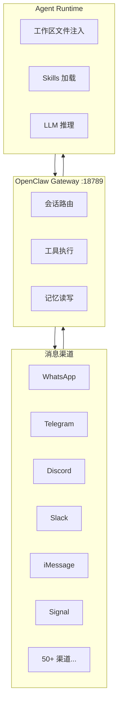
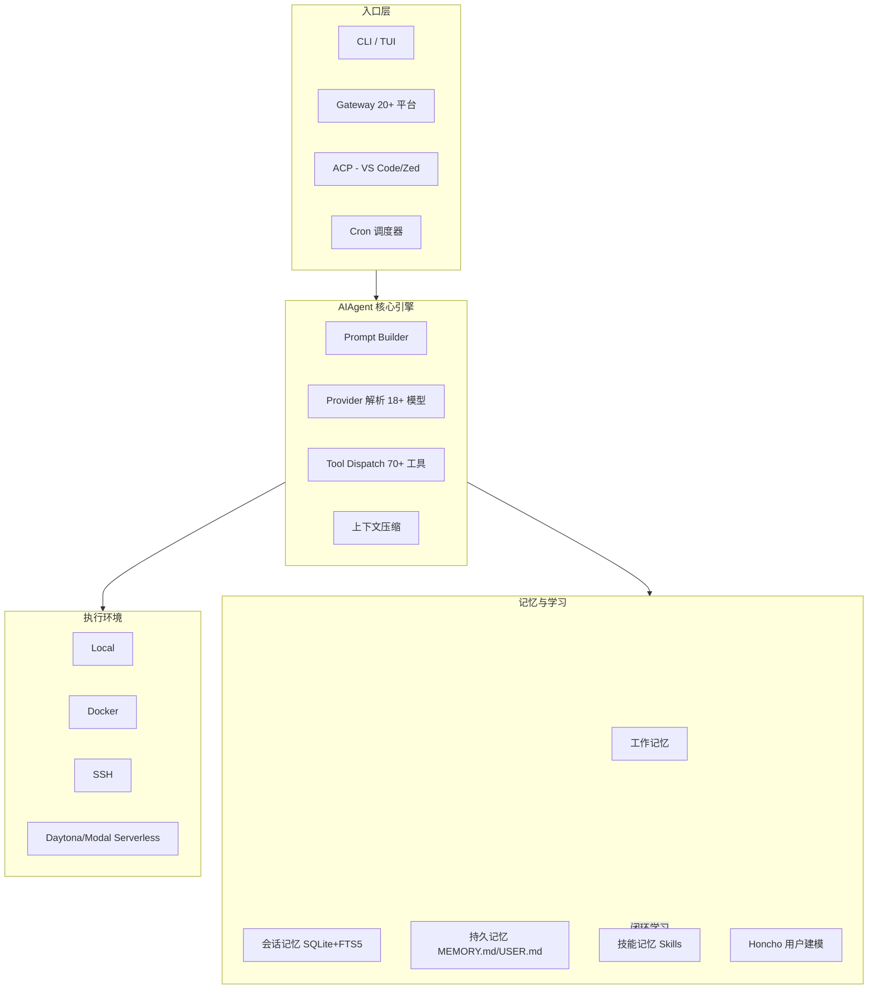
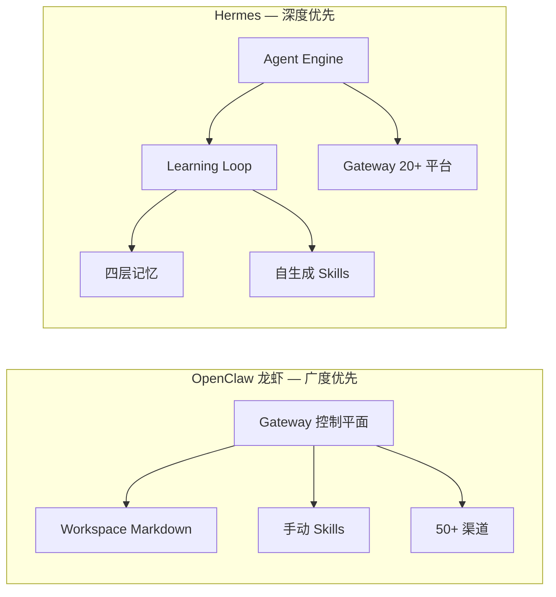

# Agent Hermes 与 OpenClaw（龙虾）：架构、应用与对比
# Agent Hermes & OpenClaw (Lobster): Architecture, Applications, and Comparison

> 最后更新 | Last updated: 2026-06-05

---

## 一、背景与定位 | Background & Positioning

**中文**

2026 年初，个人 AI Agent 领域出现两个现象级开源项目：

- **OpenClaw（龙虾）**：吉祥物是太空龙虾 Molty 🦞，GitHub Star 超 35 万，社区称其为「养虾」——在本地或服务器上长期运行一只个人助理。
- **Hermes Agent（爱马仕）**：由 Nous Research 发布，定位是 **"The agent that grows with you"（与你共同成长的智能体）**，核心差异是内置 **闭环学习系统（Learning Loop）**。

二者均为 MIT 协议、可自托管、支持多渠道消息，但设计哲学不同：

| 维度 | OpenClaw（龙虾） | Hermes Agent |
|------|------------------|--------------|
| 核心问题 | **连接** — 让 AI 接入工具与聊天渠道 | **进化** — 让 AI 从经验中学习并自我改进 |
| 架构重心 | Gateway 控制平面 | Agent Engine + 学习闭环 |
| 技能来源 | 用户/社区手动编写 SKILL.md | 任务完成后 **自动生成 + 自我迭代** |
| 记忆模式 | Markdown 工作区文件 | 分层记忆 + SQLite FTS5 检索 |

**English**

In early 2026, two standout open-source personal AI agent projects emerged:

- **OpenClaw (Lobster)**: Mascot Molty the space lobster 🦞, 350K+ GitHub stars; Chinese communities call it "raising a lobster" — running a persistent personal assistant locally or on a server.
- **Hermes Agent**: Built by Nous Research, positioned as **"The agent that grows with you"**, with a built-in **closed learning loop**.

Both are MIT-licensed, self-hostable, and multi-channel — but their design philosophies diverge:

| Dimension | OpenClaw (Lobster) | Hermes Agent |
|-----------|-------------------|--------------|
| Core problem | **Connectivity** — tools + chat channels | **Evolution** — learn and improve from experience |
| Architecture focus | Gateway control plane | Agent engine + learning loop |
| Skills | User/community-authored SKILL.md | **Auto-generated + self-improving** after tasks |
| Memory | Markdown workspace files | Layered memory + SQLite FTS5 search |

---

## 二、OpenClaw（龙虾）架构设计 | OpenClaw Architecture

**中文**

OpenClaw 的核心理念是：**Gateway 即产品**。单一 TypeScript 进程监听默认端口 `18789`，统一管理所有渠道连接、会话路由与工具执行。



### 2.1 工作区文件体系（Workspace Bootstrap）

Agent 的「人格」与「知识」以纯 Markdown 文件存在，默认位于 `~/.openclaw/workspace/`：

| 文件 | 作用 |
|------|------|
| `SOUL.md` | 人格、语气、价值观、行为边界 |
| `AGENTS.md` | 操作手册：工作流、记忆规则、多 Agent 协作 |
| `USER.md` | 用户偏好与身份信息 |
| `TOOLS.md` | 工具使用指南 |
| `MEMORY.md` | 长期记忆（Agent 可周期性更新） |
| `HEARTBEAT.md` | 主动巡检任务（如晨间简报） |
| `IDENTITY.md` | Agent 名称、头像等元数据 |
| `skills/*/SKILL.md` | 可扩展技能包 |

每次会话启动时，这些文件按固定顺序注入系统提示词：`SOUL.md` 优先（人格），`MEMORY.md` 靠后（变化最频繁）。

### 2.2 三层扩展体系

1. **Workspace 文件** — 人格与上下文
2. **Skills（SKILL.md）** — 按需加载的能力包
3. **Channel Plugins** — Matrix、Nostr、Twitch 等渠道插件

### 2.3 多 Agent 路由

Gateway 支持按发送者、工作区或 Agent 实例隔离会话，适合「一个 Gateway、多个专职 Agent」的场景。

**English**

OpenClaw's core idea: **the Gateway is the product**. A single TypeScript process on port `18789` manages all channel connections, session routing, and tool execution.

### 2.1 Workspace Bootstrap Files

Agent identity and knowledge live as plain Markdown under `~/.openclaw/workspace/`:

| File | Purpose |
|------|---------|
| `SOUL.md` | Persona, tone, values, behavioral boundaries |
| `AGENTS.md` | Operating manual: workflows, memory rules, multi-agent coordination |
| `USER.md` | User preferences and identity |
| `TOOLS.md` | Tool usage guidance |
| `MEMORY.md` | Long-term memory (periodically updated by the agent) |
| `HEARTBEAT.md` | Proactive checks (e.g., morning briefings) |
| `IDENTITY.md` | Agent name, avatar, metadata |
| `skills/*/SKILL.md` | Extensible skill packages |

At session start, files inject into the system prompt in a fixed order: `SOUL.md` first (persona), `MEMORY.md` last (most volatile).

### 2.2 Three-Layer Extension System

1. **Workspace files** — persona and context
2. **Skills (SKILL.md)** — on-demand capability packs
3. **Channel plugins** — Matrix, Nostr, Twitch, etc.

### 2.3 Multi-Agent Routing

The Gateway isolates sessions per sender, workspace, or agent instance — one Gateway, many specialized agents.

---

## 三、Hermes Agent 架构设计 | Hermes Agent Architecture

**中文**

Hermes 的架构重心是 **AIAgent 同步编排引擎**（`run_agent.py`），而非微服务。CLI、Gateway、ACP（IDE 集成）、Cron、Batch Runner 共用同一 Agent 核心。



### 3.1 Agent 循环（Agent Loop）

标准流程：

```
用户消息 → 构建 Prompt（系统提示 + 记忆 + 上下文）
         → 调用 LLM（支持 chat_completions / codex_responses / anthropic_messages 三种 API 模式）
         → 解析工具调用 → 执行工具 → 结果回注上下文
         → 循环直至 LLM 不再请求工具 → 返回最终响应 → 持久化会话
```

设计原则包括：**提示词稳定性**（会话中不突变，保护前缀缓存）、**可观测执行**（每次工具调用对用户可见）、**可中断**（用户可随时取消）。

### 3.2 四层记忆体系

| 层级 | 机制 | 特点 |
|------|------|------|
| 工作记忆 | 当前对话上下文 | 即时可用 |
| 会话记忆 | SQLite + FTS5 全文检索 | 跨会话搜索历史对话，`session_search` 工具按需召回 |
| 持久记忆 | `MEMORY.md`（~2200 字符）+ `USER.md`（~1375 字符） | 会话启动时冻结注入系统提示词 |
| 技能记忆 | `~/.hermes/skills/` 下的 SKILL.md | **渐进式披露**：索引仅含名称/描述，全文按需加载 |

此外支持 8 种外部记忆 Provider（Honcho、Mem0、Hindsight 等），用于知识图谱、语义检索、跨会话用户建模。

### 3.3 闭环学习（Learning Loop）

Hermes 最核心的差异化能力：

1. **策划记忆** — 任务完成后，Agent 自主判断什么值得记住
2. **创建 Skill** — 复杂任务（通常 5+ 次工具调用）成功后，自动生成 Markdown 格式 Skill
3. **Skill 自改进** — 执行失败或发现更优路径时，通过 `skill_manage` 工具 patch 更新
4. **周期性微调（Periodic Nudge）** — 会话间隙触发自我反思与优化
5. **FTS5 召回** — 按需检索历史，经 LLM 摘要后注入相关片段

技能库可从几十个增长到上百个，而上下文 Token 成本几乎不变（仅加载索引 + 按需全文）。

### 3.4 工具与执行环境

- **70+ 工具**，28 个 toolsets，模块级自注册（`registry.register()`）
- **6 种终端后端**：Local、Docker、SSH、Daytona、Modal、Singularity
- **5 种浏览器后端** + MCP 双向支持（既可作 MCP 客户端，也可被 Cursor/VS Code 接入）
- **子 Agent 委派**：`delegate_tool` 生成隔离子代理并行处理

### 3.5 Gateway 与多渠道

单一 Gateway 进程支持 20 个平台适配器：Telegram、Discord、Slack、WhatsApp、Signal、Matrix、钉钉、飞书、企业微信、QQ 等。与 CLI 共享斜杠命令（`/model`、`/skills`、`/compress` 等）。

**English**

Hermes centers on the **AIAgent synchronous orchestration engine** (`run_agent.py`) — not microservices. CLI, Gateway, ACP (IDE), Cron, and Batch Runner share one agent core.

### 3.1 Agent Loop

```
User message → Build prompt (system + memory + context)
            → Call LLM (3 API modes: chat_completions / codex_responses / anthropic_messages)
            → Parse tool calls → Execute → Inject results
            → Loop until no more tool calls → Final response → Persist session
```

Design principles: **prompt stability** (no mid-session mutations, preserves prefix cache), **observable execution**, **interruptibility**.

### 3.2 Four-Layer Memory

| Layer | Mechanism | Trait |
|-------|-----------|-------|
| Working memory | Current conversation context | Immediate |
| Session memory | SQLite + FTS5 full-text search | Cross-session recall via `session_search` |
| Persistent memory | `MEMORY.md` (~2200 chars) + `USER.md` (~1375 chars) | Frozen into system prompt at session start |
| Skill memory | `SKILL.md` under `~/.hermes/skills/` | **Progressive disclosure**: index only, full content on demand |

Plus 8 external memory providers (Honcho, Mem0, Hindsight, etc.) for knowledge graphs and semantic search.

### 3.3 Closed Learning Loop

Hermes's key differentiator:

1. **Curate memory** — after tasks, decide what's worth remembering
2. **Create skills** — auto-generate Markdown skills after complex tasks (typically 5+ tool calls)
3. **Self-improve skills** — patch via `skill_manage` on failure or better paths
4. **Periodic Nudge** — self-reflection between sessions
5. **FTS5 recall** — search history, LLM-summarize, inject relevant snippets

Skill libraries can grow from dozens to hundreds with near-flat context token cost.

### 3.4 Tools & Execution Environments

- **70+ tools**, 28 toolsets, self-registering at import time
- **6 terminal backends**: Local, Docker, SSH, Daytona, Modal, Singularity
- **5 browser backends** + bidirectional MCP (client and server for Cursor/VS Code)
- **Sub-agent delegation** via `delegate_tool`

### 3.5 Gateway & Multi-Channel

One Gateway process, 20 platform adapters: Telegram, Discord, Slack, WhatsApp, Signal, Matrix, DingTalk, Feishu, WeCom, QQ, etc. Shares slash commands with CLI (`/model`, `/skills`, `/compress`).

---

## 四、典型应用场景 | Typical Use Cases

**中文**

### OpenClaw（龙虾）擅长

| 场景 | 说明 |
|------|------|
| 口袋里的个人助理 | 手机 Telegram/WhatsApp 发消息，Gateway 在本地/服务器响应 |
| 多渠道统一入口 | 一个 Gateway 同时服务 Discord + Slack + iMessage |
| 开发者编码助手 | 与 Claude Code / Cursor 等 Agent Runtime 集成 |
| 主动巡检 | `HEARTBEAT.md` 定义定时检查（邮件、日历、服务器状态） |
| 多 Agent 分工 | 不同工作区/发送者路由到不同专职 Agent |
| 社区生态 | 海量 Skills 市场、插件、教程 |

### Hermes Agent 擅长

| 场景 | 说明 |
|------|------|
| 长期个人进化 | 用得越久，技能库越丰富，越贴合个人习惯 |
| 自动化 Cron 任务 | 自然语言描述日报、备份、周审计，无人值守投递到任意平台 |
| 研究 / RL 轨迹 | 批量生成 ShareGPT 格式轨迹，用于训练工具调用模型 |
| 低成本 Serverless | Daytona/Modal 后端：空闲休眠、按需唤醒，接近零闲置成本 |
| 从龙虾迁移 | `hermes claw migrate` 一键导入 SOUL.md、记忆、技能、API Key |
| 企业级安全审批 | 危险命令强制审批、容器隔离、DM 配对白名单 |

**English**

### OpenClaw Excels At

| Scenario | Description |
|----------|-------------|
| Pocket personal assistant | Message from Telegram/WhatsApp; Gateway responds locally/on server |
| Unified multi-channel hub | One Gateway for Discord + Slack + iMessage simultaneously |
| Developer coding assistant | Integrates with Claude Code / Cursor agent runtimes |
| Proactive monitoring | `HEARTBEAT.md` defines scheduled checks (email, calendar, servers) |
| Multi-agent specialization | Route by workspace/sender to dedicated agents |
| Community ecosystem | Large skills marketplace, plugins, tutorials |

### Hermes Excels At

| Scenario | Description |
|----------|-------------|
| Long-term personal evolution | Richer skill library and better habit fit over time |
| Cron automation | Natural-language daily reports, backups, audits — unattended delivery |
| Research / RL trajectories | Batch ShareGPT-format trajectories for tool-calling model training |
| Low-cost serverless | Daytona/Modal backends: sleep when idle, wake on demand |
| Migration from OpenClaw | `hermes claw migrate` imports SOUL.md, memory, skills, API keys |
| Enterprise-grade safety | Dangerous-command approval, container isolation, DM pairing allowlists |

---

## 五、优缺点对比 | Pros & Cons Comparison

**中文**

### OpenClaw（龙虾）

**优点**
- 社区体量极大，文档、教程、第三方 Skills 丰富
- Gateway 架构简洁直观，「一个进程、一个端口」易于理解
- 渠道覆盖广（50+），含 iOS/Android Nodes、Web Control UI
- 工作区文件（SOUL.md 等）人类可读、可 Git 版本管理
- 本地优先，数据主权在用户手中
- 上手快：`openclaw onboard` 引导式安装

**缺点**
- 记忆与技能主要靠人工维护，缺少内置自学习闭环
- 技能不会随使用自动优化，重复任务仍需重新推理
- 广泛文件/系统访问带来安全风险，需仔细配置 allowlist
- 云模型 API 费用可能较高（$10–150+/月，视用量而定）
- 静态配置为主，「越用越懂你」需额外 Skills 或手动维护 MEMORY.md

### Hermes Agent

**优点**
- 唯一内置完整闭环学习的 Agent 框架
- 技能自动生成与自我迭代，重复任务效率显著提升
- 四层记忆 + FTS5 按需检索，Token 成本可控
- 模型无关，支持 18+ Provider（OpenRouter、NIM、Kimi、GLM 等）
- 6 种执行后端 + Serverless，$5 VPS 到 GPU 集群均可
- 官方提供 OpenClaw 迁移工具，降低切换成本
- 研究友好：轨迹导出、批量 Runner、RL 环境支持

**缺点**
- 生态较新，社区规模小于 OpenClaw
- 学习闭环增加系统复杂度，调试需理解记忆/技能机制
- 持久记忆有字符上限（MEMORY.md ~2200 字符），需主动整合
- 企业集成与大型社区插件市场仍在建设中
- Windows 需 WSL2，不支持原生 Windows

**English**

### OpenClaw (Lobster)

**Pros**
- Massive community, docs, tutorials, third-party skills
- Simple Gateway: one process, one port
- Broad channel coverage (50+), iOS/Android nodes, Web Control UI
- Human-readable workspace files, Git-versionable
- Local-first, user data sovereignty
- Fast onboarding via `openclaw onboard`

**Cons**
- Memory and skills mostly manual; no built-in self-learning loop
- Skills don't auto-improve; repeated tasks re-reason each time
- Broad file/system access raises security risk; careful allowlist config needed
- Cloud model API costs can be high ($10–150+/month depending on usage)
- Static config; "knows you better over time" needs extra skills or manual MEMORY.md

### Hermes Agent

**Pros**
- Only major framework with a built-in closed learning loop
- Auto-generated, self-improving skills; big gains on repeated tasks
- Four-layer memory + FTS5 on-demand recall; controlled token cost
- Model-agnostic, 18+ providers (OpenRouter, NIM, Kimi, GLM, etc.)
- 6 execution backends + serverless; $5 VPS to GPU cluster
- Official OpenClaw migration tool
- Research-ready: trajectory export, batch runner, RL environments

**Cons**
- Newer ecosystem, smaller community than OpenClaw
- Learning loop adds complexity; debugging requires understanding memory/skills
- Persistent memory has char limits (~2200 for MEMORY.md); active consolidation needed
- Enterprise integrations and large plugin marketplace still maturing
- Windows requires WSL2; no native Windows

---

## 六、架构哲学对比 | Architectural Philosophy Comparison



**中文总结**

- **龙虾** 回答的是：「如何让 AI 连上我的世界？」— Gateway + 文件即配置。
- **Hermes** 回答的是：「如何让 AI 在使用中变得更聪明？」— Engine + 学习闭环。

二者并非简单替代关系。Hermes 官方提供 `hermes claw migrate`，说明其定位是承接龙虾用户、并叠加自进化能力。社区也有 **HermesClaw** 等项目，尝试在同一微信账号上同时运行两者。

**选型建议：**

| 你的需求 | 推荐 |
|----------|------|
| 多渠道聊天、快速上手、庞大社区 | OpenClaw |
| 长期运行、自动沉淀技能、研究轨迹 | Hermes Agent |
| 已有龙虾部署、想尝试自学习 | `hermes claw migrate` |
| 编码为主、IDE 深度集成 | 两者均可；OpenClaw 与 Cursor/Claude Code 生态更成熟 |

**English Summary**

- **OpenClaw** asks: "How do I connect AI to my world?" — Gateway + files-as-config.
- **Hermes** asks: "How does AI get smarter through use?" — Engine + learning loop.

They're not simple replacements. Hermes ships `hermes claw migrate` to onboard OpenClaw users with self-evolution on top. Community projects like **HermesClaw** run both on the same WeChat account.

**Selection guide:**

| Your need | Recommendation |
|-----------|----------------|
| Multi-channel chat, fast start, large community | OpenClaw |
| Long-running use, auto skill accumulation, research trajectories | Hermes Agent |
| Existing OpenClaw setup, want self-learning | `hermes claw migrate` |
| Coding-first, deep IDE integration | Both work; OpenClaw + Cursor/Claude Code ecosystem is more mature |

---

## 七、快速上手命令对照 | Quick Start Command Reference

| 操作 | OpenClaw（龙虾） | Hermes Agent |
|------|------------------|--------------|
| 安装 | `npm install -g openclaw@latest` | `curl -fsSL https://hermes-agent.nousresearch.com/install.sh \| bash` |
| 初始化 | `openclaw onboard --install-daemon` | `hermes setup` |
| 启动服务 | `openclaw dashboard` | `hermes gateway start` |
| 对话 | Web Control UI 或聊天 App | `hermes` 或 Telegram 等 |
| 人格配置 | 编辑 `~/.openclaw/workspace/SOUL.md` | `/personality` 或 SOUL 迁移 |
| 技能管理 | `skills/` 目录 + SKILL.md | `/skills` + 自动生成 + Skills Hub |
| 从对方迁移 | — | `hermes claw migrate` |
| 诊断 | Gateway 日志 | `hermes doctor` |

---

## 八、延伸阅读 | Further Reading

- [记忆系统深度解析](./memory-system.md)
- [Gateway 架构深度解析](./gateway.md)
- [安全模型深度解析](./security-model.md)

---

## 九、结语 | Conclusion

**中文**

Agent Hermes 与 OpenClaw（龙虾）代表了个人 AI Agent 的两条演进路线：**连接广度** 与 **学习深度**。龙虾用 Gateway 把 AI 带进你的消息应用和工作区；Hermes 用闭环学习让 AI 从每一次任务中沉淀经验。在实际部署中，二者可以共存、迁移、甚至互补——关键取决于你是更需要「随时随地的多渠道助理」，还是「越用越懂你的自进化伙伴」。

**English**

Agent Hermes and OpenClaw (Lobster) represent two evolution paths for personal AI agents: **connectivity breadth** vs. **learning depth**. OpenClaw's Gateway brings AI into your messaging apps and workspace; Hermes's closed loop turns every task into lasting experience. In practice they can coexist, migrate, and complement each other — the choice depends on whether you need an always-available multi-channel assistant or a self-evolving partner that knows you better over time.
