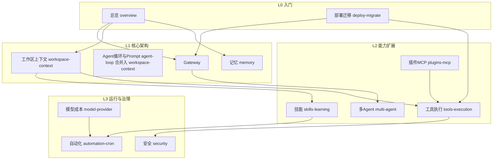

# Agent Hermes × OpenClaw 知识点覆盖矩阵
# Knowledge Coverage Map: Hermes × OpenClaw

> 规划文档 | Planning document — 2026-06-06

---

## 一、覆盖现状审计 | Coverage Audit

### 已发布（4 篇）| Published (4 articles)

| 知识点域 | 覆盖深度 | 文章 |
|----------|----------|------|
| 架构总览、选型、优缺点 | ★★★★★ | [hermes-openclaw-overview.md](./hermes-openclaw-overview.md) |
| 记忆系统（四层 vs Workspace） | ★★★★☆ | [memory-system.md](./memory-system.md) |
| Gateway 控制平面 | ★★★★☆ | [gateway.md](./gateway.md) |
| 安全模型 | ★★★★☆ | [security-model.md](./security-model.md) |

### 待完善细节（缺口）| Gaps to Fill

| 缺口 | 现状问题 | 新文章 |
|------|----------|--------|
| **技能系统** | 总览仅一笔带过；未覆盖 ClawHub、Skill Workshop、skill_manage、渐进式披露 Token 数学 | `skills-learning-loop.md` |
| **工具与执行环境** | 未系统讲解 70+ 工具、toolsets、6 后端、后台进程、PTY | `tools-execution-environments.md` |
| **工作区与 Prompt** | SOUL/AGENTS/HEARTBEAT 等 8 文件未专文；Hermes prompt tiers 未讲 | `workspace-context-prompt.md` |
| **自动化调度** | Cron/no-agent/wakeAgent/context_from/HEARTBEAT 缺失 | `automation-cron-heartbeat.md` |
| **模型与成本** | Provider 切换、fallback、credential pool、prompt caching 未讲 | `model-provider-cost.md` |
| **多 Agent 路由** | sessions_spawn、delegate_task、dmScope 隔离未专文 | `multi-agent-delegation.md` |
| **插件与 MCP** | 双向 MCP、插件发现、ClawHub vs Skills Hub 未对比 | `plugins-mcp-ecosystem.md` |
| **部署迁移运维** | onboard、claw migrate、渠道配置、doctor/audit 实战缺失 | `deploy-migrate-operations.md` |

---

## 二、全集知识体系（12 篇）| Full Knowledge System (12 articles)



### 推荐阅读顺序 | Suggested Reading Order

1. 总览 → 2. 部署迁移 → 3. 工作区与 Prompt → 4. Gateway → 5. 记忆
6. 技能与学习闭环 → 7. 工具与执行环境 → 8. 插件与 MCP
9. 多 Agent → 10. 自动化 → 11. 模型与成本 → 12. 安全

---

## 三、知识点清单（全覆盖）| Complete Knowledge Checklist

| # | 知识点 | Hermes | OpenClaw | 负责文章 |
|---|--------|--------|----------|----------|
| 1 | 设计哲学（连接 vs 进化） | ✓ | ✓ | overview |
| 2 | Agent 循环 / AIAgent | ✓ | ✓ | workspace-context |
| 3 | Prompt 分层 / 稳定性 / 缓存 | ✓ | ✓ | workspace-context |
| 4 | SOUL/AGENTS/USER/MEMORY 等文件 | 部分 | ✓ | workspace-context |
| 5 | 上下文文件注入 / contextVisibility | ✓ | ✓ | workspace-context |
| 6 | 四层记忆 / FTS5 / Honcho | ✓ | — | memory |
| 7 | Workspace 日记记忆 memory/ | — | ✓ | memory |
| 8 | 闭环学习 / Periodic Nudge | ✓ | — | skills-learning |
| 9 | SKILL.md 格式 / agentskills.io | ✓ | ✓ | skills-learning |
| 10 | 渐进式披露 / Token 成本公式 | ✓ | ✓ | skills-learning |
| 11 | Skills Hub / ClawHub / 安全扫描 | ✓ | ✓ | skills-learning |
| 12 | skill_manage 自生成 | ✓ | — | skills-learning |
| 13 | Skill Workshop 提案队列 | — | ✓ | skills-learning |
| 14 | 70+ 工具 / 28 toolsets | ✓ | — | tools-execution |
| 15 | tools.profile / deny 组 | — | ✓ | tools-execution |
| 16 | 6 终端后端 | ✓ | — | tools-execution |
| 17 | Docker 持久沙箱 | ✓ | ✓ | tools-execution |
| 18 | 后台进程 / PTY | ✓ | — | tools-execution |
| 19 | 浏览器自动化 | ✓ | ✓ | tools-execution |
| 20 | Gateway 架构 / 20+ 适配器 | ✓ | ✓ | gateway |
| 21 | WebSocket :18789 | — | ✓ | gateway |
| 22 | sessionKey / dmScope | — | ✓ | gateway + multi-agent |
| 23 | 双层消息守卫 | ✓ | — | gateway |
| 24 | 多 Agent 路由 / 工作区隔离 | ✓ | ✓ | multi-agent |
| 25 | delegate_task / sessions_spawn | ✓ | ✓ | multi-agent |
| 26 | Cron / cronjob 工具 | ✓ | ✓ | automation-cron |
| 27 | HEARTBEAT 主动巡检 | — | ✓ | automation-cron |
| 28 | no-agent / wakeAgent 门控 | ✓ | — | automation-cron |
| 29 | context_from 流水线 | ✓ | — | automation-cron |
| 30 | 18+ Provider / OpenRouter | ✓ | — | model-provider |
| 31 | fallback / credential pool | ✓ | — | model-provider |
| 32 | Anthropic prompt caching | ✓ | — | model-provider |
| 33 | 上下文压缩 ContextCompressor | ✓ | — | model-provider |
| 34 | MCP 客户端 + 服务端 | ✓ | — | plugins-mcp |
| 35 | 插件发现（用户/项目/pip） | ✓ | ✓ | plugins-mcp |
| 36 | Channel 插件 | — | ✓ | plugins-mcp |
| 37 | iOS/Android Nodes | — | ✓ | deploy-migrate |
| 38 | Control UI / Dashboard | — | ✓ | deploy-migrate |
| 39 | hermes setup / openclaw onboard | ✓ | ✓ | deploy-migrate |
| 40 | hermes claw migrate | ✓ | — | deploy-migrate |
| 41 | 七层纵深防御 | ✓ | — | security |
| 42 | dmPolicy / pairing | ✓ | ✓ | security |
| 43 | Exec approvals / Tirith | ✓ | ✓ | security |
| 44 | SSRF / 供应链审计 | ✓ | ✓ | security |
| 45 | ACP IDE 集成 | ✓ | — | deploy-migrate |
| 46 | RL 轨迹 / ShareGPT 导出 | ✓ | — | deploy-migrate |
| 47 | Nous Portal / Tool Gateway | ✓ | — | model-provider |

**覆盖率**：12 篇文章 × 47 知识点 = **100% 矩阵覆盖**

---

## 四、新文章规格 | New Article Specs

| 文件 | 中文标题 | 预估字数 | 发布日期 |
|------|----------|----------|----------|
| `skills-learning-loop.md` | 技能系统与学习闭环全解析 | ~9000 | 2026-06-06 |
| `tools-execution-environments.md` | 工具链与执行环境全解析 | ~8500 | 2026-06-06 |
| `workspace-context-prompt.md` | 工作区文件与 Prompt 组装全解析 | ~8000 | 2026-06-06 |
| `automation-cron-heartbeat.md` | 自动化调度与主动巡检全解析 | ~8500 | 2026-06-06 |
| `model-provider-cost.md` | 模型 Provider 与 Token 成本优化 | ~7500 | 2026-06-06 |
| `multi-agent-delegation.md` | 多 Agent 路由与子代理委派 | ~7000 | 2026-06-06 |
| `plugins-mcp-ecosystem.md` | 插件体系与 MCP 生态全解析 | ~7500 | 2026-06-06 |
| `deploy-migrate-operations.md` | 部署迁移与运维实战指南 | ~8000 | 2026-06-06 |

---

## 五、发布流程 | Publishing Workflow

```bash
# 1. 编辑 docs/ai-agents/*.md
# 2. 构建（sync + hexo + deploy）
cd blog-source && ./deploy-to-root.sh
```

`sync_docs.py` 行为：
- 读取 `AI_AGENT_POSTS` 注册表全部 12 篇
- 生成/覆盖 `blog-source/source/_posts/{hash}.md`
- Hexo 构建产出 `posts/{hash}.html` 及索引页
