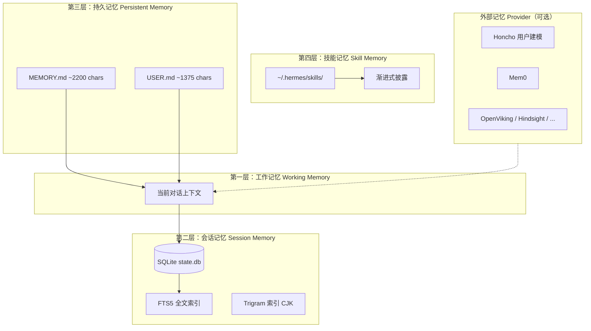
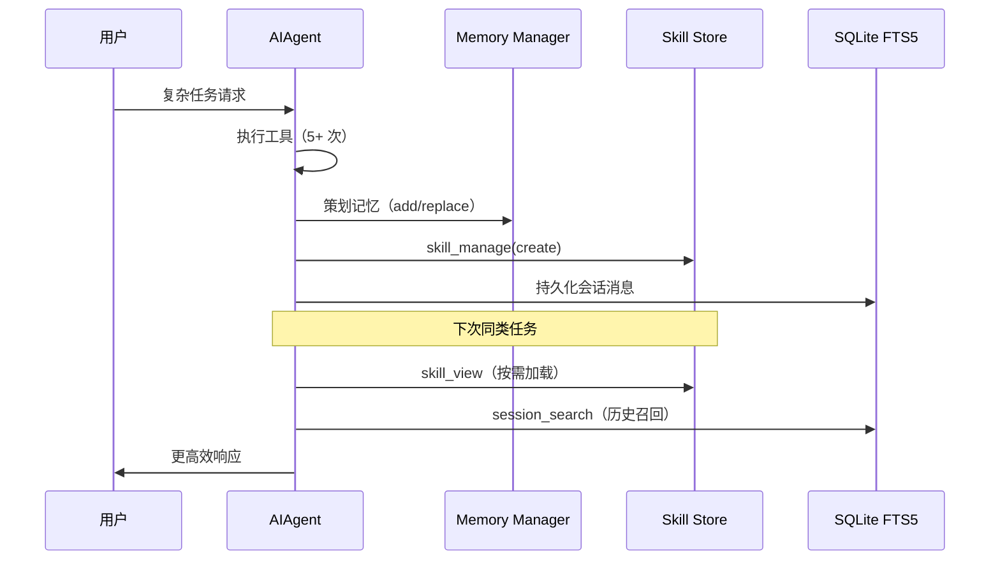

# Agent Hermes 与 OpenClaw（龙虾）记忆系统深度解析
# Memory Systems in Agent Hermes & OpenClaw (Lobster): A Deep Dive

> 最后更新 | Last updated: 2026-06-05

---

## 一、设计哲学对比 | Design Philosophy Comparison

**中文**

记忆系统是个人 Agent「是否越用越懂你」的核心。两个框架在此采取了截然不同的路径：

| 维度 | OpenClaw（龙虾） | Hermes Agent |
|------|------------------|--------------|
| 存储介质 | 纯 Markdown 文件 | Markdown + SQLite + 可选外部 Provider |
| 更新方式 | Agent 按规则写入 MEMORY.md | Agent 主动管理 + 闭环学习自动沉淀 |
| 检索方式 | 全量注入系统提示词 | 分层：冻结注入 + FTS5 按需检索 + 语义搜索 |
| 技能与记忆关系 | Skills 与 Memory 分离 | Skills 是「程序性记忆」的产出 |
| 容量策略 | 文件大小无硬限，但全量进 Prompt | 持久记忆有字符上限，技能渐进式披露 |

**English**

Memory is central to whether a personal agent "knows you better over time." The two frameworks take fundamentally different approaches:

| Dimension | OpenClaw (Lobster) | Hermes Agent |
|-----------|-------------------|--------------|
| Storage medium | Plain Markdown files | Markdown + SQLite + optional external providers |
| Update model | Agent writes to MEMORY.md per rules | Agent-managed + closed-loop auto-curation |
| Retrieval | Full injection into system prompt | Layered: frozen injection + FTS5 on-demand + semantic search |
| Skills vs memory | Skills and memory are separate | Skills are procedural memory output |
| Capacity strategy | No hard file limit, but full content in prompt | Char limits on persistent memory; progressive skill disclosure |

---

## 二、OpenClaw 记忆架构 | OpenClaw Memory Architecture

**中文**

### 2.1 核心理念：文件即记忆

OpenClaw 将 Agent 的「身份」与「知识」完全外化为工作区中的 Markdown 文件。默认路径：`~/.openclaw/workspace/`。

```text
~/.openclaw/workspace/
├── SOUL.md            # 人格（每次会话注入，通常人工维护）
├── AGENTS.md          # 操作手册（含记忆规则）
├── USER.md            # 用户偏好
├── MEMORY.md          # 长期记忆（Agent 可更新）
├── memory/            # 日记式记忆
│   ├── 2026-06-01.md
│   └── 2026-06-05.md
└── skills/            # 技能（与记忆分离）
    └── weather/SKILL.md
```

### 2.2 系统提示词注入顺序

OpenClaw 在会话启动时按固定顺序组装系统提示词：

1. `SOUL.md` — 人格优先，影响模型注意力分配
2. `IDENTITY.md` — Agent 身份信息
3. `USER.md` — 用户上下文
4. `AGENTS.md` — 工具与流程指令
5. `MEMORY.md` — 持久知识（变化最频繁，靠后注入）

这种顺序设计确保人格指令优先于易变的记忆内容。

### 2.3 记忆类型划分

| 类型 | 文件 | 管理者 | 典型内容 |
|------|------|--------|----------|
| 人格记忆 | SOUL.md | 用户（可 Git 管理） | 语气、边界、价值观 |
| 用户画像 | USER.md | 用户 + Agent | 姓名、时区、沟通偏好 |
| 长期事实 | MEMORY.md | Agent | 项目路径、约定、重要决策 |
| 日记记忆 | memory/*.md | Agent | 按日归档的对话摘要 |
| 程序性知识 | skills/*/SKILL.md | 用户/社区 | 工作流、操作步骤 |

### 2.4 记忆更新机制

OpenClaw 的记忆更新依赖 `AGENTS.md` 中定义的规则。Agent 在会话中根据指令决定是否写入 `MEMORY.md` 或 `memory/YYYY-MM-DD.md`。没有内置的：

- 自动技能生成
- FTS5 历史检索
- 记忆容量管理与整合

优势是透明、可审计；劣势是随记忆增长，系统提示词 Token 成本线性上升。

### 2.5 会话持久化

会话记录存储在 `~/.openclaw/agents/<agent>/sessions/*.jsonl`，用于会话连续性和可选的记忆索引，但**不等于**结构化记忆检索层。磁盘访问权限即信任边界。

**English**

### 2.1 Core Idea: Files as Memory

OpenClaw externalizes agent identity and knowledge as Markdown in the workspace. Default path: `~/.openclaw/workspace/`.

### 2.2 System Prompt Injection Order

At session start, files assemble in fixed order: SOUL.md → IDENTITY.md → USER.md → AGENTS.md → MEMORY.md. Persona instructions precede volatile memory content.

### 2.3 Memory Type Taxonomy

| Type | File | Maintainer | Typical content |
|------|------|------------|-----------------|
| Persona memory | SOUL.md | User (Git-managed) | Tone, boundaries, values |
| User profile | USER.md | User + agent | Name, timezone, preferences |
| Long-term facts | MEMORY.md | Agent | Project paths, conventions, decisions |
| Diary memory | memory/*.md | Agent | Daily conversation summaries |
| Procedural knowledge | skills/*/SKILL.md | User/community | Workflows, procedures |

### 2.4 Update Mechanism

Updates follow rules in AGENTS.md. No built-in auto-skill generation, FTS5 history search, or capacity management. Transparent and auditable, but prompt token cost grows linearly with memory size.

### 2.5 Session Persistence

Transcripts live in `~/.openclaw/agents/<agent>/sessions/*.jsonl` for continuity and optional indexing — not a structured memory retrieval layer. Filesystem access is the trust boundary.

---

## 三、Hermes Agent 记忆架构 | Hermes Agent Memory Architecture

**中文**

### 3.1 四层记忆模型



### 3.2 第一层：工作记忆

当前会话中的消息、工具调用结果、压缩后的历史摘要。由 `ContextCompressor` 在上下文超阈值时进行有损压缩，触发会话分裂（`parent_session_id` 链）。

### 3.3 第二层：会话记忆（SQLite + FTS5）

**存储位置**：`~/.hermes/state.db`（WAL 模式）

**核心表结构**：

```text
state.db
├── sessions          — 会话元数据、Token 统计、计费
├── messages          — 完整消息历史
├── messages_fts      — FTS5 全文索引（content + tool_name + tool_calls）
├── messages_fts_trigram — Trigram 分词器（中日韩子串搜索）
└── state_meta        — 键值元数据
```

**检索工具**：`session_search`

| 特性 | 持久记忆 MEMORY.md | 会话搜索 session_search |
|------|-------------------|------------------------|
| 容量 | ~1300 tokens 固定 | 无限（所有历史会话） |
| 速度 | 即时（已在 Prompt 中） | ~20ms FTS5 查询 |
| 成本 | 每会话固定 Token 开销 | 按需，无 LLM 调用 |
| 用途 | 关键事实常驻 | 「上周我们讨论过 X 吗？」 |

**FTS5 查询语法**：

| 语法 | 示例 | 含义 |
|------|------|------|
| 关键词 | `docker deployment` | 隐式 AND |
| 引号短语 | `"exact phrase"` | 精确匹配 |
| 布尔 OR | `docker OR kubernetes` | 任一匹配 |
| 前缀 | `deploy*` | 前缀匹配 |

**写入争用处理**：Gateway 多平台并发写入时，采用 1 秒超时 + 最多 15 次随机抖动重试（20–150ms）+ BEGIN IMMEDIATE 事务。

### 3.4 第三层：持久记忆

两个受字符上限约束的文件，位于 `~/.hermes/memories/`：

| 文件 | 用途 | 上限 |
|------|------|------|
| MEMORY.md | Agent 个人笔记：环境事实、约定、经验教训 | 2,200 字符（~800 tokens） |
| USER.md | 用户画像：偏好、沟通风格、期望 | 1,375 字符（~500 tokens） |

**冻结快照模式**：会话启动时将记忆渲染进系统提示词后**不再变更**（保护 LLM 前缀缓存）。Agent 在会话中通过 `memory` 工具增删改，变更立即落盘，但下次会话才进入 Prompt。

**memory 工具操作**：

```python
memory(action="add",    target="memory", content="...")
memory(action="replace", target="user",  old_text="dark mode", content="...")
memory(action="remove",  target="memory", old_text="obsolete entry")
```

**安全扫描**：写入前检测 Prompt 注入、凭证外泄、不可见 Unicode 字符。

### 3.5 第四层：技能记忆（程序性记忆）

技能是 Hermes 闭环学习的核心产出，存储于 `~/.hermes/skills/`。

**渐进式披露（Progressive Disclosure）**：

```text
Level 0: skills_list()        → [{name, description}]     (~3k tokens)
Level 1: skill_view(name)     → 完整 SKILL.md 内容        (按需)
Level 2: skill_view(name, path) → 特定参考文件            (按需)
```

效果：技能库从 40 个增长到 200 个，上下文成本几乎不变。

**自动创建触发条件**（`skill_manage` 工具）：

- 完成 5+ 次工具调用的复杂任务
- 经历错误并找到正确路径
- 用户纠正了 Agent 做法
- 发现非平凡工作流

**自改进**：优先使用 `patch`（`old_string` / `new_string`）而非全量 `edit`，节省 Token。

### 3.6 外部记忆 Provider

Hermes 内置 8 种可选外部 Provider，与内置记忆**并行运行**（不替代）：

| Provider | 能力 |
|----------|------|
| Honcho | 辩证式用户建模 |
| Mem0 | 自动事实提取 |
| OpenViking | 知识图谱 |
| Hindsight | 长期回忆增强 |
| Holographic | 语义向量检索 |
| RetainDB / ByteRover / Supermemory | 各专精场景 |

配置：`hermes memory setup` / `hermes memory status`

### 3.7 闭环学习与记忆的协同



**English**

### 3.1 Four-Layer Memory Model

Working memory (current context) → Session memory (SQLite + FTS5) → Persistent memory (MEMORY.md / USER.md with char limits) → Skill memory (progressive disclosure in `~/.hermes/skills/`). Optional external providers (Honcho, Mem0, etc.) run in parallel.

### 3.2 Layer 1: Working Memory

Current session messages and tool results. `ContextCompressor` summarizes when context exceeds thresholds, triggering session splits via `parent_session_id` chains.

### 3.3 Layer 2: Session Memory

Stored in `~/.hermes/state.db` (WAL mode). FTS5 + trigram indexes for full-text and CJK substring search. `session_search` tool for on-demand recall. Write contention handled with short timeouts and jittered retries.

### 3.4 Layer 3: Persistent Memory

`MEMORY.md` (~2200 chars) and `USER.md` (~1375 chars) in `~/.hermes/memories/`. **Frozen snapshot** at session start for prefix-cache stability. `memory` tool for add/replace/remove with security scanning.

### 3.5 Layer 4: Skill Memory

Procedural memory in `~/.hermes/skills/` with progressive disclosure (index → full content on demand). Auto-created after complex tasks; self-improved via `skill_manage` patch.

### 3.6 External Memory Providers

8 optional providers (Honcho, Mem0, OpenViking, Hindsight, etc.) complement built-in memory.

### 3.7 Learning Loop Synergy

Task completion → memory curation → skill creation → FTS5 indexing → faster recall on similar future tasks.

---

## 四、关键差异总结 | Key Differences Summary

**中文**

| 场景 | OpenClaw 做法 | Hermes 做法 |
|------|--------------|-------------|
| 记住用户偏好 | 写入 USER.md，全量注入 | 写入 USER.md（有上限），冻结注入 |
| 回忆上周对话 | 依赖 MEMORY.md 摘要或重新阅读 jsonl | `session_search` FTS5 按需检索 |
| 沉淀重复工作流 | 手动编写 SKILL.md | 任务完成后自动生成 + patch 优化 |
| 控制 Token 成本 | 精简 Markdown 文件 | 字符上限 + 渐进式技能披露 + 压缩 |
| 跨会话用户理解 | 静态文件累积 | Honcho 辩证建模 + 周期性微调 |
| 记忆可审计性 | 极高（纯文本 Git） | 高（Markdown + SQLite 可导出） |

**English**

| Scenario | OpenClaw | Hermes |
|----------|----------|--------|
| Remember user preferences | Write USER.md, full injection | Write USER.md (capped), frozen injection |
| Recall last week's chat | MEMORY.md summary or jsonl replay | `session_search` FTS5 on demand |
| Capture repeated workflows | Manual SKILL.md | Auto-create + patch after tasks |
| Control token cost | Trim Markdown files | Char limits + progressive skills + compression |
| Cross-session user modeling | Static file accumulation | Honcho dialectic + periodic nudge |
| Auditability | Very high (plain text Git) | High (Markdown + exportable SQLite) |

---

## 五、最佳实践 | Best Practices

**中文**

### OpenClaw

1. **职责分离**：人格写 SOUL.md，流程写 AGENTS.md，事实写 MEMORY.md
2. **版本管理**：SOUL.md 和 AGENTS.md 纳入 Git；MEMORY.md 可让 Agent 自管
3. **控制体积**：MEMORY.md 定期人工审查，避免 Prompt 膨胀
4. **日记归档**：用 `memory/YYYY-MM-DD.md` 分离当日 ephemeral 内容

### Hermes Agent

1. **善用分层**：关键事实放 MEMORY.md；历史细节靠 `session_search`
2. **监控容量**：MEMORY.md 超 80% 时主动整合条目
3. **信任技能索引**：不必手动维护大量 Skill，让闭环学习自动沉淀
4. **选配 Provider**：需要深度用户建模时启用 Honcho；简单场景用内置即可
5. **从龙虾迁移**：`hermes claw migrate` 导入 MEMORY.md / USER.md 条目

**English**

### OpenClaw

1. Separate concerns: SOUL.md (persona), AGENTS.md (procedures), MEMORY.md (facts)
2. Version-control SOUL.md and AGENTS.md in Git
3. Periodically audit MEMORY.md to control prompt size
4. Use `memory/YYYY-MM-DD.md` for daily ephemeral content

### Hermes Agent

1. Use layers: critical facts in MEMORY.md; historical detail via `session_search`
2. Consolidate when MEMORY.md exceeds ~80% capacity
3. Trust the skill index — let the learning loop accumulate procedural memory
4. Enable external providers (e.g., Honcho) only when deeper user modeling is needed
5. Migrate from OpenClaw with `hermes claw migrate`

---

## 六、结语 | Conclusion

**中文**

OpenClaw 的记忆系统是 **「透明文件柜」**——简单、可读、完全由人掌控，适合重视可审计性与手动定制的用户。Hermes 的记忆系统是 **「分层图书馆 + 自学习档案员」**——通过 SQLite 检索、字符预算、技能渐进披露和闭环学习，在 Token 成本可控的前提下实现「越用越懂你」。选择哪套记忆架构，本质上是在 **可控透明度** 与 **自动进化效率** 之间做权衡。

**English**

OpenClaw's memory is a **transparent filing cabinet** — simple, readable, fully human-controlled, ideal for users who value auditability and manual curation. Hermes's memory is a **layered library with a self-learning archivist** — SQLite search, char budgets, progressive skill disclosure, and closed-loop learning deliver "knows you better over time" with controlled token cost. The choice is fundamentally a tradeoff between **transparent control** and **automatic evolutionary efficiency**.
