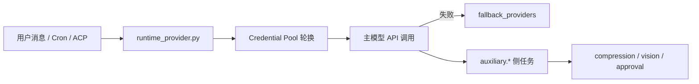
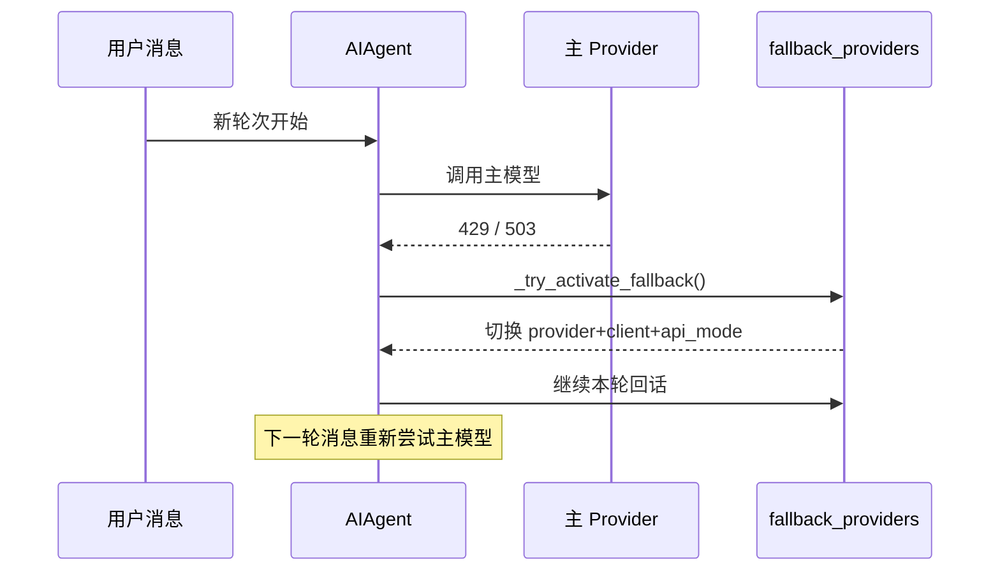
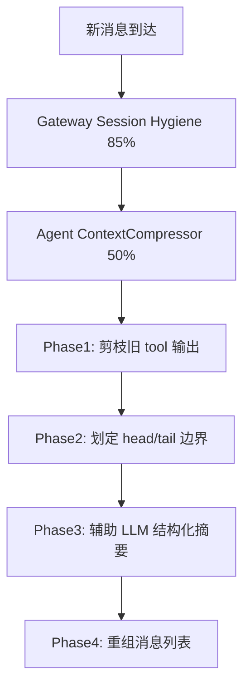
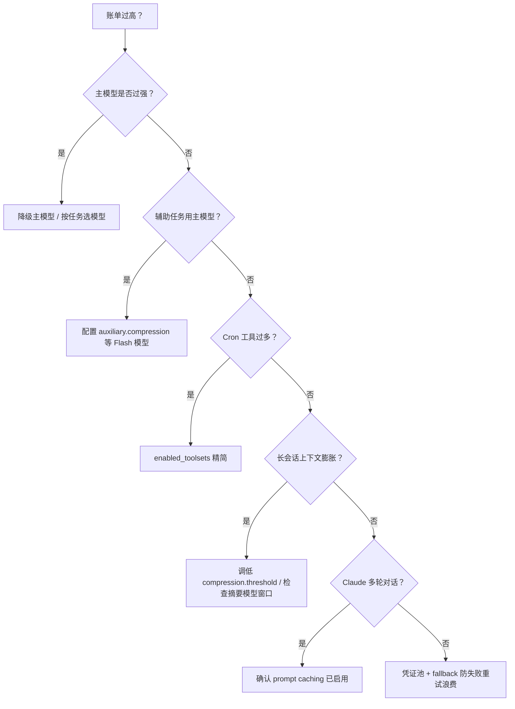

# Agent Hermes 与 OpenClaw 模型 Provider 与 Token 成本优化全解析
# Model Providers & Token Cost Optimization in Agent Hermes & OpenClaw

> 最后更新 | Last updated: 2026-06-06

---

## 一、成本问题的本质 | The Nature of Agent Cost

**中文**

个人 AI Agent 的运行成本主要来自三类 Token 消耗：

| 成本来源 | 说明 | 谁更敏感 |
|----------|------|----------|
| 主模型推理 | 每轮对话 + 工具循环的输入/输出 Token | 两者皆然 |
| 系统提示词前缀 | SOUL/AGENTS/MEMORY/Skills 索引等静态内容 | OpenClaw 全量注入；Hermes 分层控制 |
| 辅助模型调用 | 压缩摘要、视觉、审批评分、网页提取 | Hermes 独有，可独立优化 |

OpenClaw 的模型选择通常绑定在 Gateway 配置或外部 Agent Runtime（Claude Code、Cursor 等），成本优化侧重 **工作区文件瘦身** 与 **工具爆炸半径**。Hermes 将 Provider 解析、凭证轮换、fallback、辅助模型、Prompt 缓存、上下文压缩统一纳入 `runtime_provider.py` 与 `AIAgent` 循环——适合需要 **模型无关 + 长期无人值守 Cron** 的场景。

**English**

Personal agent costs come from three token buckets:

| Source | Description | Who feels it more |
|--------|-------------|-------------------|
| Main model inference | Input/output tokens per turn and tool loop | Both |
| System prompt prefix | SOUL, AGENTS, MEMORY, skill indexes | OpenClaw full injection; Hermes layered control |
| Auxiliary model calls | Compression, vision, approval scoring, web extract | Hermes-specific, independently tunable |

OpenClaw model choice is typically tied to Gateway config or external runtimes; cost control focuses on **workspace slimming** and **tool blast radius**. Hermes unifies provider resolution, credential rotation, fallback, auxiliary models, prompt caching, and context compression in `runtime_provider.py` and the `AIAgent` loop — ideal for **model-agnostic** and **unattended cron** deployments.

---

## 二、Hermes Provider 体系（18+）| Hermes Provider Ecosystem (18+)

**中文**

Hermes 通过 `plugins/model-providers/` 插件注册推理后端，用户插件可覆盖同名内置 Provider。核心解析链：



### 2.1 主模型槽位（Main Model）

配置位于 `~/.hermes/config.yaml` 的 `model:` 段：

```yaml
model:
  provider: openrouter
  default: anthropic/claude-opus-4.7
  base_url: ''
  api_mode: chat_completions
```

| 切换方式 | 作用域 | 说明 |
|----------|--------|------|
| `hermes model` | 全局默认 | 交互式选择 Provider + 模型 |
| `hermes setup --portal` | 全局 | OAuth 一次覆盖模型 + Tool Gateway |
| Dashboard Models 页 | 全局 | 可视化主模型与 8 个辅助槽位 |
| `/model provider:model` | 当前会话 | Gateway/CLI 内热切换 |
| `/model ... --global` | 全局 + 当前会话 | 等同 Dashboard 的 Change |

**English**

Hermes registers inference backends via `plugins/model-providers/`; user plugins override bundled ones. Resolution flow: request → `runtime_provider.py` → credential pool → main API call → optional `fallback_providers` → auxiliary tasks.

Main model config lives under `model:` in `config.yaml`. Switch via `hermes model`, `hermes setup --portal`, dashboard, or `/model` (session-only or `--global`).

### 2.2 三种 API 模式（api_mode）

| api_mode | 适用 Provider | 实现路径 |
|----------|---------------|----------|
| `chat_completions` | OpenRouter、大多数 OpenAI 兼容端点 | 标准 Chat Completions |
| `codex_responses` | `openai-codex` | OpenAI Responses API 专用路径 |
| `anthropic_messages` | `anthropic` 原生 | `agent/anthropic_adapter.py` 翻译 Messages API |

Fallback 激活时会按目标 Provider **就地切换** `api_mode`：Codex → `codex_responses`，Anthropic → `anthropic_messages`，其余 → `chat_completions`。

**English**

Three API modes: `chat_completions` (default), `codex_responses` (OpenAI Codex), `anthropic_messages` (native Anthropic). Fallback swaps `api_mode` in-place when activating a backup provider.

### 2.3 Nous Portal 与 Tool Gateway

`hermes setup --portal` 是最低摩擦路径：

- **300+ 模型** 单一 OAuth 订阅
- **Tool Gateway** 捆绑：web search、image generation、TTS、cloud browser
- OAuth 自动刷新，适合 Cron 无人值守
- Portal 订阅者对按 Token 计费的 Provider 享 **10% 折扣**

```bash
hermes setup --portal    # 登录 + 设置 Nous Provider + 启用 Tool Gateway
hermes portal info       # 查看已接入能力
```

对比单独配置 `OPENROUTER_API_KEY` + 各工具 API Key，Portal 显著降低 **密钥管理成本** 与 **辅助服务账单碎片度**。

**English**

`hermes setup --portal` covers 300+ models plus Tool Gateway (search, images, TTS, browser) under one OAuth — ideal for unattended cron with automatic token refresh. Portal subscribers get 10% off token-billed providers.

### 2.4 OpenRouter 与自定义端点

Hermes 严格隔离 API Key 与 base URL：

- `OPENROUTER_API_KEY` 仅发往 `openrouter.ai` 端点
- `OPENAI_API_KEY` 用于自定义 OpenAI 兼容端点及回退
- `provider: custom` + `custom_providers` 列表支持 LM Studio、Together、本地 vLLM 等

避免「配置了 OpenRouter 却把 OpenAI Key 泄漏到自定义 localhost」的常见踩坑。

**English**

API keys are scoped to their base URLs. `OPENROUTER_API_KEY` never leaks to custom endpoints; `provider: custom` supports local and third-party OpenAI-compatible servers.

---

## 三、凭证池轮换（Credential Pool）| Credential Pool Rotation

**中文**

凭证池处理 **同 Provider 多 Key 轮换**；`fallback_providers` 处理 **跨 Provider 故障转移**。执行顺序：**先池，后 fallback**。

```text
请求 → 从池选 Key（fill_first / round_robin / least_used / random）
     → 429？先重试一次，再轮换下一 Key（冷却 1h）
     → 402 账单/配额？立即轮换（冷却 24h）
     → 401？尝试 OAuth 刷新，失败则轮换
     → 池耗尽 → 激活 fallback_providers
```

### 3.1 快速配置

```bash
hermes auth add openrouter --api-key sk-or-v1-second-key
hermes auth add anthropic --type oauth          # Claude Max OAuth
hermes auth list                                # ← 标记当前选中凭证
```

```yaml
credential_pool_strategies:
  openrouter: round_robin
  anthropic: least_used
```

### 3.2 与 Gateway 并发

凭证池使用线程锁保护 `select()` / `mark_exhausted_and_rotate()`，多 Telegram/Discord 会话并发时安全。子代理通过 `delegate_task` _spawn 时 **继承父代理凭证池**，同 Provider 子任务可共享轮换能力。

**English**

Credential pools rotate multiple keys for the same provider before cross-provider fallback kicks in. Strategies: `fill_first`, `round_robin`, `least_used`, `random`. Thread-safe for concurrent gateway sessions; subagents inherit the parent's pool.

---

## 四、主模型 Fallback 链 | Primary Model Fallback Chain

**中文**

```yaml
fallback_providers:
  - provider: openrouter
    model: anthropic/claude-sonnet-4
  - provider: nous
    model: nous-hermes-3
```

| 特性 | 行为 |
|------|------|
| 触发条件 | 429/5xx 重试耗尽、401/403/404、畸形响应 |
| 作用域 | **按轮（per-turn）** — 每轮新消息先尝试主模型 |
| 单轮上限 | 每轮最多激活 fallback 一次，防止级联循环 |
| 会话连续性 | 历史、工具调用、上下文完整保留 |
| CLI 管理 | `hermes fallback add/list/remove/clear` |



### 4.1 Fallback 覆盖范围

| 上下文 | 支持 fallback |
|--------|---------------|
| CLI / Gateway 会话 | ✔ |
| Cron 任务 | ✔（继承 `fallback_providers`） |
| 子代理 delegate_task | ✔（继承父链；可用 `delegation.provider` 覆盖主模型） |
| 辅助模型任务 | ✘（独立 auto-detection 链） |

**English**

`fallback_providers` is an ordered list tried on primary failure. Per-turn scope: each new user message retries the primary first; at most one fallback activation per turn. Cron and subagents inherit the chain; auxiliary tasks use their own routing.

---

## 五、辅助模型与成本杠杆 | Auxiliary Models & Cost Levers

**中文**

Hermes 将侧任务从主模型剥离，共 **8 个辅助槽位**：

| 任务 | config 键 | 典型优化 |
|------|-----------|----------|
| Title Gen | `auxiliary.title_generation` | Flash 模型写标题（默认 gemini-flash） |
| Vision | `auxiliary.vision` | 主模型无视觉时指向 gpt-4o-mini / gemini-flash |
| Compression | `auxiliary.compression` | **勿用 Opus 做摘要** — 1/50 成本 |
| Web Extract | `auxiliary.web_extract` | 网页摘要用廉价 chat 模型 |
| Approval | `auxiliary.approval` | `approval_mode: smart` 的评分模型 |
| Skills Hub | `auxiliary.skills_hub` | 技能搜索，通常 `auto` 即可 |
| MCP | `auxiliary.mcp` | MCP 辅助操作 |
| Triage Specifier | `auxiliary.triage_specifier` | Kanban 任务规格化 |

```yaml
auxiliary:
  compression:
    provider: openrouter
    model: google/gemini-3-flash-preview
  approval:
    provider: openrouter
    model: anthropic/claude-haiku-4-5
  title_generation:
    provider: openrouter
    model: google/gemini-3-flash-preview
```

`provider: auto` 表示使用主模型 — 对 Compression / Approval 通常是 **浪费**。

**English**

Eight auxiliary slots offload side jobs from the main model. Override compression and approval with fast/cheap models — using Opus for summarization wastes reasoning tokens. `provider: auto` means "use main model."

### 5.1 Smart Approval 的辅助 LLM 成本

`approval_mode: smart` 时，每条待审批命令会调用 `auxiliary.approval` 做风险分类：

| 模式 | 行为 | Token 成本 |
|------|------|------------|
| `manual`（默认） | 用户手动审批 | 无辅助调用 |
| `smart` | 辅助 LLM 评估低/高风险 | 每条危险模式匹配 + 一次 aux 调用 |
| `off` | YOLO（硬阻断列表仍生效） | 无辅助调用 |

**成本建议**：将 `auxiliary.approval` 指向 haiku / flash / gpt-5-mini；切勿用 Opus 做审批评分。容器后端（Docker/Modal）跳过审批检查 — 容器即边界。

**English**

`approval_mode: smart` routes each dangerous-command candidate through `auxiliary.approval`. Point it at haiku/flash/mini models — never Opus. Container backends skip approval checks entirely.

### 5.2 辅助模型容量错误 Fallback

显式配置 `auxiliary.vision.provider: glm` 等时，若遇 402/日配额耗尽/连接失败，Hermes 按层回退：

1. 配置的 aux Provider
2. `auxiliary.*.fallback_chain`（可选）
3. 主代理 Provider + 模型（安全网）
4. 全部失败 → WARNING 日志 + 抛出原错误

瞬时 429（`Retry-After`）**不**触发此阶梯，尊重显式 Provider 选择。

**English**

Explicit auxiliary providers fall back through optional `fallback_chain`, then the main agent model, on capacity errors (402, daily quota, connection failure) — not transient 429s.

---

## 六、上下文压缩（ContextCompressor）| Context Compression

**中文**

Hermes 采用 **双层压缩**，防止长会话 Token 爆炸：



| 层级 | 阈值 | 位置 | 目的 |
|------|------|------|------|
| Gateway 卫生 | 85% 上下文 | `gateway/run.py` | 隔夜 Telegram 会话安全网 |
| Agent 压缩器 | 50%（可配） | `context_compressor.py` | 主循环精确 Token 管理 |

```yaml
compression:
  enabled: true
  threshold: 0.50
  target_ratio: 0.20
  protect_last_n: 20

auxiliary:
  compression:
    provider: openrouter
    model: google/gemini-3-flash-preview
```

**关键警告**：摘要模型的上下文窗口必须 **≥ 主模型**。否则中间段无法一次送入摘要 API，压缩退化为 **无摘要丢弃** — 最常见的质量劣化原因。

压缩触发 **会话分裂**（`parent_session_id` 链），详见 [记忆系统](./memory-system.md)。

**English**

Dual compression: gateway hygiene at 85% (safety net), agent `ContextCompressor` at 50% (default). Four phases: prune old tool output, bound head/tail, auxiliary LLM structured summary, reassemble. Summary model context must be ≥ main model or middle turns are dropped without summary.

### 6.1 可插拔 Context Engine

```yaml
context:
  engine: "compressor"    # 默认有损摘要
  engine: "lcm"           # 插件：无损上下文管理
```

插件需用户显式设置 `context.engine` — 默认 `"compressor"` 始终使用内置实现。

**English**

Plugins can replace the context engine via `context.engine` (e.g., lossless `lcm`). User must opt in explicitly.

---

## 七、Anthropic Prompt Caching | Anthropic Prompt Caching

**中文**

对 Claude 模型，Hermes 自动启用 `cache_control`（`agent/prompt_caching.py`），多轮对话输入成本可降约 **75%**。

**策略 system_and_3**（Anthropic 最多 4 个断点）：

```text
断点 1: 系统提示词（跨轮稳定）
断点 2-4: 倒数第 3/2/1 条非 system 消息（滚动窗口）
```

| 设计原则 | 原因 |
|----------|------|
| 系统提示词稳定性 | 保护断点 1 缓存命中 |
| 压缩仅首次追加注记 | 避免 mid-session 突变系统提示 |
| TTL 可选 5m / 1h | 长间隔对话用 1h |

```yaml
prompt_caching:
  cache_ttl: "5m"
```

启用条件：Claude 模型名 + Provider 支持 `cache_control`（原生 Anthropic 或 OpenRouter）。

**English**

Anthropic prompt caching via `system_and_3` strategy: system prompt plus rolling 3-message window. ~75% input cost reduction on multi-turn Claude conversations. Preserve prompt stability; compression appends a note only on first compaction.

---

## 八、Cron 成本治理 | Cron Cost Governance

**中文**

无人值守 Cron 是 Token 成本 **放大器**。Hermes 提供多层节制：

| 机制 | 作用 |
|------|------|
| `enabled_toolsets` | 单任务仅暴露必要 toolset，缩小 schema prompt |
| `hermes tools` → cron 平台 | 全局 Cron 默认 toolset |
| `no_agent=True` | 纯脚本，零 LLM Token |
| `wakeAgent: false` | 预检脚本跳过本轮 Agent |
| `context_from` | 流水线传递上游输出，避免重复抓取 |
| Provider recovery | 凭证池 + fallback_providers 防 Cron 因 429 整体失败 |
| 每任务 `provider`/`model` | 廉价模型跑高频巡检 |

```python
cronjob(
    action="create",
    schedule="every sunday 9am",
    enabled_toolsets=["web", "file"],   # 不带 terminal/browser/delegation
    provider="openrouter",
    model="google/gemini-3-flash-preview",
    prompt="Summarize this week's AI news...",
)
```

**反面教材**：默认携带 `moa`、`browser`、`delegation` 的 Cron 在每次 LLM 调用中注入大量工具 schema — 对小任务极其浪费。

**English**

Cron amplifies token cost. Control via `enabled_toolsets`, platform defaults in `hermes tools`, `no_agent` script-only jobs, `wakeAgent: false` gates, per-job cheap models, and inherited fallback/credential pools. Avoid bloated toolsets on simple scheduled tasks.

---

## 九、OpenClaw 模型与成本 | OpenClaw Models & Cost

**中文**

OpenClaw 模型由 Gateway Runtime 或外部编码 Agent（Claude Code、Cursor）配置，无 Hermes 式 18+ Provider 抽象。成本杠杆：工作区瘦身、`tools.profile: messaging`、子代理 `sessions_spawn` 隔离长任务、`openclaw security audit` 收紧工具面。云账单常见 **$10–150+/月**；Hermes 对辅助模型、压缩、缓存的可编程控制更细。

**English**

OpenClaw lacks Hermes-style multi-provider runtime. Cost levers: slim workspaces, tight tool profiles, `sessions_spawn` isolation, security audit. Cloud bills commonly $10–150+/month; Hermes offers finer aux/compression/caching control.

---

## 十、模型选择卫生（Hygiene）| Model Selection Hygiene

**中文**

| 实践 | Hermes | OpenClaw |
|------|--------|----------|
| 主模型用于推理 | ✔ 复杂工具循环 | ✔ Agent Runtime |
| 廉价模型用于摘要/标题 | `auxiliary.*` 显式覆盖 | 依赖外部 Runtime 或手动 |
| 视觉任务分离 | `auxiliary.vision` | 取决于所选 Runtime |
| 高频 Cron 专用模型 | per-job `provider`/`model` | 按 Agent 配置 |
| 避免 mid-session 突变系统提示 | 设计原则 + 缓存友好 | 工作区文件顺序注入 |
| 监控用量 | Dashboard Usage analytics | Gateway 日志 + 提供商控制台 |
| 凭证轮换 | `hermes auth` 多 Key | 按渠道/Provider 手动 |

**English**

Hygiene checklist: cheap models for aux tasks, dedicated cron models, stable system prompts for cache hits, credential pools for rate limits, dashboard analytics for monitoring.

---

## 十一、成本优化决策树 | Cost Optimization Decision Tree



---

## 十二、配置速查 | Configuration Quick Reference

**中文**

| 目标 | 命令 / 配置 |
|------|-------------|
| 一键 Portal | `hermes setup --portal` |
| 交互选模型 | `hermes model` |
| 管理 fallback | `hermes fallback` |
| 管理凭证池 | `hermes auth` |
| 热切换会话模型 | `/model provider:model` |
| 压缩阈值 | `compression.threshold` |
| 审批智能模式 | `approval_mode: smart` + `auxiliary.approval` |
| Cron 工具集 | `enabled_toolsets` / `hermes tools` |
| Prompt 缓存 TTL | `prompt_caching.cache_ttl` |

**English**

Quick ref: `hermes setup --portal`, `hermes model`, `hermes fallback`, `hermes auth`, `/model`, `compression.*`, `auxiliary.*`, `enabled_toolsets`, `prompt_caching.cache_ttl`.

---

## 十三、延伸阅读 | Further Reading

- [记忆系统深度解析](./memory-system.md) — ContextCompressor 与会话分裂
- [Gateway 架构深度解析](./gateway.md) — Gateway 85% 卫生压缩
- [安全模型深度解析](./security-model.md) — smart approval 与 Tirith
- Hermes 官方：[Configuring Models](https://hermes-agent.nousresearch.com/docs/user-guide/configuring-models)、[Fallback Providers](https://hermes-agent.nousresearch.com/docs/user-guide/features/fallback-providers)、[Context Compression](https://hermes-agent.nousresearch.com/docs/developer-guide/context-compression-and-caching)

---

## 十四、结语 | Conclusion

**中文**

Hermes 将 **Provider 解析、凭证池、fallback、辅助模型、双层压缩、Anthropic 缓存** 串成可配置的成本治理体系；OpenClaw 则通过 **工作区瘦身、工具 profile、子代理隔离** 控制爆炸半径。实践中的最高 ROI 动作通常是：为 Compression / Title / Approval 配置 Flash 模型、为 Cron 设置 `enabled_toolsets`、启用凭证池与 fallback 避免失败重试、在 Claude 长会话中依赖 Prompt Caching。模型无关不等于成本无关 — **侧任务与工具 schema 才是隐形大户**。

**English**

Hermes offers a configurable cost stack: providers, credential pools, fallback, auxiliary models, dual compression, and Anthropic caching. OpenClaw leans on workspace slimming, tool profiles, and sub-agent isolation. Highest-ROI moves: flash models for aux tasks, `enabled_toolsets` for cron, pools + fallback for resilience, prompt caching for long Claude sessions. Model-agnostic doesn't mean cost-agnostic — auxiliary calls and tool schemas are the hidden spend.
