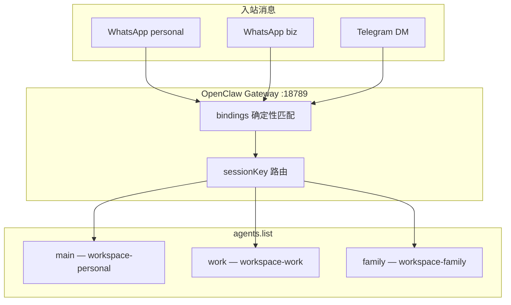
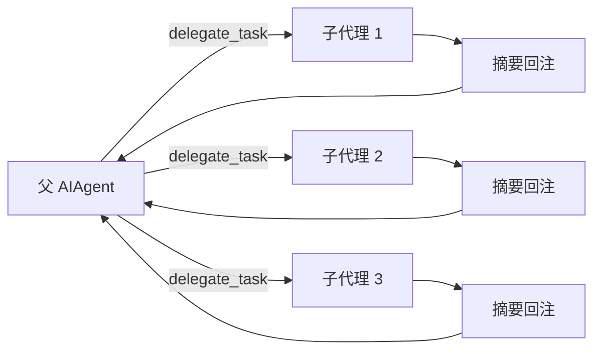
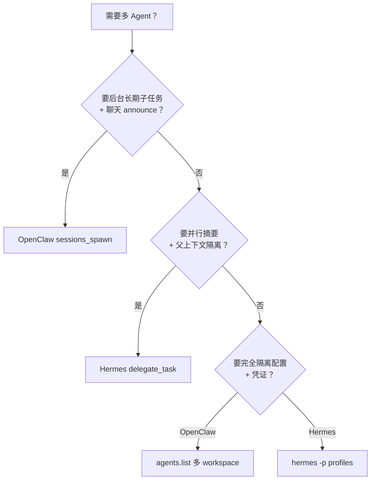

# Agent Hermes 与 OpenClaw 多 Agent 路由与子代理委派全解析
# Multi-Agent Routing & Sub-Agent Delegation in Agent Hermes & OpenClaw

> 最后更新 | Last updated: 2026-06-06

---

## 一、为什么需要多 Agent | Why Multi-Agent?

**中文**

单一 Gateway 往往要同时服务：

- 个人 vs 工作人格
- 不同聊天渠道（Telegram 私聊 vs 工作群）
- 并行子任务（研究 A/B/C 同时进行）
- 团队共享 Bot vs 个人助理

两个框架都支持「一个控制平面、多个 Agent 脑」，但路由机制与委派模型不同：

| 维度 | OpenClaw（龙虾） | Hermes Agent |
|------|------------------|--------------|
| 路由键 | `sessionKey` + `bindings` | `agent:main:platform:chat_type:chat_id` |
| 多脑配置 | `agents.list[]` + 独立 workspace | `hermes -p <profile>` 完整隔离 |
| 子代理工具 | `sessions_spawn` / `sessions_send` | `delegate_task` |
| 子代理上下文 | 精简 bootstrap（目标 workspace） | 仅 `goal` + `context`，零对话历史 |
| 跨会话风险 | 高（控制面工具） | 中（委派同步、可取消） |

**English**

A single Gateway often serves multiple personas, channels, parallel workstreams, or team vs personal bots. Both frameworks support multiple agent brains on one control plane, but routing and delegation differ: OpenClaw uses `sessionKey` + `bindings` + `sessions_spawn`; Hermes uses structured session keys, profiles, and `delegate_task`.

---

## 二、OpenClaw 多 Agent 路由 | OpenClaw Multi-Agent Routing

**中文**

### 2.1 核心概念



每个 Agent 是完整信任边界：

| 资源 | 隔离路径 |
|------|----------|
| 工作区 | `agents.list[].workspace` → SOUL/AGENTS/MEMORY/skills |
| 状态目录 | `~/.openclaw/agents/<agentId>/agent` |
| 会话存储 | `~/.openclaw/agents/<agentId>/sessions/*.jsonl` |
| 认证配置 | per-agent auth profiles（**不共享**） |

### 2.2 agents.list 与 bindings

```json5
{
  agents: {
    list: [
      {
        id: "main",
        name: "Personal",
        workspace: "~/.openclaw/workspace",
        tools: {
          allow: ["group:fs", "group:sessions", "agents_list"],
        },
        subagents: {
          allowAgents: ["coder", "research"],  // sessions_spawn 目标白名单
        },
      },
      {
        id: "coder",
        workspace: "~/.openclaw/workspace-coder",
        sandbox: { mode: "all", scope: "agent" },
        tools: {
          deny: ["gateway", "cron", "sessions_spawn"],
        },
      },
    ],
  },
  bindings: [
    {
      agentId: "main",
      match: { channel: "whatsapp", accountId: "personal" },
    },
    {
      agentId: "main",
      match: {
        channel: "whatsapp",
        peer: { kind: "group", id: "120363999999999@g.us" },
      },
    },
  ],
}
```

**路由规则**：bindings 按 `(channel, accountId, peer, guild/team)` 确定性匹配，**最具体规则优先**。

### 2.3 session.dmScope 与 DM 隔离

| 值 | 行为 |
|----|------|
| `per-channel-peer` | 每个发送者独立 DM 会话（**多用户收件箱推荐**） |
| `per-account-channel-peer` | 多账号渠道下按账号+发送者隔离 |

```json5
{
  session: { dmScope: "per-channel-peer" },
  channels: {
    whatsapp: { dmPolicy: "pairing" },
  },
}
```

`sessionKey` 是**路由选择器**，不是认证令牌。与 `dmPolicy: pairing` 组合可硬化多用户场景。

**English**

OpenClaw routes via `agents.list` (full per-agent workspace, state, sessions, auth) and deterministic `bindings`. Each agent is an isolated trust boundary. `session.dmScope` controls DM isolation; `sessionKey` routes sessions but does not authenticate users.

### 2.4 sessions_spawn 与 sessions_send

**sessions_spawn** — 启动后台子代理：

```text
- 会话键：agent:<agentId>:subagent:<uuid>
- deliver: false（结果以内部事件回传）
- 完成后 announce 到请求者聊天渠道
- 默认 maxConcurrent: 8
- 可继承或覆盖 model/thinking
- 默认 maxSpawnDepth: 1（子代理不能再 spawn）
```

**sessions_send** — 向另一会话发送消息（跨会话操作，高风险）。

| 深度 | sessionKey 形态 | 角色 | 能否 spawn |
|------|-----------------|------|------------|
| 0 | `agent:<id>:main` | 主代理 | 始终可以 |
| 1 | `agent:<id>:subagent:<uuid>` | 子代理 / 编排者 | 仅当 `maxSpawnDepth >= 2` |
| 2 | `agent:<id>:subagent:<uuid>:subagent:<uuid>` | 叶子 worker | 永远不能 |

**编排者模式**（`maxSpawnDepth: 2`）：

```text
Main → Orchestrator sub-agent → Worker sub-sub-agents
```

深度 1 编排者保留 `sessions_spawn`、`subagents`、`sessions_list`；深度 2 worker **无** session 工具。

### 2.5 子代理精简 Bootstrap

子代理从目标 Agent 的 workspace 加载 bootstrap 文件（`AGENTS.md`、`TOOLS.md` 等），但 **不继承** 主会话完整历史。可选 `cwd` 指定子任务工作目录。

这与 Hermes `delegate_task`「仅 goal+context」哲学类似，但 OpenClaw 仍注入 workspace 级人格与工具指南。

### 2.6 allowAgents 门禁（常见踩坑）

`sessions_spawn` 有两层门禁：

1. **工具 allowlist** — 必须包含 `sessions_spawn`（或 `group:sessions`）
2. **跨 Agent spawn** — 调用方 `agents.list[].subagents.allowAgents` 必须列出目标 `agentId`

```json5
// 正确：allowAgents 与 tools 同级，不在 tools 下
{
  id: "main",
  tools: { allow: ["group:sessions", "agents_list"] },
  subagents: { allowAgents: ["finance"] },  // 或 ["*"]
}
```

用 `agents_list` 工具验证可 spawn 的目标列表。

**English**

`sessions_spawn` starts background sub-agents with reduced bootstrap from the target workspace. Cross-agent spawning requires `subagents.allowAgents` on the caller — separate from `tools.allow`. `sessions_send` is a high-risk cross-session primitive; deny by default on untrusted surfaces.

### 2.7 团队 vs 个人 Agent 模式

| 模式 | 配置要点 |
|------|----------|
| 个人多人格 | 多 workspace + bindings 按 accountId/peer |
| 团队共享 Bot | `dmScope: per-channel-peer` + `dmPolicy: pairing` + 收紧 tools |
| 编排者-专家 | main 绑定全渠道，`allowAgents` 指向 sandboxed 专家 Agent |
| agentToAgent | `tools.agentToAgent.enabled` + `allow: [ids]` |

硬化基线应对不可信面 deny：`gateway`、`cron`、`sessions_spawn`、`sessions_send`。

**English**

Patterns: personal multi-persona via bindings, team bots with `per-channel-peer` + pairing, orchestrator-specialist with sandboxed worker agents. Harden untrusted surfaces by denying control-plane tools.

---

## 三、Hermes 多 Agent 与 Profile 隔离 | Hermes Multi-Agent & Profile Isolation

**中文**

### 3.1 Session Key 格式

```text
agent:main:{platform}:{chat_type}:{chat_id}
```

示例：`agent:main:telegram:private:123456789`

| 组成部分 | 说明 |
|----------|------|
| `agent:main` | 主 Agent 实例（未来可扩展多 agent id） |
| `platform` | telegram / discord / slack / cli 等 |
| `chat_type` | private / group / channel |
| `chat_id` | 平台原生 ID；线程型平台含 thread ID |

**禁止手动拼接** — 使用 `build_session_key()`。详见 [Gateway 架构](./gateway.md)。

### 3.2 Profile 隔离（hermes -p）

```bash
hermes -p work gateway start
hermes -p personal chat
```

每个 Profile 拥有独立：

| 资源 | 路径 |
|------|------|
| HERMES_HOME | `~/.hermes-profiles/<name>/` 或自定义 |
| config.yaml / .env | Profile 作用域 |
| state.db 会话 | Profile 作用域 |
| Gateway PID | Profile 作用域 |
| Bot Token 锁 | `acquire_scoped_lock()` 防多 Profile 抢同一 Token |

**团队 vs 个人**：团队 Bot 用 `work` Profile + 平台 allowlist；个人进化用 `default` Profile + 学习闭环。

**English**

Hermes session keys follow `agent:main:{platform}:{chat_type}:{chat_id}`. Profiles (`hermes -p <name>`) fully isolate config, sessions, gateway, and token locks — the primary multi-agent pattern on Hermes.

### 3.3 跨会话镜像与投递

Hermes Gateway 的 `delivery.py` 支持跨平台投递，但 **Cron 投递不镜像**进 Gateway 会话历史（避免消息交替违规）。这与 OpenClaw `sessions_send` 的跨会话写入是不同层面的能力。

**English**

Cross-platform delivery exists via `delivery.py`, but cron deliveries are excluded from gateway session history to preserve message ordering invariants.

---

## 四、Hermes delegate_task 委派 | Hermes delegate_task Delegation

**中文**

### 4.1 设计理念



- 每个子代理：**独立会话、独立终端、可选独立 toolsets**
- 中间工具调用 **不进入** 父上下文 — 仅最终摘要返回
- **同步**执行于父轮次内；父中断则子任务取消

```python
delegate_task(tasks=[
    {
        "goal": "Research WebAssembly edge deployments",
        "context": "Focus on Wasmtime, Wasmer, WASI 2025 progress",
        "toolsets": ["web"],
    },
    {
        "goal": "Review src/auth/ for security issues",
        "context": "Project at /home/user/app. Run: pytest tests/auth/ -v",
        "toolsets": ["terminal", "file"],
    },
])
```

### 4.2 与 sessions_spawn 对比

| 维度 | OpenClaw sessions_spawn | Hermes delegate_task |
|------|-------------------------|----------------------|
| 执行模型 | 后台非阻塞，announce 回聊天 | 父轮次内同步等待摘要 |
| 上下文 | workspace bootstrap + 可选 cwd | 仅 goal + context 字符串 |
| 会话键 | `agent:id:subagent:uuid` | 内部子会话，不暴露给用户 |
| 嵌套 | maxSpawnDepth 2 编排者模式 | `role=orchestrator` + max_spawn_depth |
| 持久性 | 可 auto-archive 60min | 父中断即丢弃；用 cron 做持久任务 |
| 凭证 | per-agent auth | 继承父 credential pool |
| fallback | per-agent 配置 | 继承父 fallback_providers |

### 4.3 隔离子代理（Isolated Subagents）

子代理 **不知道** 父对话任何内容。「修复我们刚讨论的 bug」会失败 — 必须在 `context` 中写明路径、错误信息、约束。

| 应传入 context | 不应假设 |
|----------------|----------|
| 绝对路径、项目根 | 父会话中的指代 |
| 测试命令、技术栈 | 用户偏好（除非写入 context） |
| 明确目标与验收标准 | 父代理已读过的文件内容 |

### 4.4 并行工作流（Parallel Workstreams）

```yaml
delegation:
  max_concurrent_children: 3    # 默认每批 3 并行，可提高到 30+
  max_spawn_depth: 1            # 默认叶子子代理
  orchestrator_enabled: true
```

| 配置 | 默认 | 说明 |
|------|------|------|
| `max_concurrent_children` | 3 | 单批 `delegate_task` 并行上限 |
| `max_spawn_depth` | 1 | >1 允许 orchestrator 再委派 |
| `orchestrator_enabled` | true | false 全局禁用嵌套 |

**编排者子代理**（`role="orchestrator"`）可保留 `delegate_task`；叶子子代理默认 **禁止** `delegate_task`、`clarify`、`memory`、`send_message`、`execute_code`。

### 4.5 成本优化：delegation.provider

```yaml
delegation:
  provider: openrouter
  model: google/gemini-3-flash-preview
```

子代理使用廉价模型跑并行研究，父代理用强模型综合 — 常见 **质量/成本** 平衡点。

**English**

`delegate_task` spawns isolated children with separate sessions and toolsets; only summaries return to the parent. Synchronous within the parent turn — interrupted parents cancel children. Pass explicit `goal` + `context`; children have zero conversation history. Override `delegation.provider/model` for cost optimization.

### 4.6 典型模式速查

| 模式 | 工具选择 |
|------|----------|
| 并行研究 | `toolsets: ["web"]` |
| 代码审查 | `toolsets: ["terminal", "file"]` |
| 多文件重构 | 多 task 并行，各管不同目录 |
| 收集 + 分析 | `execute_code` 机械收集 → `delegate_task` 推理分析 |

**English**

Patterns: parallel research (`web`), code review (`terminal`+`file`), gather-then-analyze (`execute_code` then `delegate_task`).

---

## 五、风险矩阵 | Risk Matrix

**中文**

| 能力 | 风险 | OpenClaw 缓解 | Hermes 缓解 |
|------|------|---------------|-------------|
| sessions_spawn | 跨 Agent 越权 spawn | `allowAgents` 白名单 | N/A（不同工具） |
| sessions_send | 跨会话注入/泄露 | deny + tools.profile | 无对等一等工具 |
| delegate_task | 父中断丢工作 | N/A | 用 cron / background terminal |
| 多用户 DM | 会话串线 | `per-channel-peer` + pairing | 平台 allowlist + pairing |
| 团队 Bot | 任意用户触发工具 | sandbox + deny 控制面 | Docker backend + manual approval |
| 嵌套子代理 | 资源耗尽 | maxChildrenPerAgent | max_concurrent_children |

**English**

Risk matrix: cross-agent spawn gates (`allowAgents`), deny `sessions_send` on untrusted surfaces, use cron for durable work instead of delegation, isolate DMs with `per-channel-peer` and pairing.

---

## 六、OpenClaw 与 Hermes 选型 | When to Use Which

**中文**



| 场景 | 推荐 |
|------|------|
| WhatsApp 双账号 → 双人格 | OpenClaw bindings + agents.list |
| Telegram 团队 Bot + 个人 CLI | Hermes `-p work` / `-p personal` |
| 三路并行网络调研 | Hermes `delegate_task` 批量 |
| 编码编排者 → 沙箱 worker | OpenClaw maxSpawnDepth: 2 |
| 跨会话发消息给另一用户 | OpenClaw sessions_send（慎用） |
| IDE 内并行子任务 | Hermes ACP 含 delegate_task |

**English**

Use OpenClaw `sessions_spawn` for background announced sub-runs and multi-workspace routing via `bindings`. Use Hermes `delegate_task` for parallel in-turn summaries and `hermes -p` for full profile isolation.

---

## 七、生产配置清单 | Production Checklist

**中文**

### OpenClaw

- [ ] `session.dmScope: "per-channel-peer"`（多用户）
- [ ] `dmPolicy: "pairing"`
- [ ] `subagents.allowAgents` 显式列出可 spawn 目标（避免 `["*"]` 除非可信）
- [ ] 不可信面 deny `sessions_send`、`gateway`、`cron`
- [ ] 专家 Agent 启用 `sandbox.mode: "all"`
- [ ] `agents_list` 定期审计可 spawn 列表

### Hermes

- [ ] 团队 Bot 配置平台 allowlist，禁用 `GATEWAY_ALLOW_ALL_USERS`
- [ ] 并行委派设置 `delegation.max_concurrent_children` 防止 API 风暴
- [ ] 子任务用 `delegation.provider` 指向 Flash 模型
- [ ] 持久任务用 `cronjob` 而非 `delegate_task`
- [ ] 多 Profile 时确认 Token 锁无冲突
- [ ] 子代理 `context` 含绝对路径与验收标准

**English**

OpenClaw: per-channel-peer, pairing, explicit `allowAgents`, deny risky tools, sandbox specialists. Hermes: allowlists, cap concurrent children, cheap delegation models, cron for durable work, explicit subagent context.

---

## 八、命令对照 | Command Reference

| 操作 | OpenClaw | Hermes |
|------|----------|--------|
| 列出可 spawn Agent | `agents_list` 工具 | N/A |
| 启动子代理 | `sessions_spawn` | `delegate_task` |
| 跨会话消息 | `sessions_send` | `send_message`（不同语义） |
| 多配置隔离 | `agents.list` + workspace | `hermes -p <profile>` |
| 查看子代理状态 | `subagents` 工具 | 父会话内摘要 |
| 会话键 | Gateway sessionKey | `build_session_key()` |
| DM 隔离 | `session.dmScope` | 平台 allowlist + pairing |

---

## 九、延伸阅读 | Further Reading

- [Gateway 架构深度解析](./gateway.md) — sessionKey、dmScope、Profile 隔离
- [安全模型深度解析](./security-model.md) — sessions_spawn deny 基线
- [模型 Provider 与成本](./model-provider-cost.md) — delegation.provider 成本优化
- OpenClaw：[Multi-agent routing](https://docs.openclaw.ai/concepts/multi-agent)、[Sub-agents](https://docs.openclaw.ai/tools/subagents)
- Hermes：[Delegation](https://hermes-agent.nousresearch.com/docs/user-guide/features/delegation)、[Delegation Patterns](https://hermes-agent.nousresearch.com/docs/guides/delegation-patterns)

---

## 十、结语 | Conclusion

**中文**

OpenClaw 的多 Agent 哲学是 **bindings 路由多个完整 workspace 脑**，用 `sessions_spawn` 做后台 announce 式子任务，适合「一个 Gateway 服务多渠道、多人格、编排者-专家」拓扑。Hermes 的多 Agent 哲学是 **Profile 隔离 + 同步 delegate_task 并行**，用极简 context 换父上下文清洁，适合「并行研究/审查 + 强模型综合 + 学习闭环沉淀」。二者可经 `hermes claw migrate` 迁移人格与技能，但路由与委派语义不可直接互换 — 选型应取决于你需要 **后台会话 announce** 还是 **轮内并行摘要**。

**English**

OpenClaw routes multiple full workspace brains via `bindings`, with background `sessions_spawn` sub-runs that announce back — ideal for multi-channel, multi-persona, orchestrator-worker topologies. Hermes isolates via profiles and parallel synchronous `delegate_task` with minimal context — ideal for in-turn research/review with a strong parent synthesizer. Choose based on whether you need background announced sessions or in-turn parallel summaries.
