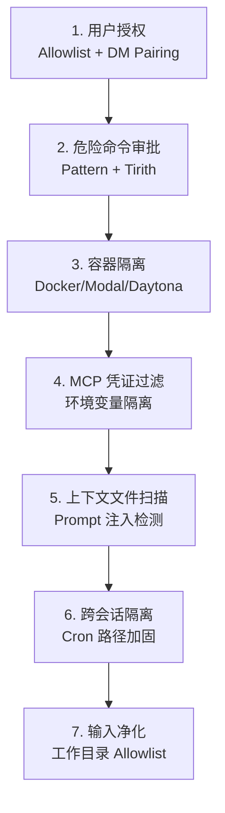

# Agent Hermes 与 OpenClaw（龙虾）安全模型深度解析
# Security Models in Agent Hermes & OpenClaw (Lobster): A Deep Dive

> 最后更新 | Last updated: 2026-06-05

---

## 一、共同前提：个人助理信任模型 | Shared Premise: Personal Assistant Trust Model

**中文**

两个框架都面向 **单用户/单信任边界** 的个人助理场景，而非 hostile multi-tenant（敌对多租户）隔离：

| 假设 | 含义 |
|------|------|
| 单操作者 | 一个 Gateway 对应一个信任的操作者 |
| 主机可信 | 能修改 `~/.openclaw` 或 `~/.hermes` 的人视为可信管理员 |
| 非多租户边界 | 多个互不信任用户共享同一 Gateway **不是**推荐部署模式 |
| 工具即权限 | 能触发 Agent 的人 ≈ 能诱导 Agent 使用其工具权限 |

若需敌对用户隔离，应 **拆分信任边界**：独立 Gateway + 独立凭证 + 理想情况下独立 OS 用户/主机。

**English**

Both frameworks target **single-user / single-trust-boundary** personal assistant deployments, not hostile multi-tenant isolation:

| Assumption | Meaning |
|------------|---------|
| Single operator | One Gateway per trusted operator |
| Host is trusted | Anyone who can modify `~/.openclaw` or `~/.hermes` is a trusted admin |
| Not multi-tenant | Multiple mutually untrusted users on one Gateway is **not** a recommended setup |
| Tools = authority | Anyone who can trigger the agent can induce tool usage within the agent's policy |

For adversarial-user isolation, **split trust boundaries**: separate Gateways, credentials, and ideally OS users/hosts.

---

## 二、安全设计哲学对比 | Security Design Philosophy Comparison

**中文**

| 维度 | OpenClaw | Hermes Agent |
|------|----------|--------------|
| 核心理念 | **Access control before intelligence** — 先控身份，再控范围，最后才信任模型 | **Defense in depth** — 七层纵深防御 |
| 默认姿态 | 信任单操作者，`security="full"` 为个人助理默认 | 默认 `manual` 审批危险命令 |
| 审计工具 | `openclaw security audit [--deep] [--fix]` | `hermes doctor` + 供应链告警 |
| 沙箱策略 | Docker sandbox（可选）+ fs-safe 文件操作 | 6 种终端后端，容器即边界 |
| 审批模型 | Exec approvals（allowlist + ask） | 危险命令模式匹配 + Tirith 扫描 |
| 供应链 | npm shrinkwrap 锁定发布依赖 | tirith + Skills Guard + 懒安装隔离 |

**English**

| Dimension | OpenClaw | Hermes Agent |
|-----------|----------|--------------|
| Core idea | **Access control before intelligence** — identity, scope, then model | **Defense in depth** — seven layers |
| Default posture | Trusted single-operator; `security="full"` for personal use | Default `manual` approval for dangerous commands |
| Audit tooling | `openclaw security audit [--deep] [--fix]` | `hermes doctor` + supply-chain advisories |
| Sandboxing | Optional Docker sandbox + `@openclaw/fs-safe` | 6 terminal backends; container as boundary |
| Approval model | Exec approvals (allowlist + ask) | Dangerous-command patterns + Tirith scanning |
| Supply chain | npm shrinkwrap for published deps | Tirith + Skills Guard + lazy install isolation |

---

## 三、OpenClaw 安全模型 | OpenClaw Security Model

**中文**

### 3.1 威胁模型

Agent 可以：执行任意 Shell、读写文件、访问网络、代发消息。

消息者可以：Prompt 注入、社会工程、探测基础设施。

OpenClaw 的应对：**先决定谁能说话，再决定 Agent 能在哪行动，最后假设模型可被操纵并限制爆炸半径。**

### 3.2 信任边界矩阵

| 控制项 | 实际作用 | 常见误读 |
|--------|----------|----------|
| `gateway.auth` | 认证 Gateway API 调用者 | 「每帧都需签名才安全」 |
| `sessionKey` | 会话路由键 | 「sessionKey 是用户认证」 |
| Prompt 防护 | 降低模型滥用风险 | 「注入 alone 即证明认证绕过」 |
| Node pairing | 操作者级远程执行 | 「应默认视为不可信用户访问」 |
| Exec approvals | 操作者意图护栏 | 「非敌对多租户隔离」 |

### 3.3 DM 访问模型

所有支持 DM 的渠道均有 `dmPolicy`：

| 策略 | 行为 |
|------|------|
| `pairing`（默认） | 未知发送者收到配对码，需管理员批准 |
| `allowlist` | 仅白名单内 ID 可对话 |
| `open` | 任何人可触发（高风险） |
| `disabled` | 禁用 DM |

群组策略：`requireMention: true` 防止群内误触发。

### 3.4 上下文可见性（contextVisibility）

控制**注入模型的补充上下文**（引用回复、线程历史），与触发授权分离：

| 值 | 行为 |
|----|------|
| `all`（默认） | 保留所有补充上下文 |
| `allowlist` | 仅白名单发送者的上下文 |
| `allowlist_quote` | 白名单过滤，但保留一条显式引用 |

### 3.5 工具爆炸半径控制

**硬化基线配置**（60 秒快速加固）：

```json5
{
  gateway: {
    mode: "local",
    bind: "loopback",
    auth: { mode: "token", token: "replace-with-long-random-token" },
  },
  session: { dmScope: "per-channel-peer" },
  tools: {
    profile: "messaging",
    deny: ["group:automation", "group:runtime", "group:fs",
           "sessions_spawn", "sessions_send"],
    fs: { workspaceOnly: true },
    exec: { security: "deny", ask: "always" },
    elevated: { enabled: false },
  },
  channels: {
    whatsapp: {
      dmPolicy: "pairing",
      groups: { "*": { requireMention: true } },
    },
  },
}
```

**高风险控制面工具**（对不可信内容默认 deny）：

- `gateway` — 可修改持久配置
- `cron` — 可创建持久定时任务
- `sessions_spawn` / `sessions_send` — 跨会话操作

### 3.6 Exec 审批模型

| 配置 | 含义 |
|------|------|
| `tools.exec.security` | `deny` / `allowlist` / `full` |
| `tools.exec.ask` | `always` / `on-miss` / `off` |
| `tools.exec.host` | `sandbox` / `gateway` / `node` / `auto` |

默认对个人助理：`security="full"`, `ask="off"` — 这是**有意为之的 UX 默认**，非漏洞。

审批绑定精确请求上下文；无法识别单一本地文件操作数的解释器命令会被拒绝。

### 3.7 安全文件操作（@openclaw/fs-safe）

- 根目录边界文件访问
- 原子写入
- 安全归档解压
- 密钥文件辅助函数

### 3.8 网络安全

| 风险 | 缓解 |
|------|------|
| Gateway 公网暴露 | `bind: "loopback"` + Tailscale |
| 反向代理认证绕过 | 配置 `gateway.trustedProxies`，拒绝未信任代理的 localhost 伪装 |
| Control UI HTTP | 需 HTTPS 或 localhost；`allowInsecureAuth` 仅本地兼容 |
| DNS 重绑定 | 收紧 `trustedProxies`，避免直接公网暴露 |

### 3.9 插件与 Skills 供应链

- 插件在 Gateway **进程内**运行 — 视为可信代码
- 推荐 `plugins.allow` 显式白名单
- Skills 目录视为可信代码，限制修改权限
- `openclaw security audit --deep` 扫描 Skills/插件
- 发布包使用 `npm-shrinkwrap.json` 锁定依赖图

### 3.10 安全审计

```bash
openclaw security audit          # 常规审计
openclaw security audit --deep   # 含实时 Gateway 探测
openclaw security audit --fix    # 自动修复常见问题
```

审计覆盖：入站访问、工具爆炸半径、网络暴露、浏览器控制、文件权限、插件、策略漂移。

**English**

### 3.1 Threat Model

The agent can execute shell, read/write files, access network, send messages. Messengers can prompt-inject and social-engineer. Response: control who can talk, where the agent acts, assume the model is manipulable, limit blast radius.

### 3.2 Trust Boundary Matrix

`gateway.auth` authenticates API callers; `sessionKey` routes sessions (not auth); exec approvals are operator guardrails, not multi-tenant isolation.

### 3.3 DM Access Model

`dmPolicy`: pairing (default), allowlist, open (high risk), disabled. Group mention gates prevent accidental triggers.

### 3.4 Context Visibility

Separates trigger authorization from supplemental context injection (`all`, `allowlist`, `allowlist_quote`).

### 3.5 Tool Blast Radius

Hardened baseline denies automation/runtime/fs tools, enables workspace-only filesystem, denies exec by default. Deny `gateway`, `cron`, `sessions_spawn` for untrusted surfaces.

### 3.6 Exec Approvals

`security` + `ask` + `host` configuration. Default `full`/`off` is intentional for trusted personal assistants.

### 3.7 Secure File Operations

`@openclaw/fs-safe`: root-bounded access, atomic writes, safe archive extraction.

### 3.8 Network Security

Loopback bind, trusted proxy config, HTTPS for Control UI, no direct public exposure.

### 3.9 Plugin & Skills Supply Chain

In-process plugins = trusted code. Explicit allowlists, shrinkwrapped npm deps, deep audit scanning.

### 3.10 Security Audit

`openclaw security audit [--deep] [--fix]` covers inbound access, tool blast radius, network exposure, permissions, plugins, policy drift.

---

## 四、Hermes Agent 安全模型 | Hermes Agent Security Model

**中文**

### 4.1 七层纵深防御



### 4.2 危险命令审批

**审批模式**（`~/.hermes/config.yaml`）：

| 模式 | 行为 |
|------|------|
| `manual`（默认） | 所有危险命令需用户明确批准 |
| `smart` | 辅助 LLM 评估风险；低风险自动批准，高风险自动拒绝，不确定则人工 |
| `off` | 禁用所有审批（等同 `--yolo`） |

**YOLO 模式**（`/yolo` 或 `hermes --yolo`）：
- 绕过审批提示，但**不绕过硬线黑名单**
- 会话中显示红色 `⚠ YOLO` 状态栏提醒

**硬线黑名单（Always-On Floor）** — 无论 YOLO/off/approve 均拒绝：

| 模式 | 原因 |
|------|------|
| `rm -rf /` 及变体 | 擦除文件系统根 |
| Bash fork bomb | 耗尽进程直到重启 |
| `mkfs.*` on root device | 格式化 live 系统 |
| `dd if=/dev/zero of=/dev/sd*` | 清零物理磁盘 |
| 管道不可信 URL 到 sh | 远程代码执行 |

**触发审批的模式**（部分）：

- `rm -r` / `rm --recursive`
- `chmod 777` / `chmod -R` 不安全权限
- `DROP TABLE` / `DELETE FROM` 无 WHERE / `TRUNCATE`
- `systemctl stop/restart/disable`
- `bash -c` / `curl | sh` / `bash <(curl ...)`
- 覆写 `/etc/`、`~/.ssh/`、`~/.hermes/.env`
- `pkill`/`killall` hermes/gateway（防自终止）

**容器绕过**：Docker/Singularity/Modal/Daytona 后端跳过危险命令检查——容器本身是安全边界。

### 4.3 Tirith 预执行扫描

集成 tirith 进行内容级命令扫描，检测：

- 同形字 URL 欺骗
- 管道到解释器（`curl | bash`）
- 终端注入攻击

```yaml
security:
  tirith_enabled: true
  tirith_timeout: 5
  tirith_fail_open: true   # tirith 不可用时是否放行（高安全环境设为 false）
```

可疑/阻断命令触发审批流程，默认选择 deny。

### 4.4 用户授权（Gateway）

授权检查顺序：

1. 平台 allow-all 标志
2. DM 配对已批准列表
3. 平台 allowlist
4. 全局 allowlist
5. 全局 allow-all
6. **默认拒绝**

**DM 配对安全特性**（OWASP + NIST SP 800-63-4）：

| 特性 | 详情 |
|------|------|
| 码格式 | 8 字符，32 字符无歧义字母表 |
| 随机性 | `secrets.choice()` 密码学安全 |
| TTL | 1 小时过期 |
| 速率限制 | 每用户每 10 分钟 1 次 |
| 锁定 | 5 次失败 → 锁定 1 小时 |
| 文件权限 | `chmod 0600` |

### 4.5 容器隔离（Docker 示例）

每个容器强制安全参数：

```python
"--cap-drop", "ALL"
"--security-opt", "no-new-privileges"
"--pids-limit", "256"
"--tmpfs", "/tmp:rw,nosuid,size=512m"
"--tmpfs", "/var/tmp:rw,noexec,nosuid,size=256m"
```

可配置 CPU/内存/磁盘限制。持久模式 bind-mount `/workspace` 和 `/root`；临时模式使用 tmpfs。

### 4.6 终端后端安全对比

| 后端 | 隔离 | 危险命令检查 | 适用场景 |
|------|------|-------------|----------|
| local | 无（宿主机） | ✅ | 开发、可信用户 |
| ssh | 远程机器 | ✅ | Gateway 与执行分离 |
| docker | 容器 | ❌（容器即边界） | 生产 Gateway |
| singularity | 容器 | ❌ | HPC |
| modal / daytona | 云沙箱 | ❌ | Serverless 隔离 |

### 4.7 环境变量与凭证过滤

**execute_code / terminal** 默认剥离敏感环境变量（含 KEY/TOKEN/SECRET/PASSWORD 等）。

**Skill 声明式透传**：Skill frontmatter 中 `required_environment_variables` 仅在 Skill 加载后透传对应变量。

**MCP 子进程**：仅传递 PATH/HOME/USER/LANG 等安全变量 + MCP 配置中显式声明的 `env`。

**凭证脱敏**：MCP 错误消息中 GitHub PAT、Bearer token 等替换为 `[REDACTED]`。

### 4.8 SSRF 与网站访问策略

**SSRF 防护**（始终开启，面向公网）：

阻断 RFC 1918 私网、回环地址、链路本地（含 `169.254.169.254` 云元数据）、CGNAT、云元数据主机名。重定向链每跳重新验证。

```yaml
security:
  allow_private_urls: false   # 仅内网场景设为 true
  website_blocklist:
    enabled: true
    domains: ["*.internal.company.com"]
```

### 4.9 上下文文件注入防护

注入系统提示词前扫描 AGENTS.md、SOUL.md、.cursorrules 等：

- 忽略/覆盖先前指令的注入
- 隐藏 HTML 注释中的可疑关键词
- 读取密钥文件的尝试
- 不可见 Unicode 字符

被阻断时显示：`[BLOCKED: AGENTS.md contained potential prompt injection]`

### 4.10 记忆安全扫描

`MEMORY.md` / `USER.md` 写入前检测 Prompt 注入、凭证外泄、SSH 后门、不可见 Unicode。

### 4.11 Skills 供应链安全

- Skills Hub 安装经过安全扫描（数据外泄、注入、破坏性命令）
- `--force` 可覆盖 caution/warn 级发现，**不可**覆盖 `dangerous` 判定
- 信任等级：`builtin` > `official` > `trusted` > `community`
- 懒安装（`lazy_deps.py`）隔离可选依赖，防止一个毒化包拖垮全部功能

### 4.12 供应链告警

`hermes doctor` 检查 Python venv 中已知妥协版本（如供应链蠕虫），可用 `hermes doctor --ack <id>` 确认处置。

**English**

### 4.1 Seven Defense Layers

User auth → dangerous command approval → container isolation → MCP credential filtering → context file scanning → cross-session isolation → input sanitization.

### 4.2 Dangerous Command Approval

Modes: `manual` (default), `smart` (auxiliary LLM risk assessment), `off` (YOLO). Hardline blocklist always blocks catastrophic commands regardless of YOLO. Container backends skip approval checks — the container is the boundary.

### 4.3 Tirith Pre-Exec Scanning

Content-level scanning for homograph spoofing, pipe-to-interpreter, terminal injection. Integrates with approval flow; default deny on suspicious verdicts.

### 4.4 User Authorization

Layered allowlists + DM pairing (cryptographic codes, TTL, rate limits, lockout). Default deny.

### 4.5 Container Isolation

Docker: cap-drop ALL, no-new-privileges, pids-limit, size-limited tmpfs. Configurable CPU/memory/disk.

### 4.6 Terminal Backend Security

local/ssh: approval checks on. docker/singularity/modal/daytona: container is boundary, checks skipped.

### 4.7 Credential Filtering

Strip sensitive env vars by default. Skill-declared passthrough only when skill is loaded. MCP gets filtered env + explicit config only. Error message redaction.

### 4.8 SSRF & Website Policy

Block private/loopback/link-local/metadata addresses. Redirect re-validation. Optional `allow_private_urls` for LAN-only setups. Domain blocklist support.

### 4.9 Context File Injection Protection

Scan workspace files for injection patterns, hidden comments, secret exfiltration, invisible Unicode.

### 4.10 Memory Security Scanning

Scan memory entries before system-prompt injection.

### 4.11 Skills Supply Chain

Hub install security scan, trust levels, `--force` cannot override `dangerous` verdicts, lazy dep isolation.

### 4.12 Supply-Chain Advisories

`hermes doctor` flags known compromised package versions.

---

## 五、安全模型对比矩阵 | Security Model Comparison Matrix

**中文**

| 安全能力 | OpenClaw | Hermes |
|----------|----------|--------|
| 身份优先 | ✅ dmPolicy + allowlist | ✅ 多层 allowlist + pairing |
| 命令审批 | Exec approvals (allowlist + ask) | Pattern matching + Tirith + smart mode |
| 不可覆盖黑名单 | 无明确硬线层 | ✅ UNRECOVERABLE_BLOCKLIST |
| 容器沙箱 | Docker sandbox（可选） | 6 后端，容器即边界 |
| 文件安全 | @openclaw/fs-safe 根边界 | 工作目录 allowlist + 上下文扫描 |
| SSRF 防护 | 浏览器 SSRF 策略可配 | 内置多类地址阻断 |
| Prompt 注入防护 | contextVisibility 过滤 | 上下文文件 + 记忆写入扫描 |
| MCP 凭证隔离 | 配置级 env | 严格白名单 + 脱敏 |
| 安全审计 CLI | `openclaw security audit` | `hermes doctor` |
| 供应链锁定 | npm shrinkwrap | tirith + lazy_deps + Skills Guard |
| 默认安全姿态 | 信任操作者（full exec） | 人工审批（manual） |
| 硬化基线 | audit --fix 一键加固 | 生产清单（Docker + allowlist） |

**English**

| Security capability | OpenClaw | Hermes |
|--------------------|----------|--------|
| Identity-first | ✅ dmPolicy + allowlist | ✅ layered allowlist + pairing |
| Command approval | Exec approvals | Pattern + Tirith + smart mode |
| Non-overridable blocklist | No explicit hardline layer | ✅ UNRECOVERABLE_BLOCKLIST |
| Container sandbox | Optional Docker | 6 backends; container as boundary |
| File safety | @openclaw/fs-safe root bounds | cwd allowlist + context scanning |
| SSRF protection | Configurable browser SSRF policy | Built-in multi-class address blocking |
| Prompt injection | contextVisibility filtering | Context file + memory write scanning |
| MCP credential isolation | Config-level env | Strict whitelist + redaction |
| Security audit CLI | `openclaw security audit` | `hermes doctor` |
| Supply chain | npm shrinkwrap | tirith + lazy_deps + Skills Guard |
| Default posture | Trust operator (full exec) | Manual approval |
| Hardening baseline | audit --fix | Production checklist (Docker + allowlist) |

---

## 六、共享收件箱场景 | Shared Inbox Scenarios

**中文**

若多人可 DM 你的 Bot，核心风险是 **委派工具权限**：

- 任一允许发送者可诱导 `exec`、浏览器、网络/文件工具
- 一个发送者的 Prompt 注入可影响共享状态/设备/输出
- 若 Agent 持有敏感凭证，任何允许发送者都可能驱动外泄

**OpenClaw 建议**：
- `session.dmScope: "per-channel-peer"`
- `dmPolicy: "pairing"` 或严格 allowlist
- 不要对共享 DM 开放广泛工具访问
- 团队工作流用独立 Agent/Gateway，最小工具集

**Hermes 建议**：
- 配置平台 allowlist，禁用 `GATEWAY_ALLOW_ALL_USERS`
- 生产环境 `terminal.backend: docker`
- Cron 任务设 `cron_mode: deny`（遇危险命令拒绝而非自动批准）

**English**

If multiple people can DM your bot, the core risk is **delegated tool authority**. Any allowed sender can induce exec/browser/network tools; prompt injection from one sender affects shared state.

**OpenClaw**: per-channel-peer DM scope, pairing/allowlist, no broad tools on shared DMs, separate agents for team workflows.

**Hermes**: platform allowlists, Docker backend in production, `cron_mode: deny` for headless jobs.

---

## 七、生产硬化清单 | Production Hardening Checklists

**中文**

### OpenClaw 生产清单

1. `openclaw security audit --deep --fix`
2. `gateway.bind: "loopback"` + 强随机 `gateway.auth.token`
3. `dmPolicy: "pairing"` + `session.dmScope: "per-channel-peer"`
4. 收紧 `tools.profile`，deny `gateway`/`cron`/`sessions_spawn`
5. `tools.exec.security: "deny"` 或 `"allowlist"` + `ask: "always"`
6. `tools.fs.workspaceOnly: true`
7. `chmod 700 ~/.openclaw`，凭证文件 `600`
8. `plugins.allow` 显式白名单
9. 反向代理配置 `trustedProxies`
10. 定期审查 Skills 目录修改权限

### Hermes 生产清单

1. 配置 `TELEGRAM_ALLOWED_USERS` 等，**禁用** `GATEWAY_ALLOW_ALL_USERS`
2. `terminal.backend: docker`（或 modal/daytona）
3. 设置容器 CPU/内存/磁盘限制
4. `chmod 600 ~/.hermes/.env`
5. 启用 DM pairing，`unauthorized_dm_behavior: pair`
6. `approvals.mode: manual`（或 `smart`）
7. `security.tirith_fail_open: false`（高安全环境）
8. `security.allow_private_urls: false`
9. 定期审查 `command_allowlist`
10. `hermes doctor` + `hermes update` 保持补丁最新
11. Gateway 以非 root 用户运行
12. 网络隔离：Gateway 与执行分离（`terminal.backend: ssh`）

**English**

**OpenClaw production**: security audit --deep --fix, loopback bind + auth token, pairing DM policy, tighten tool profile, deny/limit exec, workspace-only fs, lock permissions, plugin allowlist, trusted proxies, audit skills directory.

**Hermes production**: platform allowlists (no allow-all), Docker/modal backend, container limits, secure .env, DM pairing, manual/smart approvals, tirith fail-closed, no private URLs, audit command allowlist, hermes doctor + update, non-root gateway, split gateway/execution via SSH.

---

## 八、结语 | Conclusion

**中文**

OpenClaw 的安全模型是 **「身份先行、范围次之、模型最后」** — 用 Gateway 认证、DM 策略、工具 Profile 和 Exec 审批控制爆炸半径，默认信任单操作者，适合快速搭建个人助理并通过 `security audit` 渐进加固。Hermes 的安全模型是 **「七层纵深、默认审慎」** — 危险命令人工审批、硬线黑名单、Tirith 扫描、容器隔离、凭证过滤环环相扣，适合对命令执行安全有更高要求的长期运行场景。两者都不是敌对多租户沙箱；若需此类隔离，唯一可靠方案是 **拆分信任边界**，而非在单一 Gateway 上叠加更多审批规则。

**English**

OpenClaw's security model is **identity first, scope second, model last** — Gateway auth, DM policies, tool profiles, and exec approvals control blast radius, defaulting to trusted single-operator UX, hardened progressively via `security audit`. Hermes's model is **seven-layer defense-in-depth with cautious defaults** — manual approval, hardline blocklist, Tirith scanning, container isolation, and credential filtering for higher-assurance long-running deployments. Neither is a hostile multi-tenant sandbox; for that, the only reliable approach is **splitting trust boundaries**, not piling more approval rules onto one Gateway.
