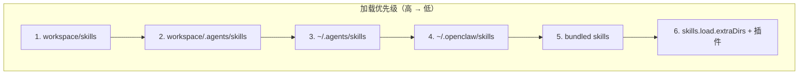
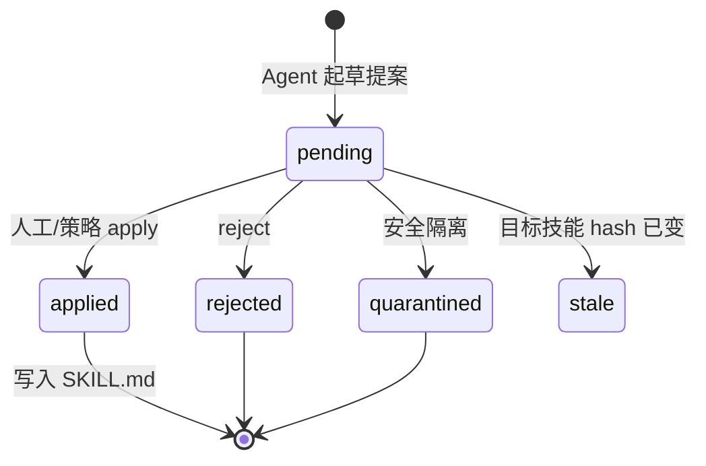
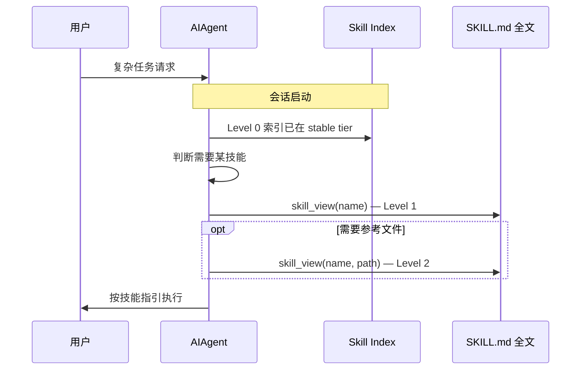
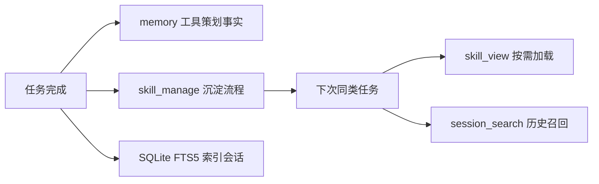

# Agent Hermes 与 OpenClaw 技能系统与学习闭环全解析
# Agent Hermes & OpenClaw: Skills System and Learning Loop — A Deep Dive

> 最后更新 | Last updated: 2026-06-06

---

## 一、设计哲学对比 | Design Philosophy Comparison

**中文**

技能（Skills）是两个框架扩展 Agent「程序性记忆」的核心机制，但学习与治理路径截然不同：

| 维度 | OpenClaw（龙虾） | Hermes Agent |
|------|------------------|--------------|
| 标准格式 | [agentskills.io](https://agentskills.io) 兼容 `SKILL.md` | 同标准，外加 Hermes 扩展 metadata |
| 技能来源 | 用户/社区/ClawHub 手动安装 | 自动生成 + Skills Hub + 手动 |
| 学习闭环 | 无内置；Skill Workshop 提案队列 | `skill_manage` 自动创建与 patch |
| 上下文成本 | XML 元数据快照（确定性公式） | Level 0 索引 ~3k tokens，全文按需 |
| 供应链 | ClawHub 验证 + 安装策略 | Skills Guard 扫描 + 信任等级 |
| 技能组合 | 无原生 bundle | `skill-bundles/` YAML 组合 |

**English**

Skills are the core mechanism for procedural memory in both frameworks, but learning and governance paths diverge sharply:

| Dimension | OpenClaw (Lobster) | Hermes Agent |
|-----------|-------------------|--------------|
| Standard format | [agentskills.io](https://agentskills.io)-compatible `SKILL.md` | Same standard + Hermes metadata extensions |
| Skill sources | User/community/ClawHub manual install | Auto-generate + Skills Hub + manual |
| Learning loop | None built-in; Skill Workshop proposal queue | `skill_manage` auto-create and patch |
| Context cost | XML metadata snapshot (deterministic formula) | Level 0 index ~3k tokens; full content on demand |
| Supply chain | ClawHub verification + install policy | Skills Guard scan + trust levels |
| Skill bundles | No native bundle | `skill-bundles/` YAML groups |

---

## 二、SKILL.md 开放标准 | The agentskills.io Standard

**中文**

两个框架均遵循 **Agent Skills** 开放标准：每个技能是一个目录，内含带 YAML frontmatter 的 `SKILL.md` 正文。

```markdown
---
name: deploy-k8s
description: Deploy services to Kubernetes with rollout verification
version: 1.0.0
metadata:
  {"openclaw": {"requires": {"bins": ["kubectl"], "env": ["KUBECONFIG"]}}}
---

# Deploy to Kubernetes

## When to Use
User asks to deploy, roll out, or verify a K8s service.

## Procedure
1. Validate manifest with `kubectl apply --dry-run=client`
2. Apply and watch rollout status
3. Run smoke checks against the service endpoint
```

**关键约定**：

| 字段 | 必需 | 作用 |
|------|------|------|
| `name` | ✅ | 技能标识、斜杠命令、allowlist 键 |
| `description` | ✅ | 注入索引时的简短说明 |
| `metadata.openclaw` | 可选 | OpenClaw 门控（bins/env/config/os） |
| `metadata.hermes` | 可选 | Hermes 分类、条件激活、config 设置 |

OpenClaw frontmatter 解析器仅支持**单行键**；`metadata` 必须是单行 JSON。Hermes 额外支持 `platforms`、`required_environment_variables`、`fallback_for_toolsets` 等扩展。

**English**

Both frameworks follow the **Agent Skills** open standard: each skill is a directory containing `SKILL.md` with YAML frontmatter and a markdown body.

Key conventions: `name` and `description` are required; `metadata.openclaw` gates skills by bins/env/config/OS on OpenClaw; Hermes adds `platforms`, `required_environment_variables`, and conditional activation fields. OpenClaw's parser accepts single-line keys only; `metadata` must be a single-line JSON object.

---

## 三、OpenClaw 技能加载与优先级 | OpenClaw Skill Loading & Precedence

**中文**

OpenClaw 从多个根目录发现技能，**同名技能以高优先级来源覆盖低优先级**：



| 优先级 | 来源 | 路径 | 可见范围 |
|--------|------|------|----------|
| 1（最高） | Workspace | `<workspace>/skills` | 仅该 Agent |
| 2 | Project agent | `<workspace>/.agents/skills` | 该工作区 Agent |
| 3 | Personal agent | `~/.agents/skills` | 本机所有 Agent |
| 4 | Managed/local | `~/.openclaw/skills` | 本机所有 Agent |
| 5 | Bundled | 安装包内置 | 全局 |
| 6（最低） | Extra dirs | `skills.load.extraDirs` | 可配置 |

**安装命令**：

```bash
openclaw skills install <slug>              # 安装到当前 workspace/skills/
openclaw skills install <slug> --global     # 安装到 ~/.openclaw/skills/
openclaw skills update --all                # 更新 ClawHub 来源技能
```

**门控（Gating）**：加载时根据 `metadata.openclaw.requires` 过滤——缺失二进制、环境变量或配置项的技能不会进入 eligible 列表。`always: true` 可跳过所有门控。

**会话快照**：会话启动时对 eligible 技能拍快照，同会话后续轮次复用；`skills.load.watch: true` 时 `SKILL.md` 变更会在下一轮刷新。

**English**

OpenClaw discovers skills from multiple roots; same-named skills are overridden by higher-precedence sources. Priority: workspace → project `.agents/skills` → `~/.agents/skills` → `~/.openclaw/skills` → bundled → `extraDirs` + plugins. Install with `openclaw skills install`; use `--global` for shared managed dir. Gating filters by bins/env/config at load time. Session snapshots reuse the eligible list until refresh on new session or watcher bump.

---

## 四、ClawHub 与 Skill Workshop | ClawHub & Skill Workshop

**中文**

### 4.1 ClawHub 公共注册表

[ClawHub](https://clawhub.ai) 是 OpenClaw 的公共技能市场：

| 操作 | 命令 |
|------|------|
| 安装到工作区 | `openclaw skills install <slug>` |
| 从 Git 安装 | `openclaw skills install git:owner/repo@ref` |
| 验证信任信封 | `openclaw skills verify <slug>` |
| 发布/同步 | `clawhub sync --all` |

ClawHub 技能页展示 VirusTotal、ClawScan、静态分析等安全扫描状态。安装时记录 `.clawhub/origin.json` 用于后续 verify。

### 4.2 Skill Workshop 提案队列

OpenClaw 的**治理型学习路径**：Agent 不直接写活跃 `SKILL.md`，而是先创建 `PROPOSAL.md` 提案。



**核心规则**：

- **提案优先**：生成内容存为 `PROPOSAL.md`，非 `SKILL.md`
- **Apply 是唯一活写**：create/update/revise 不改动活跃技能
- **Hash 绑定**：update 提案绑定目标技能当前 hash，过期变 stale
- **扫描门控**：apply 前重新运行安全扫描
- **审批策略**：默认 `approvalPolicy: "pending"`；`"auto"` 跳过人工确认

```bash
openclaw skills workshop list
openclaw skills workshop inspect <proposal-id>
openclaw skills workshop apply <proposal-id>
openclaw skills workshop reject <proposal-id> --reason "Not reusable"
```

`skills.workshop.autonomous.enabled: false`（默认）控制是否在成功回合后自动起草提案。

**English**

ClawHub is OpenClaw's public skill registry with install, verify, and publish flows. Skill Workshop is the governed learning path: agents draft `PROPOSAL.md` instead of writing live `SKILL.md`. Lifecycle: pending → applied/rejected/quarantined/stale. Apply is the only live write; hash binding and scanner gating protect integrity. CLI: `openclaw skills workshop list/inspect/apply/reject`.

---

## 五、OpenClaw 技能 Token 成本公式 | OpenClaw Skill Token Cost Formula

**中文**

OpenClaw 将 eligible 技能编译为紧凑 **XML 块**注入系统提示词（仅元数据，全文通过 `read` 按需加载）：

```text
total_chars = 195 + Σ (97 + len(name) + len(description) + len(filepath))
```

| 组成部分 | 说明 |
|----------|------|
| 基础开销 195 | 仅当 ≥1 个技能时计入 |
| 每技能 97 | 固定 XML 包装字符 |
| 字段长度 | `name`、`description`、`location` 的 XML 转义后长度 |
| Token 估算 | ~4 字符/token → 每技能约 24 tokens + 字段长度 |

**示例**：50 个技能，平均 name=12、description=80、filepath=40：

```text
total ≈ 195 + 50 × (97 + 12 + 80 + 40) = 195 + 11,450 ≈ 11,645 字符 ≈ ~2,900 tokens
```

**优化建议**：

- 保持 `description` 简短（影响每技能成本）
- 用 `agents.defaults.skills` allowlist 限制可见技能
- `skills.limits.maxSkillsPromptChars` 设上限
- `/context detail` 诊断当前会话技能贡献
- 禁用不需要的 bundled 技能：`skills.entries.<name>.enabled: false`

**English**

Eligible skills compile into a compact XML block in the system prompt (metadata only; full instructions loaded on demand via `read`). Formula: `total = 195 + Σ(97 + len(name) + len(description) + len(filepath))`. Base 195 chars when ≥1 skill; ~97 chars wrapper per skill plus field lengths. At ~4 chars/token, expect ~24 tokens/skill before fields. Trim descriptions, use allowlists, set `maxSkillsPromptChars`, and run `/context detail` to diagnose.

---

## 六、Hermes 渐进式披露 | Hermes Progressive Disclosure

**中文**

Hermes 将技能作为**第四层程序性记忆**，采用三级渐进式披露控制 Token：

```text
Level 0: skills_list()           → [{name, description, category}]   (~3k tokens)
Level 1: skill_view(name)        → 完整 SKILL.md + metadata            (按需)
Level 2: skill_view(name, path)  → references/ 等附属文件              (按需)
```



**效果**：技能库从 40 个增长到 200 个，Level 0 成本几乎不变（~3k tokens）；仅实际使用的技能产生 Level 1/2 开销。

技能索引属于 Prompt **stable tier**（与 SOUL、工具指引同层），保证前缀缓存友好；全文加载通过工具调用注入对话，不污染系统提示词前缀。

**English**

Hermes treats skills as fourth-layer procedural memory with three disclosure levels: Level 0 index (~3k tokens at session start), Level 1 full `SKILL.md` on demand, Level 2 reference files on demand. Libraries can grow from 40 to 200 skills with near-flat Level 0 cost. The index lives in the stable prompt tier; full content loads via tool calls without mutating the cached prefix.

---

## 七、Hermes 闭环学习（skill_manage）| Hermes Closed Learning Loop

**中文**

Hermes 最核心的差异化能力：任务完成后 Agent 自主沉淀技能，无需人工编写。

### 7.1 自动创建触发条件

| 场景 | 说明 |
|------|------|
| 复杂任务成功 | 通常 5+ 次工具调用 |
| 排错后找到正解 | 经历错误并修正路径 |
| 用户纠正做法 | 显式反馈更优流程 |
| 发现非平凡工作流 | 可复用的多步操作 |

### 7.2 skill_manage 工具操作

| Action | 用途 | 关键参数 |
|--------|------|----------|
| `create` | 从零创建 | `name`, `content`（完整 SKILL.md） |
| `patch` | 定向修复（**首选**） | `name`, `old_string`, `new_string` |
| `edit` | 大改重写 | `name`, `content`（全量替换） |
| `delete` | 删除技能 | `name` |
| `write_file` | 添加附属文件 | `name`, `file_path`, `file_content` |
| `remove_file` | 删除附属文件 | `name`, `file_path` |

```python
# 优先 patch — 比 edit 更省 Token
skill_manage(
    action="patch",
    name="deploy-k8s",
    old_string="kubectl apply -f manifest.yaml",
    new_string="kubectl apply -f manifest.yaml --server-side"
)
```

### 7.3 与记忆系统的协同



**Periodic Nudge**：会话间隙触发自我反思，可能更新 MEMORY.md 或 patch 现有技能。

**English**

Hermes's key differentiator: after tasks, the agent curates procedural memory via `skill_manage`. Triggers: 5+ tool calls, error recovery, user corrections, non-trivial workflows. Prefer `patch` over `edit` for token efficiency. Synergy with `memory` tool curation, FTS5 session indexing, and Periodic Nudge between sessions.

---

## 八、Skills Hub 与供应链安全 | Skills Hub & Supply Chain Security

**中文**

### 8.1 Hermes Skills Hub 来源

| 来源 ID | 示例 | 说明 |
|---------|------|------|
| `official` | `official/security/1password` | 仓库 optional-skills，内置信任 |
| `skills-sh` | `skills-sh/vercel-labs/...` | Vercel 公共目录 |
| `well-known` | `well-known:https://mintlify.com/docs/...` | `/.well-known/skills/index.json` |
| `github` | `openai/skills/k8s` | 直接 GitHub 安装 + 自定义 tap |
| `clawhub` | ClawHub 标识符 | 第三方市场集成 |
| `browse-sh` | `browse-sh/airbnb.com/...` | 200+ 站点浏览器自动化技能 |
| `url` | `https://example.com/SKILL.md` | 单文件直链安装 |

```bash
hermes skills browse
hermes skills search kubernetes --source skills-sh
hermes skills install openai/skills/k8s        # 安全扫描后安装
hermes skills install <slug> --force           # 覆盖 caution/warn，不可覆盖 dangerous
hermes skills audit                            # 重扫已安装技能
```

### 8.2 信任等级与安全扫描

| 等级 | 来源 | 策略 |
|------|------|------|
| `builtin` | Hermes 内置 | 始终信任 |
| `official` | optional-skills | 内置信任 |
| `trusted` | openai/anthropics/NVIDIA 等 | 宽松策略 |
| `community` | 其他所有来源 | `--force` 可覆盖非 dangerous 发现 |

扫描项：数据外泄、Prompt 注入、破坏性命令、供应链信号。`dangerous` 判定**不可**被 `--force` 覆盖。

### 8.3 Hermes Skill Bundles

`~/.hermes/skill-bundles/*.yaml` 将多个技能组合为单一斜杠命令：

```yaml
name: backend-dev
description: Backend feature work — review, test, PR
skills:
  - github-code-review
  - test-driven-development
  - github-pr-workflow
instruction: |
  Always start with failing tests, then implement.
```

`/backend-dev refactor auth middleware` 一次加载全部技能。Bundle 不修改系统提示词缓存，在调用时生成新 user message。

**English**

Hermes Skills Hub integrates official, skills-sh, well-known, GitHub, ClawHub, browse-sh, and direct URL sources. Trust levels: builtin > official > trusted > community. Security scan blocks dangerous verdicts regardless of `--force`. Skill bundles group multiple skills under one slash command without invalidating the prompt cache.

---

## 九、学习路径对比与选型 | Learning Path Comparison

**中文**

| 场景 | OpenClaw | Hermes |
|------|----------|--------|
| 沉淀重复工作流 | 手动写 SKILL.md 或 Skill Workshop 审批 | 任务后 `skill_manage` 自动创建 |
| 技能自改进 | Workshop revise + apply | `skill_manage patch` 实时优化 |
| 控制 Prompt 成本 | 缩短 description + allowlist | Level 0 索引 + 按需全文 |
| 社区生态 | ClawHub 体量大 | Skills Hub 多源集成 |
| 安全治理 | Workshop 提案 + ClawHub verify | Skills Guard + 信任等级 |
| 从对方迁移 | — | `hermes claw migrate` 导入技能 |

**选型建议**：

- 重视**人工审核与社区市场** → OpenClaw + ClawHub + Skill Workshop
- 重视**自动进化与 Token 效率** → Hermes + `skill_manage` + 渐进式披露
- 已有龙虾技能库 → `hermes claw migrate` 或保持 OpenClaw 加载顺序兼容的 `~/.agents/skills/` 共享目录

**English**

| Scenario | OpenClaw | Hermes |
|----------|----------|--------|
| Capture repeated workflows | Manual SKILL.md or Skill Workshop approval | Auto `skill_manage` after tasks |
| Self-improve skills | Workshop revise + apply | `skill_manage patch` in real time |
| Control prompt cost | Short descriptions + allowlist | Level 0 index + on-demand full load |
| Community ecosystem | Large ClawHub catalog | Multi-source Skills Hub |
| Security governance | Workshop proposals + ClawHub verify | Skills Guard + trust levels |
| Migration | — | `hermes claw migrate` imports skills |

Choose OpenClaw for human-reviewed community skills; choose Hermes for automatic evolution and token-efficient progressive disclosure.

---

## 十、最佳实践 | Best Practices

**中文**

### OpenClaw

1. **工作区优先**：项目专属技能放 `workspace/skills/`，全局共享放 `~/.openclaw/skills/`
2. **简短描述**：直接影响 Token 公式中的 `len(description)`
3. **启用 Workshop**：生产环境保持 `approvalPolicy: "pending"`
4. **定期 verify**：`openclaw skills verify` 检查 ClawHub 信任信封
5. **allowlist 收敛**：多 Agent 场景用 `agents.list[].skills` 限制爆炸半径

### Hermes Agent

1. **信任闭环学习**：复杂任务后让 Agent 自动 `skill_manage`，不必手写一切
2. **优先 patch**：小改动用 patch 而非 edit，节省 Token 与 diff 可读性
3. **Hub 安装先 inspect**：`hermes skills inspect` 预览后再 `install`
4. **善用 bundle**： recurring 多技能任务用 `/backend-dev` 而非多次 `/skill`
5. **外部目录只读**：共享 `external_dirs` 用文件权限防止 Agent 误改

**English**

**OpenClaw**: workspace-first layout, short descriptions, Workshop with pending approval, periodic `verify`, per-agent allowlists.

**Hermes**: trust the learning loop, prefer `patch`, inspect before install, use bundles for recurring multi-skill tasks, make shared `external_dirs` read-only when needed.

---

## 十一、延伸阅读 | Further Reading

- [记忆系统深度解析](./memory-system.md) — 技能作为第四层程序性记忆
- [工作区文件与 Prompt 组装](./workspace-context-prompt.md) — stable tier 中的技能索引
- [安全模型深度解析](./security-model.md) — Skills 供应链扫描
- [Agent Skills 开放标准](https://agentskills.io)
- [OpenClaw Skills 文档](https://docs.openclaw.ai/tools/skills)
- [Hermes Skills 文档](https://hermes-agent.nousresearch.com/docs/user-guide/features/skills)

---

## 十二、结语 | Conclusion

**中文**

OpenClaw 的技能系统是 **「连接生态 + 人工治理」** — 通过 agentskills.io 标准、六级加载优先级、ClawHub 市场和 Skill Workshop 提案队列，让社区技能可发现、可审计、可控制爆炸半径。Hermes 的技能系统是 **「进化引擎 + 渐进披露」** — 通过 `skill_manage` 闭环学习、Level 0-2 披露和 Skills Hub 多源集成，让 Agent 从经验中自动沉淀程序性记忆，同时保持 Token 成本近乎平坦。二者共享同一文件格式，却服务不同的产品哲学：**广度连接** 与 **深度进化**。

**English**

OpenClaw's skill system is **connectivity + human governance** — agentskills.io standard, six-tier loading precedence, ClawHub marketplace, and Skill Workshop proposal queues for discoverable, auditable community skills. Hermes's skill system is **evolution engine + progressive disclosure** — `skill_manage` closed-loop learning, Level 0-2 disclosure, and multi-source Skills Hub for automatic procedural memory with near-flat token cost. Both share the same file format but serve different philosophies: **connectivity breadth** vs. **evolutionary depth**.
