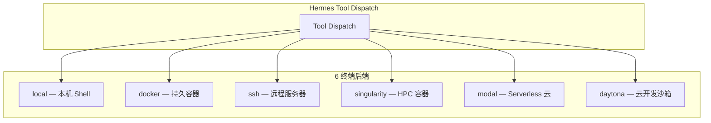
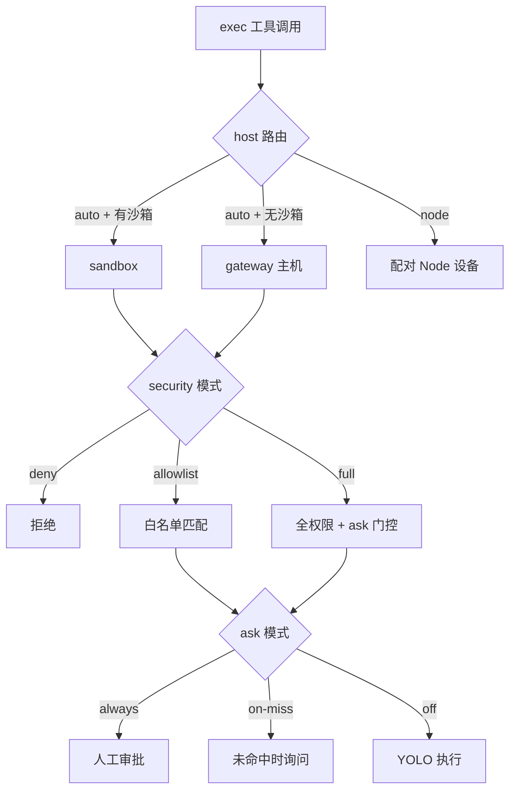

# Agent Hermes 与 OpenClaw 工具链与执行环境全解析
# Agent Hermes & OpenClaw: Toolchains and Execution Environments — A Deep Dive

> 最后更新 | Last updated: 2026-06-06

---

## 一、工具体系概览 | Tool System Overview

**中文**

两个框架都将「工具」作为 Agent 连接外部世界的桥梁，但组织方式不同：

| 维度 | OpenClaw（龙虾） | Hermes Agent |
|------|------------------|--------------|
| 工具数量 | 核心内置 + 插件扩展 | **70+ 工具**，**28 toolsets** |
| 组织方式 | `tools.profile` / `deny` / `groups` | 模块自注册 `registry.register()` |
| 平台预设 | 渠道 + 硬化基线 profile | `hermes-cli`、`hermes-telegram` 等 |
| 执行后端 | sandbox docker / gateway / node | **6 终端后端** |
| 后台进程 | `exec` + `process` 工具 | `terminal` + `process` 工具 |
| 浏览器 | 插件 + browser 工具 | 5 浏览器后端 + MCP |

**English**

Both frameworks use tools as the bridge to the external world, but organize them differently:

| Dimension | OpenClaw (Lobster) | Hermes Agent |
|-----------|-------------------|--------------|
| Tool count | Core built-in + plugin extensions | **70+ tools**, **28 toolsets** |
| Organization | `tools.profile` / `deny` / `groups` | Self-registering via `registry.register()` |
| Platform presets | Channel + hardened baseline profile | `hermes-cli`, `hermes-telegram`, etc. |
| Execution backends | sandbox docker / gateway / node | **6 terminal backends** |
| Background processes | `exec` + `process` tools | `terminal` + `process` tools |
| Browser | Plugin + browser tools | 5 browser backends + MCP |

---

## 二、Hermes 工具与 Toolsets | Hermes Tools & Toolsets

**中文**

Hermes 工具按 **toolset** 分组，每个平台（CLI、Telegram、Cron 等）可独立启用/禁用 toolset 子集：

| 类别 | Toolset | 代表工具 | 典型用途 |
|------|---------|----------|----------|
| Web | `web` | `web_search`, `web_fetch` | 搜索、抓取网页 |
| Terminal | `terminal`, `file` | `terminal`, `read_file`, `patch` | Shell、文件读写 |
| Browser | `browser` | `browser_navigate`, `browser_click` | 网页自动化 |
| Media | `vision`, `image_gen`, `tts` | 图像理解、生成、语音 | 多模态任务 |
| Memory | `memory`, `session_search` | `memory`, `session_search` | 持久记忆与历史检索 |
| Skills | `skills` | `skills_list`, `skill_view`, `skill_manage` | 技能加载与管理 |
| Delegation | `delegation` | `delegate_tool` | 子 Agent 并行委派 |
| Cron | `cronjob` | `cronjob` | 定时任务管理 |
| Code | `code_execution` | `execute_code` | 沙箱内执行 Python 等 |
| Messaging | `messaging` | `send_message` | 跨平台消息投递 |
| Safe | `safe` | 安全相关辅助 | 审批、扫描 |
| RL/Research | `rl` | 轨迹导出 | 训练数据生成 |

```bash
hermes tools                    # Curses UI 按平台配置 toolsets
hermes chat --toolsets web,file -q "List files in cwd"
```

**平台预设**（`hermes tools` 中的 platform）：

| 预设 | 特点 |
|------|------|
| `hermes-cli` | 全功能开发：terminal + browser + delegation |
| `hermes-telegram` | 消息场景：收紧 terminal，保留 web/messaging |
| `cron` | 定时任务专用：可单独配置，避免携带 moa/browser 膨胀 schema |

**English**

Hermes groups 70+ tools into 28 toolsets. Each platform (CLI, Telegram, Cron, etc.) can enable/disable subsets via `hermes tools`. Categories: web, terminal/file, browser, media, memory, skills, delegation, cron, code execution, messaging, safe, RL. Presets like `hermes-cli` (full dev) and `hermes-telegram` (messaging-focused) tune the default tool surface.

---

## 三、Hermes 六类终端后端 | Hermes Six Terminal Backends

**中文**

所有 `terminal`、文件工具、`execute_code` 调用均路由到配置的**执行后端**：



| 后端 | 描述 | 适用场景 |
|------|------|----------|
| `local` | 本机执行（默认） | 开发、可信环境 |
| `docker` | 隔离容器 | 生产 Gateway、安全边界 |
| `ssh` | 远程 SSH | Gateway 与执行分离 |
| `singularity` | Apptainer/Singularity | HPC 集群、无 root |
| `modal` | Modal 云函数 | Serverless、按需扩缩 |
| `daytona` | Daytona 工作区 | 持久远程开发环境 |

```yaml
# ~/.hermes/config.yaml
terminal:
  backend: docker
  docker_image: "nikolaik/python-nodejs:python3.11-nodejs20"
  container_cpu: 1
  container_memory: 5120      # MB
  container_disk: 51200     # MB
  container_persistent: true
  docker_volumes:
    - "/home/user/projects:/workspace/projects"
```

`TERMINAL_ENV` 环境变量可覆盖 `config.yaml` 中的 `terminal.backend`，适合单次会话临时切换。

**English**

All `terminal`, file, and `execute_code` calls route through the configured backend: local (default), docker, ssh, singularity, modal, or daytona. Configure in `~/.hermes/config.yaml` or override with `TERMINAL_ENV`. Docker is recommended for production Gateway isolation; SSH splits control plane from execution.

---

## 四、Docker 持久容器生命周期 | Docker Persistent Container Lifecycle

**中文**

Hermes Docker 后端的核心理念：**一个长驻容器，跨工具调用、跨会话、跨子 Agent 共享**。

```text
首次 terminal/file/execute_code 调用
    → docker run -d ... sleep 2h（懒创建）
    → 后续全部通过 docker exec 进入同一容器
    → 工作目录、已装包、/workspace 文件在调用间保持
    → /new、/reset、delegate_task 子代理共用同一容器
    → Hermes 进程退出时默认不销毁容器（可复用）
    → 带 hermes-profile= 标签，下一会话毫秒级 attach
```

| 行为 | 说明 |
|------|------|
| 懒创建 | 首次需要时才 `docker run` |
| 跨会话持久 | 默认退出不 stop 容器，下一会话 label 探测复用 |
| 跨子 Agent | `delegate_task` 子代理共享父容器 |
| 后台进程存活 | npm watcher、dev server 可跨 `/quit` 继续运行 |
| Profile 隔离 | `hermes-profile=work` 与 `research` 容器互不可见 |
| 清理 | `terminal.lifetime_seconds`（默认 300s）无活动且无后台进程时回收 |

**与 OpenClaw 对比**：OpenClaw 可选 `agents.defaults.sandbox.docker` 按会话沙箱；Hermes Docker 默认是**进程级单容器共享模型**，更适合长期开发工作流。

**English**

Hermes Docker backend uses one long-lived container shared across tool calls, sessions, and sub-agents. Lazy creation on first use; state (cwd, packages, `/workspace` files) persists between calls. Default: container survives Hermes process exit and reattaches via label on next start. Profile-scoped isolation via `hermes-profile=` labels. Cleanup after `terminal.lifetime_seconds` of inactivity when no background processes remain.

---

## 五、后台进程、PTY 与 sudo | Background Processes, PTY & Privileges

**中文**

### 5.1 后台进程（Background）

```python
# Hermes terminal 工具
terminal(command="pytest -v tests/", background=True)
# → {"session_id": "proc_abc123", "pid": 12345}

process(action="list")                              # 列出运行中进程
process(action="poll", session_id="proc_abc123")  # 检查状态
process(action="wait", session_id="proc_abc123")  # 阻塞至完成
process(action="log", session_id="proc_abc123")   # 完整输出
process(action="kill", session_id="proc_abc123")  # 终止
process(action="write", session_id="proc_abc123", data="y")  # 发送输入
```

**两种后台模式**：

1. **长驻服务**（dev server、watcher）— 永不退出
2. **长任务 + notify_on_complete** — 测试/构建完成后自动通知 Agent

`watch_patterns` 可在输出中匹配错误/就绪标记，中途触发通知。

### 5.2 PTY 模式

`pty=true` 启用伪终端，支持交互式 CLI：

- Codex、Claude Code 等 coding agent
- Python REPL、`vim`、`htop` 等 TUI 工具

OpenClaw 等效：`exec` 工具的 `pty` 参数。

### 5.3 sudo 与危险命令

| 框架 | 机制 |
|------|------|
| Hermes | `approvals.mode: manual/smart/off` + Tirith 扫描；`force=true` 用户确认后跳过 |
| OpenClaw | `tools.exec.security` + `tools.exec.ask` + exec-approvals.json |

**容器后端跳过审批**：docker/singularity/modal/daytona 将容器视为信任边界，不重复主机级审批。

**English**

Hermes `terminal(background=true)` returns a `session_id` managed via `process` tool (list/poll/wait/log/kill/write). PTY mode (`pty=true`) enables interactive CLIs. Container backends skip host approval checks — the container is the boundary. OpenClaw mirrors this with `exec` + `process` and `pty` parameter.

---

## 六、OpenClaw 工具 Profile 与分组 | OpenClaw Tool Profiles & Groups

**中文**

OpenClaw 通过 `tools` 配置控制 Agent 可见工具集：

```json5
{
  tools: {
    profile: "messaging",           // 预设 profile
    deny: ["group:automation", "group:runtime", "group:fs",
           "sessions_spawn", "sessions_send"],
    allow: ["read", "web_search"],
    fs: { workspaceOnly: true },
    exec: {
      security: "deny",             // deny | allowlist | full
      ask: "always",                // always | on-miss | off
      host: "sandbox",              // auto | sandbox | gateway | node
      timeoutSec: 1800,
    },
    elevated: { enabled: false },
  },
}
```

**工具分组（groups）**：

| 组 | 包含能力 | 风险 |
|----|----------|------|
| `group:automation` | `cron` 等 | 可创建持久定时任务 |
| `group:runtime` | `exec`, `process` | Shell 执行 |
| `group:fs` | `read`, `write`, `edit`, `apply_patch` | 文件系统变更 |
| `gateway` | Gateway 配置修改 | 控制面 |
| `sessions_spawn` | 跨会话生成 Agent | 权限扩散 |

**硬化基线**（不可信渠道推荐）：

- `tools.profile: "messaging"`
- deny `gateway` / `cron` / `sessions_spawn`
- `tools.fs.workspaceOnly: true`
- `tools.exec.security: "deny"` 或 `"allowlist"` + `ask: "always"`

**English**

OpenClaw controls tool visibility via `tools.profile`, `deny`, `allow`, and groups (`group:automation`, `group:runtime`, `group:fs`). High-risk control-plane tools: `gateway`, `cron`, `sessions_spawn`. Hardened baseline: messaging profile, deny automation/runtime/fs groups, `workspaceOnly` fs, deny/limit exec with approvals.

---

## 七、OpenClaw Exec 安全模型 | OpenClaw Exec Security Model

**中文**



| 配置项 | 含义 |
|--------|------|
| `tools.exec.security` | `deny` / `allowlist` / `full` |
| `tools.exec.ask` | `always` / `on-miss` / `off` |
| `tools.exec.host` | `auto` / `sandbox` / `gateway` / `node` |
| `elevated` | 逃离沙箱到 gateway/node（需显式授权） |

**关键安全行为**：

- 沙箱默认**关闭**；`host=auto` 无沙箱时解析为 `gateway`
- 显式 `host=sandbox` 无沙箱时**失败关闭**，不会静默落到 gateway
- `env.PATH` 和 `LD_*` 覆盖在 gateway/node 执行时被拒绝
- `OPENCLAW_SHELL=exec` 注入子进程环境，供 shell 配置识别
- 长任务用 `process` 管理，**禁止** sleep 循环模拟调度（应用 `cron`）

**会话覆盖**：`/exec host=auto security=allowlist ask=on-miss`

**English**

OpenClaw `exec` routes by `host` (auto→sandbox or gateway, or node). Security modes: deny, allowlist, full. Ask modes gate human approval. Sandbox off by default; explicit `host=sandbox` fails closed without sandbox. PATH/loader overrides rejected on gateway/node. Use `process` for long work; use `cron` for scheduling, not sleep loops. Session overrides via `/exec`.

---

## 八、文件安全与沙箱 | Filesystem Safety & Sandboxing

**中文**

| 能力 | OpenClaw | Hermes |
|------|----------|--------|
| 工作区边界 | `@openclaw/fs-safe` + `tools.fs.workspaceOnly` | 工作目录 allowlist + 上下文扫描 |
| apply_patch | `tools.exec.applyPatch.workspaceOnly`（默认 true） | `patch` 工具受 cwd 约束 |
| 沙箱镜像 | `agents.defaults.sandbox.docker.setupCommand` | `terminal.backend: docker` 镜像配置 |
| 凭证过滤 | Skill env 仅 agent turn 注入 | 默认剥离 KEY/TOKEN/SECRET 环境变量 |

OpenClaw `workspaceOnly: true` 限制 `read`/`write`/`edit` 仅在 workspace 目录内操作。Hermes cron 任务可通过 `workdir` 参数将文件/终端工具钉在特定项目目录。

**English**

OpenClaw: `@openclaw/fs-safe`, `tools.fs.workspaceOnly`, `applyPatch.workspaceOnly` (default true). Hermes: cwd allowlist, context file scanning, env var stripping. Both constrain filesystem blast radius; Hermes cron `workdir` pins file/terminal tools to a project directory.

---

## 九、浏览器与代码执行 | Browser & Code Execution

**中文**

### 9.1 浏览器自动化

| 框架 | 能力 |
|------|------|
| OpenClaw | Browser 插件 + `browser-automation` 技能；可配 SSRF 策略 |
| Hermes | 5 浏览器后端；`browse-sh` 技能目录（200+ 站点）；MCP 双向 |

Hermes 浏览器工具支持导航、点击、填表、截图；与 `web_fetch` 互补（后者适合静态抓取）。

### 9.2 代码执行

| 工具 | 框架 | 说明 |
|------|------|------|
| `execute_code` | Hermes | 在终端后端沙箱内运行 Python 等；凭证默认过滤 |
| `apply_patch` | OpenClaw | OpenAI/Codex 模型的结构化多文件编辑 |
| MCP | Hermes | 既可作 MCP 客户端，也可被 Cursor/VS Code 接入为 MCP Server |

**English**

OpenClaw: browser plugin + SSRF policy + `apply_patch` for OpenAI models. Hermes: 5 browser backends, browse-sh skill catalog, bidirectional MCP, `execute_code` in terminal backend sandbox with credential filtering.

---

## 十、子 Agent 委派与工具隔离 | Sub-Agent Delegation

**中文**

Hermes `delegate_tool` 生成隔离子代理并行处理子任务：

- 子代理继承父级 Docker 容器（共享执行环境）
- 子代理获得**缩减上下文**（无完整聊天历史）
- Cron 执行时 **禁用 `cronjob` toolset**，防止递归调度

OpenClaw `sessions_spawn` / `sessions_send` 实现跨会话 Agent 操作，默认应对不可信面 deny。

**English**

Hermes `delegate_tool` spawns isolated sub-agents with reduced context, sharing the parent Docker container. Cron runs disable `cronjob` toolset to prevent recursive scheduling. OpenClaw uses `sessions_spawn`/`sessions_send` for cross-session agents — deny by default on untrusted surfaces.

---

## 十一、生产部署对照 | Production Deployment Comparison

**中文**

| 检查项 | OpenClaw | Hermes |
|--------|----------|--------|
| 执行隔离 | 启用 sandbox docker 或 `host=sandbox` | `terminal.backend: docker` |
| 工具收敛 | `profile: messaging` + deny 高风险组 | `hermes tools` 按平台收紧 |
| 审批 | `exec.security: deny` + `ask: always` | `approvals.mode: manual` |
| 网络分离 | Gateway loopback + SSH node | `terminal.backend: ssh` |
| Cron 安全 | deny `cron` 工具给不可信渠道 | `cron_mode: deny` + `enabled_toolsets` |
| 审计 | `openclaw security audit --deep` | `hermes doctor` |

**English**

**OpenClaw production**: enable sandbox, tighten profile/deny, exec deny + ask always, audit with `security audit`.

**Hermes production**: `terminal.backend: docker` or ssh split, per-platform toolsets, manual approvals, `cron_mode: deny`, `hermes doctor`.

---

## 十二、最佳实践 | Best Practices

**中文**

### 通用

1. **最小工具面**：只启用任务所需 toolset/profile
2. **容器即边界**：生产环境优先 docker 后端，而非 YOLO full exec
3. **后台用 process**：长任务 `background=true`，勿用 sleep 轮询
4. **PTY 仅必要时**：交互式 CLI 才开 `pty=true`，减少复杂度

### Hermes 专属

1. Cron 任务设 `enabled_toolsets: ["web", "file"]` 控制 schema 体积
2. Serverless 场景用 modal/daytona，空闲休眠降成本
3. `notify_on_complete` 用于 >1 分钟的构建/测试

### OpenClaw 专属

1. 共享 DM 禁用 `group:runtime` 和 `cron`
2. `tools.exec.safeBins` 仅用于 stdin 过滤器，勿加解释器
3. 启用 `strictInlineEval` 限制 `python -c` 类内联执行

**English**

**Universal**: minimal tool surface, container as boundary, background via process not sleep loops, PTY only when needed.

**Hermes**: cron `enabled_toolsets`, modal/daytona for serverless, `notify_on_complete` for long builds.

**OpenClaw**: deny runtime/cron on shared DMs, safeBins for stdin filters only, `strictInlineEval` for inline eval.

---

## 十三、延伸阅读 | Further Reading

- [Gateway 架构深度解析](./gateway.md)
- [安全模型深度解析](./security-model.md)
- [自动化调度与主动巡检](./automation-cron-heartbeat.md)
- [OpenClaw Exec 文档](https://docs.openclaw.ai/tools/exec)
- [Hermes Tools 文档](https://hermes-agent.nousresearch.com/docs/user-guide/features/tools)

---

## 十四、结语 | Conclusion

**中文**

工具链与执行环境决定了 Agent 能「做什么」以及「爆炸半径有多大」。OpenClaw 以 **Profile + Exec 审批 + 可选沙箱** 构建灵活的控制面，适合多渠道、多 Node 的广度连接场景。Hermes 以 **70+ 工具、28 toolsets、6 后端、持久 Docker 容器** 构建深度执行能力，适合长期开发、Serverless 和研究轨迹场景。理解两者的工具哲学——**范围控制** vs. **执行深度**——是安全配置与性能优化的前提。

**English**

Toolchains and execution environments define what an agent can do and its blast radius. OpenClaw uses **profiles + exec approvals + optional sandbox** for flexible control across channels and nodes. Hermes uses **70+ tools, 28 toolsets, 6 backends, and persistent Docker containers** for deep execution in long-running dev, serverless, and research scenarios. Understanding **scope control** vs. **execution depth** is prerequisite to security hardening and performance tuning.
