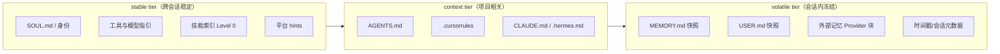
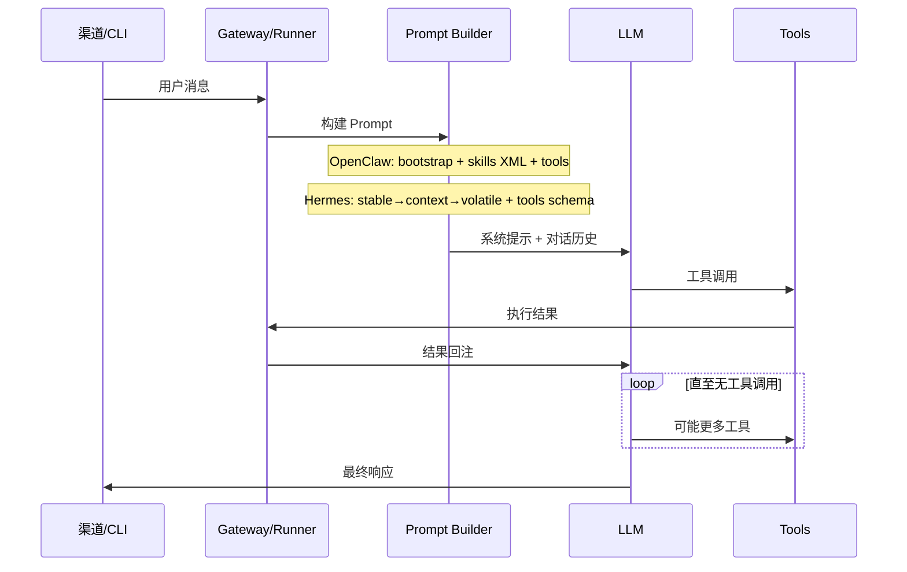

# Agent Hermes 与 OpenClaw 工作区文件与 Prompt 组装全解析
# Agent Hermes & OpenClaw: Workspace Files and Prompt Assembly — A Deep Dive

> 最后更新 | Last updated: 2026-06-06

---

## 一、设计哲学对比 | Design Philosophy Comparison

**中文**

工作区文件是「文件即配置」理念的核心：Agent 的人格、流程与知识外化为 Markdown，在会话启动时组装进系统提示词。

| 维度 | OpenClaw（龙虾） | Hermes Agent |
|------|------------------|--------------|
| 配置文件数 | 8 个 bootstrap 文件 | SOUL + 项目上下文 + 冻结记忆 |
| 注入时机 | 新会话首轮流次 | 会话构建时一次性组装 |
| 稳定性策略 | 大文件截断 + 总量上限 | **三层 Prompt tier** + 冻结快照 |
| 记忆位置 | MEMORY.md 靠后注入 | volatile tier 末尾 |
| 项目上下文 | workspace 内 AGENTS.md 等 | AGENTS.md / .cursorrules 等 |
| 子 Agent | 共享 workspace 文件 | 缩减上下文 + 无完整历史 |

**English**

Workspace files embody files-as-config: agent persona, procedures, and knowledge externalized as Markdown and assembled into the system prompt at session start.

| Dimension | OpenClaw (Lobster) | Hermes Agent |
|-----------|-------------------|--------------|
| Config files | 8 bootstrap files | SOUL + project context + frozen memory |
| Injection timing | First turn of new session | One-time assembly at session build |
| Stability strategy | Truncation + total caps | **Three prompt tiers** + frozen snapshot |
| Memory placement | MEMORY.md injected late | volatile tier at end |
| Project context | AGENTS.md etc. in workspace | AGENTS.md / .cursorrules etc. |
| Sub-agents | Share workspace files | Reduced context, no full history |

---

## 二、OpenClaw 八文件 Bootstrap 体系 | OpenClaw Eight Bootstrap Files

**中文**

OpenClaw 在 `agents.defaults.workspace`（默认 `~/.openclaw/workspace/`）中维护用户可编辑的 bootstrap 文件：

```text
~/.openclaw/workspace/
├── SOUL.md           # 人格、语气、价值观、行为边界
├── AGENTS.md         # 操作手册：工作流、记忆规则、多 Agent 协作
├── USER.md           # 用户偏好与身份信息
├── TOOLS.md          # 工具使用指南（不控制工具是否存在）
├── IDENTITY.md       # Agent 名称、头像、元数据
├── HEARTBEAT.md      # 主动巡检任务清单
├── BOOTSTRAP.md      # 首次运行仪式（完成后删除）
├── MEMORY.md         # 长期记忆（Agent 可更新）
├── memory/           # 日记式记忆（按需，非自动注入）
│   └── 2026-06-05.md
└── skills/           # 技能目录（独立加载机制）
    └── weather/SKILL.md
```

### 2.1 注入顺序与优先级

新会话首轮流次，OpenClaw 将 bootstrap 文件注入 **Project Context**（系统提示词区块）：

| 顺序 | 文件 | 角色 | 变化频率 |
|------|------|------|----------|
| 1 | `SOUL.md` | 人格优先 — 影响模型注意力分配 | 低（人工维护） |
| 2 | `IDENTITY.md` | Agent 身份元数据 | 低 |
| 3 | `USER.md` | 用户画像 | 中 |
| 4 | `AGENTS.md` | 工具与流程指令 | 中 |
| 5 | `TOOLS.md` | 工具使用约定 | 中 |
| 6 | `HEARTBEAT.md` | 巡检清单（heartbeat 启用时） | 中 |
| 7 | `BOOTSTRAP.md` | 仅全新工作区存在 | 一次性 |
| 8 | `MEMORY.md` | 持久事实 — **靠后注入** | 高 |

**设计意图**：稳定的人格指令先于易变的记忆内容，降低记忆更新对行为核心的干扰。

### 2.2 体积控制

| 配置项 | 默认值 | 作用 |
|--------|--------|------|
| `agents.defaults.bootstrapMaxChars` | 20,000 | 单文件截断上限 |
| `agents.defaults.bootstrapTotalMaxChars` | 150,000 | 总注入上限 |

空白文件跳过；超大文件截断并附加标记，提示 Agent 用 `read` 获取全文。`memory/*.md` **不**自动注入，通过 memory 工具按需读取。

### 2.3 BOOTSTRAP.md 特殊行为

- 仅当工作区无任何其他 bootstrap 文件时由 `openclaw setup` 创建
- 存在期间保持在 Project Context，指导首次仪式
- 完成后删除，**不会**在后续重启时重建
- 工作区 attestation 标记防止静默重种

**English**

OpenClaw maintains eight bootstrap files under the workspace. Injection order: SOUL → IDENTITY → USER → AGENTS → TOOLS → HEARTBEAT → BOOTSTRAP → MEMORY (most volatile last). Blank files skipped; large files truncated per `bootstrapMaxChars` (20k) and `bootstrapTotalMaxChars` (150k). `memory/*.md` is on-demand only. BOOTSTRAP.md is one-time for brand-new workspaces.

---

## 三、SOUL 与 AGENTS 职责分离 | SOUL vs AGENTS Separation

**中文**

两个框架均推荐将**人格**与**流程**拆分到不同文件：

| 文件 | 写什么 | 不写什么 | 管理者 |
|------|--------|----------|--------|
| `SOUL.md` | 语气、价值观、边界、拒绝策略 | 具体命令、API 步骤 | 用户（Git 版本管理） |
| `AGENTS.md` | 工作流、记忆规则、工具约定、多 Agent 协作 | 性格形容词堆砌 | 用户 + Agent |
| `USER.md` | 姓名、时区、沟通偏好 | 技术操作步骤 | 用户 + Agent |
| `MEMORY.md` | 项目路径、约定、重要决策 | 人格描述 | Agent |
| `TOOLS.md` | 如何使用 imsg、sag 等工具 | 工具是否存在（由 Gateway 决定） | 用户 |

**反模式示例**：

```markdown
# ❌ SOUL.md 中写操作步骤
When deploying, run kubectl apply -f deploy.yaml...

# ✅ AGENTS.md 中写操作步骤
## Deploy workflow
1. Run tests first
2. kubectl apply with --server-side
```

**English**

Separate persona (SOUL.md: tone, values, boundaries) from procedures (AGENTS.md: workflows, memory rules, tool conventions). USER.md holds user profile; MEMORY.md holds facts; TOOLS.md guides tool usage without defining which tools exist. Version-control SOUL and AGENTS in Git; let the agent manage MEMORY.

---

## 四、Hermes Prompt 三层架构 | Hermes Three-Tier Prompt Architecture

**中文**

Hermes 将系统提示词分为 **stable → context → volatile** 三层，优化前缀缓存命中率：



| Tier | 内容 | 缓存特性 |
|------|------|----------|
| **stable** | 身份、skills 索引、环境/平台 hints | 跨会话 1h 前缀缓存（Anthropic） |
| **context** | 项目上下文文件（仅加载首个匹配） | 同 stable 前缀，项目变更时失效 |
| **volatile** | 记忆/用户快照、时间戳 | 会话启动时冻结，靠后放置 |

**最终拼接**：`stable` → `context` → `volatile`

### 4.1 项目上下文发现顺序

`build_context_files_prompt()` 按优先级加载**仅一个**项目上下文类型（首个匹配胜出）：

| 优先级 | 文件 |
|--------|------|
| 1 | `.hermes.md` |
| 2 | `AGENTS.md` |
| 3 | `CLAUDE.md` |
| 4 | `.cursorrules` |

Cron 任务可通过 `workdir` 参数钉在项目目录，注入该目录的上下文文件。

### 4.2 冻结记忆快照

| 文件 | 路径 | 上限 |
|------|------|------|
| MEMORY.md | `~/.hermes/memories/MEMORY.md` | ~2,200 字符 |
| USER.md | `~/.hermes/memories/USER.md` | ~1,375 字符 |

会话启动时渲染进 volatile tier 后**不再变更**（保护 LLM 前缀缓存）。会话中 `memory` 工具可增删改并立即落盘，但**下次会话**才进入 Prompt。

**English**

Hermes assembles the system prompt as stable → context → volatile. Stable: identity, skill index, platform hints (cross-session 1h cache on Anthropic). Context: first-match project file (.hermes.md > AGENTS.md > CLAUDE.md > .cursorrules). Volatile: frozen MEMORY/USER snapshots, external memory block, timestamp — captured at session start, not mutated mid-session.

---

## 五、Prompt 稳定性与前缀缓存 | Prompt Stability & Prefix Caching

**中文**

两个框架均将 **Prompt 稳定性** 作为一等设计目标：

| 策略 | OpenClaw | Hermes |
|------|----------|--------|
| 会话中不突变 | bootstrap 快照复用 | `_cached_system_prompt` 单次构建 |
| 易变内容靠后 | MEMORY.md 最后注入 | volatile tier 在末尾 |
| 压缩后行为 | bootstrap 不变 | 仅追加 compaction 注记，不重排 stable |
| Provider 缓存 | 依赖模型/API | Anthropic `system_and_3` 策略 |

### 5.1 Hermes Anthropic 缓存策略

```text
Breakpoint 1: System prompt stable 前缀     → cache_control (1h 跨会话)
Breakpoint 2: tools schema 末尾             → cache_control (1h)
Breakpoint 3-4: 最后 2 条非 system 消息      → cache_control (5m 滚动)
```

配置：

```yaml
prompt_caching:
  cache_ttl: "5m"
  long_lived_prefix: true    # 默认开启
  long_lived_ttl: "1h"
```

**压缩交互**：上下文压缩后，stable 前缀缓存**存活**；仅压缩区域及之后的消息缓存失效，1-2 轮内滚动窗口重建。

### 5.2 已知缓存破坏点

| 破坏点 | 影响 | 缓解 |
|--------|------|------|
| 时间戳每轮变化 | 前缀 hash 变化 | 时间戳放 volatile 末尾 |
| 压缩后重建含新记忆 | KV cache miss | 记忆变更不入 mid-session rebuild |
| 技能热加载 | stable tier 变化 | 新会话或 `--now` 显式失效 |

**English**

Both frameworks prioritize prompt stability. OpenClaw reuses bootstrap snapshots; Hermes caches `_cached_system_prompt` once per session. Volatile content at the end preserves prefix cache. Hermes Anthropic strategy: 1h cache on stable prefix + tools schema, 5m rolling on last messages. Compression preserves stable prefix cache; only compressed region invalidates.

---

## 六、contextVisibility 与注入防护 | contextVisibility & Injection Protection

**中文**

### 6.1 OpenClaw contextVisibility

控制**注入模型的补充上下文**（引用回复、线程历史），与触发授权分离：

| 值 | 行为 |
|----|------|
| `all`（默认） | 保留所有补充上下文 |
| `allowlist` | 仅白名单发送者的上下文 |
| `allowlist_quote` | 白名单过滤，但保留一条显式引用 |

这降低不可信发送者通过引用链注入 Prompt 的风险，**不替代** dmPolicy 身份认证。

### 6.2 上下文文件安全扫描

两个框架在注入前扫描工作区文件：

| 检测项 | 示例 |
|--------|------|
| 指令覆盖 | "Ignore previous instructions" |
| 隐藏注释 | HTML 注释中的可疑关键词 |
| 凭证外泄 | 读取 `.env` / `id_rsa` 的尝试 |
| 不可见 Unicode | 零宽字符绕过 |

Hermes 阻断时显示：`[BLOCKED: AGENTS.md contained potential prompt injection]`

记忆写入（`memory` 工具）同样经过安全扫描后才进入下次会话快照。

**English**

OpenClaw `contextVisibility` filters supplemental context (quotes, thread history) separately from auth: `all`, `allowlist`, `allowlist_quote`. Both frameworks scan workspace files before injection for prompt injection, hidden comments, credential exfiltration, and invisible Unicode. Hermes blocks with `[BLOCKED: ...]` markers; memory writes are scanned before entering the next session snapshot.

---

## 七、Agent 循环与 Prompt 组装流程 | Agent Loop & Prompt Assembly Flow

**中文**



**Hermes 设计原则**：

- **提示词稳定性** — 会话中不突变系统提示词
- **可观测执行** — 每次工具调用对用户可见
- **可中断** — 用户可随时取消

**OpenClaw Steering**：流式响应期间到达的消息默认 steer 进当前 run，在当前 assistant turn 的工具执行完成后、下一次 LLM 调用前注入。

**English**

Standard agent loop: user message → prompt build (bootstrap/skills/tools or stable/context/volatile) → LLM → tool calls → result injection → loop until done → response. Hermes principles: prompt stability, observable execution, interruptibility. OpenClaw supports mid-run steering of inbound messages.

---

## 八、子 Agent 与缩减上下文 | Sub-Agents & Reduced Context

**中文**

多 Agent 场景下，子代理不应继承完整父会话上下文：

| 机制 | OpenClaw | Hermes |
|------|----------|--------|
| 子 Agent 生成 | `sessions_spawn` | `delegate_tool` |
| 上下文范围 | 新 sessionKey + 可选 workspace | 任务描述 + 必要文件，无聊天历史 |
| Workspace | 可路由到不同 workspace | 继承 workdir，缩减 system prompt |
| 记忆 | 独立 session jsonl | 无父会话 SQLite 历史 |
| 工具 | 可继承 profile 或单独配置 | 继承 toolsets，cron 禁用 |

**最佳实践**：子 Agent 的 prompt 应自包含任务描述，不假设「上文已讨论过 X」。

**English**

Sub-agents should not inherit full parent context. OpenClaw: `sessions_spawn` with separate sessionKey/workspace. Hermes: `delegate_tool` with task description only, no chat history, shared Docker container, cron toolset disabled. Sub-agent prompts must be self-contained.

---

## 九、从 OpenClaw 迁移工作区上下文 | Migrating Workspace Context from OpenClaw

**中文**

`hermes claw migrate` 可一键导入龙虾工作区的核心 bootstrap 文件：

| 源文件（OpenClaw） | 目标（Hermes） | 说明 |
|-------------------|----------------|------|
| `SOUL.md` | SOUL / personality | 进入 stable tier 身份块 |
| `USER.md` | `~/.hermes/memories/USER.md` | volatile tier 用户快照 |
| `MEMORY.md` | `~/.hermes/memories/MEMORY.md` | volatile tier 记忆快照 |
| `AGENTS.md` | 项目 `AGENTS.md` 或保留原路径 | context tier（需 workdir 钉扎） |
| `skills/` | `~/.hermes/skills/` | 技能目录结构兼容 agentskills.io |

**迁移后注意**：

- Hermes 记忆有字符上限，超长 MEMORY/USER 需人工精简
- OpenClaw 全量 MEMORY 注入 → Hermes 冻结快照 + `session_search` 补历史
- `HEARTBEAT.md` 不自动映射 — 需改写为 Hermes `cronjob` 或保留 OpenClaw Gateway 运行 heartbeat
- 共享 `~/.agents/skills/` 可同时服务两个框架的技能发现

```bash
hermes claw migrate    # 交互式导入 SOUL、记忆、技能、API Key
```

**English**

`hermes claw migrate` imports OpenClaw bootstrap files: SOUL → stable tier identity, USER/MEMORY → frozen volatile snapshots (with char limits), AGENTS.md → context tier (pin via workdir), skills → `~/.hermes/skills/`. HEARTBEAT.md has no direct mapping — convert to Hermes cronjob or keep OpenClaw heartbeat. Shared `~/.agents/skills/` works for both frameworks.

---

## 十、OpenClaw 与 Hermes 记忆注入对比 | Memory Injection Comparison

**中文**

| 方面 | OpenClaw MEMORY.md | Hermes 冻结快照 |
|------|-------------------|-----------------|
| 容量 | 无硬限（但全量进 Prompt） | ~2,200 + ~1,375 字符 |
| 更新可见性 | 下一会话首 turn 注入新版 | 下一会话 volatile tier |
| 日记记忆 | `memory/YYYY-MM-DD.md` | `session_search` FTS5 按需 |
| Token 趋势 | 随 MEMORY 增长线性上升 | 固定上限 + 历史检索 |
| 迁移 | — | `hermes claw migrate` 导入条目 |

**English**

OpenClaw MEMORY.md has no hard limit but full injection grows token cost linearly. Hermes frozen snapshots cap at ~2200 + ~1375 chars; historical detail via `session_search`. OpenClaw uses daily `memory/*.md` files; Hermes uses FTS5 on-demand recall.

---

## 十一、最佳实践 | Best Practices

**中文**

### OpenClaw

1. **Git 管理** SOUL.md + AGENTS.md；MEMORY.md 可 Agent 自管
2. **控制体积**：定期审查 MEMORY.md，避免 bootstrap 总量触顶
3. **HEARTBEAT 精简**：保持巡检清单短小稳定
4. **skipBootstrap**：预置工作区时设 `agents.defaults.skipBootstrap: true`
5. **/context detail**：诊断各文件 Token 贡献

### Hermes Agent

1. **职责分层**：关键事实 → MEMORY.md；历史细节 → `session_search`
2. **项目钉扎**：Cron/批处理用 `workdir` 注入正确 AGENTS.md
3. **勿 mid-session 期待记忆更新**：写入落盘但 volatile tier 不变
4. **SOUL 迁移**：`hermes claw migrate` 或 `/personality` 导入龙虾 SOUL
5. **压缩后检查**：确认 stable 前缀未被不必要重建

**English**

**OpenClaw**: Git-manage SOUL/AGENTS, audit MEMORY size, keep HEARTBEAT concise, use `/context detail`, `skipBootstrap` for pre-seeded workspaces.

**Hermes**: layer facts in MEMORY vs history in session_search, pin cron `workdir`, don't expect mid-session memory in prompt, migrate SOUL from OpenClaw, verify stable prefix after compression.

---

## 十二、快速对照表 | Quick Reference Table

| 操作 | OpenClaw | Hermes |
|------|----------|--------|
| 编辑人格 | `~/.openclaw/workspace/SOUL.md` | SOUL 迁移 / `/personality` |
| 编辑流程 | `AGENTS.md` | 项目 `AGENTS.md` 或 `.hermes.md` |
| 查看 Prompt 组成 | `/context list` `/context detail` | 开发者日志 / prompt 调试 |
| 新会话生效 | 自动（新 session） | 自动；技能变更需 `/reset` 或 `--now` |
| 禁用 bootstrap | `skipBootstrap: true` | N/A（分层构建） |

---

## 十三、延伸阅读 | Further Reading

- [记忆系统深度解析](./memory-system.md)
- [技能系统与学习闭环](./skills-learning-loop.md)
- [自动化调度与主动巡检](./automation-cron-heartbeat.md)
- [OpenClaw Agent Runtime](https://docs.openclaw.ai/concepts/agent)
- [Hermes Prompt Assembly](https://hermes-agent.nousresearch.com/docs/developer-guide/prompt-assembly)

---

## 十四、结语 | Conclusion

**中文**

工作区文件与 Prompt 组装是个人 Agent「是谁」和「怎么做」的根基。OpenClaw 以 **八文件 Bootstrap + 固定注入顺序** 提供透明、可 Git 管理、人类可读的配置面；Hermes 以 **stable/context/volatile 三层 + 冻结记忆快照** 在可控 Token 成本下最大化前缀缓存效率。掌握 SOUL/AGENTS 分离、注入顺序、稳定性策略和子 Agent 缩减上下文，是部署长期运行、高性价比 Agent 的必备知识。

**English**

Workspace files and prompt assembly are the foundation of who an agent is and how it operates. OpenClaw offers **eight bootstrap files with fixed injection order** — transparent, Git-versionable, human-readable config. Hermes offers **stable/context/volatile tiers with frozen memory snapshots** — controlled token cost and maximal prefix-cache efficiency. Mastering SOUL/AGENTS separation, injection order, stability strategies, and sub-agent reduced context is essential for long-running, cost-effective agent deployments.
